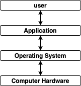
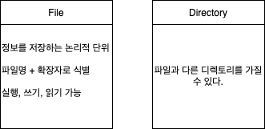
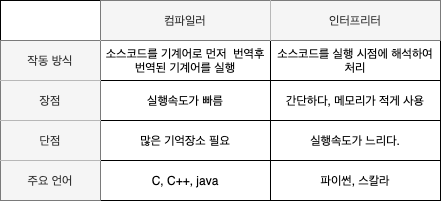
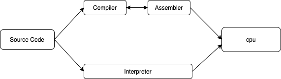
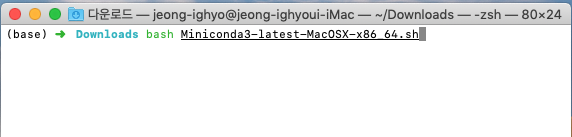
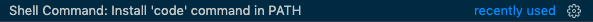
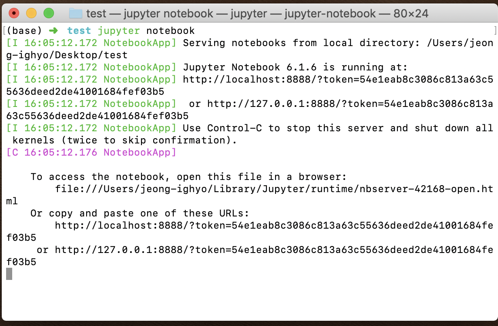
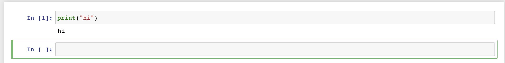

# 강의 복습 내용

1. Hidden Class
2. 파이썬 개요
3. 파이썬 코딩환경

## Hidden Class

**Operating System( 운영체제 )**

Window, Linux, Mac os 등등..

프로그램은 OS에 의존적  =>  OS에 맞추어 개발

**파일시스템**

OS에서 파일을 저장하는 **트리구조**의 저장 체계

Root 디렉토리부터 시작하는 트리구조

절대경로 : Root 디렉토리에서의 경로

상대경로 : 현재 위치한 디렉토리에서의 경로

**터미널**

Graphical User Interface : 구현된 그래픽과 마우스를 이용하여 작업을 수행

Command Line Interface : Text를 사용하여 컴퓨터에 명령을 입력하는 인터페이스

Window - CMD

Mac, Linux - Termial

## 파이썬 개요

**특징**

1. 플랫폼 독립적
2. 인터프리터 언어
3. 객체 지향 언어
4. 동적 타이핑 언어
5. C언어로 구현

**플랫폼 독립적**

적절한 인터리리터를 사용한다 운영체제에 상관없이 동작한다.

**인터프리터 언어**

컴파일러와의 차이점

**객체 지향적 언어**

모듈 중심으로 프로그램을 작성

객체는 목적을 달성하기 위한 행동(method)와 속성(attribute)을 가짐

**동적 타이핑 언어**

자료형을 실행하는 시점에 결정 

프로그램이 실행하는 시점에 사용해야할 데이터에 대한 타입을 결정

**정적 타이핑 언어**

자료형을 컴파일 시에 결정 (자료형 지정)

컴파일 시에 자료형에 맞지 않은 값이 들어있으면 컴파일 에러가 발생

## 파이썬 코딩환경

**mini conda 설치 **(mac bash쉘)

https://docs.conda.io/en/latest/miniconda.html 해당 링크에서 쉘 스크립트 다운

쉘 스크립트 실행 : bash Miniconda3-latest-MacOSX-x86_64.sh

**VScode 설치**

https://code.visualstudio.com/ 해당 링크에서 다운후 설치

설치 완료후 command + shift + p => Shell Command: Install 'code' command in PATH 설치

=> 터미널 창에서 code. => 현재 위치를 기준으로 VScode 실행

**Jupyter Notebook 설치**

Conda install Jupyter

jupyter Notebook

localhost:8888에 위치

**쉘 단위로 실행 가능**

**Colab**

구글이 개발한 클라우드 기반의 jupyter notebook

구글 드라이브 + GCP + jupyter등이 합쳐짐

구글 드라이브의 파일 데이터를 이용하여 사용가능

GPU지원

Jupyter Notebook과 유사하게 사용

https://www.youtube.com/watch?v=Q7XMSDpBb7g  <= 단축키 관련 영상 (주피터)

# 피어세션

**조 이름 선정**

부캠 8로워

**주차별 모더레이터 선정**

권태양 -> 김진현 -> 김형민 -> 이주영 -> 최준구 -> 홍정민 -> 미정

**그라운드 룰 결정**

- 지각, 결석 시 피어세션 시작 이전에 언급
- 인원이 모두 모이지 않아도 2시 5분에는 피어세션 진행
- 강의 정리 자료 업로드

**피어세션 플랜**

- 각자 강의, 과제 궁금한 내용 질문 정리하여 공유
- 강의 정리 및 심화 내용, 팁 공유
- Kaggle, Dacon 코드 리뷰 진행