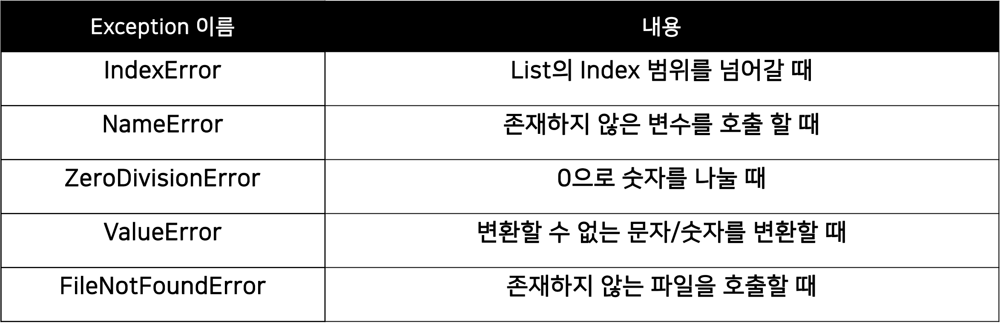
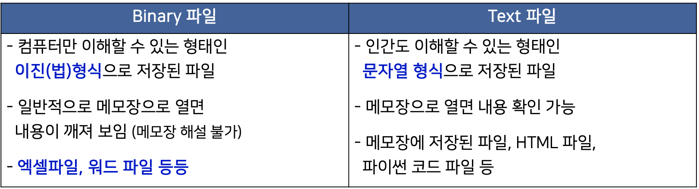
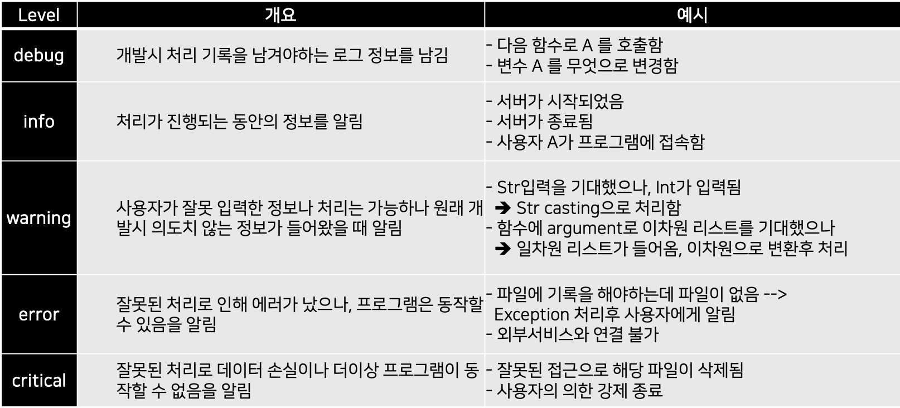

# 학습정리

- File / Exception / Log Handling
- Python data handling


## File / Exception / Log Handling

 

### Exception

사용자의 모든 행동을 예상하지 못한 일 들이 생긴다. => **예외처리를 통하여 해결** ( 잘못된 상황에 대처 )

 

**예상이 가능한 예외**

- 발생 여부 사전에 인지할 수 있는 예외
- 개발자가 반드시 **명시적으로 정의**

**예상이 불가능한 예외**

- 인터프리터 과정에서 발생하는 예외 ex) 리스트의 범위를 넘어가는 값 호출, 
- 수행 불가시 인터프리터가 자동 호출


### Exception Handling

 

**try ~ except**

```python
try :
	# 예외 발생 가능 코드
except <Exception Type> :
	# 예외 발생시 대응하는 코드
```

Exception Type ( Built- in Exception )



 

**try ~except ~ else**

```python
try :
	# 예외 발생 가능 코드
except <Exception Type> :
	# 예외 발생시 대응하는 코드
else:
	#예외가 발생하지 않을 때 동작 하는 코드
```

복잡한 구조.. 비추천

 

**try ~ except ~finally**

```python
try :
	# 예외 발생 가능 코드
except <Exception Type> :
	# 예외 발생시 대응하는 코드
finally:
  # 예외랑 상관없이 동작
```

 

**raise** :  필요에 따라 강제로 Exception을 발생

```python
raise <Exception Type>
```


**Assert** : 비교하여 특정 조건에 맞지 않을 경우 error 발생

```python
assert 예외 조건
```


### File

**파일의 종류 ( Binary, Text )**



  

파이썬은 파일 처리를 위해 **open** 사용

```python
f = open("<파일이름,경로>", "접근 모드")
f.close()
```

**접근 모드**


#### read

**read()** : 한꺼번에 가져온다.

**readlines()** : 한 줄씩 가져온다. 모두 메모리에 올린다.

**readline()** : 한 줄씩 가져온다. 한 줄씩 메모리에 올린다.

  

#### write

**encoding** : 저장하는 방식 주로 "utf8" 사용

**파일 열기 모드** : w( 파일을 처음 부터 작성 ),  a ( 파일의 마지막에 새로운 내용 추가)


### directory 다루기

#### os 모듈을 사용

터미널 명령어를 사용하여 처리가능

 

#### shutil, pathlib

최근에는 pathlib 모듈을 사용하여 path를 객체로 다룬다.

```python
#예제
import pathlib
cwd = pathlib.Path.cwd()
print(cwd)
# /Users/jeong-ighyo/Desktop/부스트 캠프/Boostcamp/1주차/2021.01.22/예제

parent = cwd.parent
print(parent)
# /Users/jeong-ighyo/Desktop/부스트 캠프/Boostcamp/1주차/2021.01.22
```


### Pickle

파이썬의 객체를 **영속화**하는 built in 객체

실행중 정보를 **저장** -> 불러와서 사용

```python
# 예제
import pickle

# test를 binary 파일로 저장
f = open("list.pickle", "wb")
test = [1, 2, 3, 4, 5]
pickle.dump(test, f)
f.close()

# 저장되어있는 list를 load
f = open("list.pickle", "rb")
load_test = pickle.load(f)
print(load_test)
f.close()
```


### log Handling

#### Logging

- 프로그램이 실행되는 동안 일어나는 정보 기록
- console화면에 출력, 파일에 기록, db에 저장.... 등의 방법
- 실행시점에서 남겨야하는 기록, 개발 시점에서 남겨야 하는 기록

 

#### logging 모듈

프로그램 진행 상황에 다라 다른 level의 log를 출력

DEBUG > INFO > WARNING > ERROR > Critical

 

**Logging level**



 

**사전에 세팅 필요**

- configparser **- 파일에**
- argparser **- 실행시점에**


#### configparser

프로그램의 실행 설정을 file에 저장

Section, key, value 값의 형태롤 설정 파일을 사용

설정파일을 Dict Type으로 호출후 사용


#### argparser

console 창에서 프로그램 실행시 Setting 정보를 저장

거의 모든 console 기반 python 프로그램이 기본으로 제공

**참고링크** : https://m.blog.naver.com/PostView.nhn?blogId=cjh226&logNo=220997049388&proxyReferer=https:%2F%2Fwww.google.com%2F


## Python data handling

 

### csv

- ','로 구분한 텍스트 파일
- 엑셀 양식의 데이터를 프로그램에 상관없이 사용하기 위하여
- textfile을 처리하듯 한 줄 한 줄 씩 데이터 처리

 

**문장 내에 들어가 있는 ","등에 대해 전처리 과정이 필요**

파이썬에서는 csv 객체를 제공

encoding 신경 윈도우는 "cp949"일 가능성, 보통 utf8로 사용

delimiter 데이터를 자르는 기준

quotechar 데이터를 묶는 문자w


### Web

**HTML**

- **웹 상의 정보를 구조적으로 표현**하기 위한 언어
- 요소 표시를 위하여 tag 사용
- 모든 요소들은 꺽쇠 괄호 안에 있다
- 트리 모양의 포함관계를 가진다

 

**웹을 알아야하는 이유**

정보의 보고, 많은 데이터들이 웹을 통하여 공유

생성 규칙이 있기 때문에 규칙을 분석하여 데이터의 추출이 가능

  

#### 정규식

복잡한 문자열 패턴을 정의하는 문자 표현 공식

특정한 규칙을 가진 문자열의 집합을 추출

형식이 있는 문자열을 원본 문자열로부터 추출

문법이 방대, 스스로 찾아서 하는 공부가 필요

**urllib** : 해당 url 주소의 데이터를 가져온다.


### XML 

- 데이터의 구조와 의미를 설명하는 tag를 사용하여 표시
- tag 와 tag 사이에 값이 표시되고 구조적인 정보를 표현
-  HTML과 유사
- 컴퓨터 간에 정보를 주고받기 유용한 저장방식
- **Beautifulsoup** 으로 parsing

  


### JSON 

- javaScript Object Notation
- 자바스크립트의 데이터 객체 표현 방식
- 데이터 용량이 적고 code로 전환이 쉽다
- XML의 대체제
- Json 모듈을 사용하여 쉽게 파싱 및 저장 가능


JSON 파일의 구조를 확인 -> 읽어온 후 Dictionary 처럼 처리

load : 가져온다 

dump : 저장


# 피어세션

### 공유할 내용, 어려웠던 내용

- 클로저를 사용하는 이유는 무엇인가?...
- logging argparse의 예시
  - edwith에 질문
- Dictionary에서 키 값을 찾을 때, get vs in 
  - get : 키에 대응되는 값을 돌려준다, 값이 없을경우 None	
  - in : 해당 key가 딕셔너리 안에 있는지 조사
- morse과제에서 dictonary를 만드는 함수를 계속 호출하는 이유는 무엇인가?


# 과제 진행 상황

**코드 리뷰 시청**


