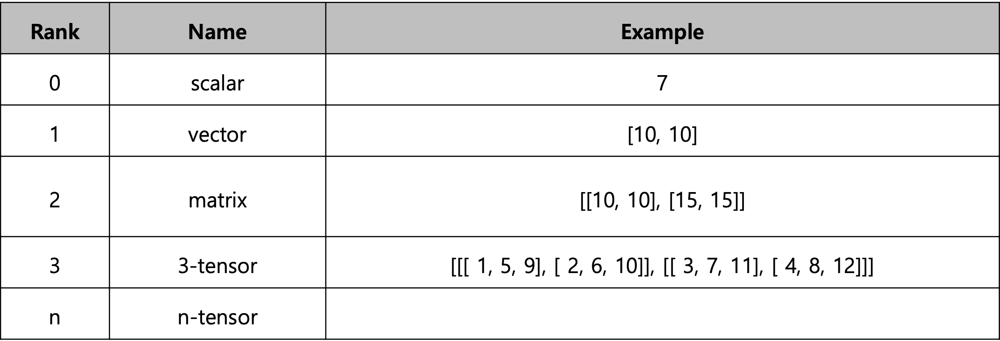
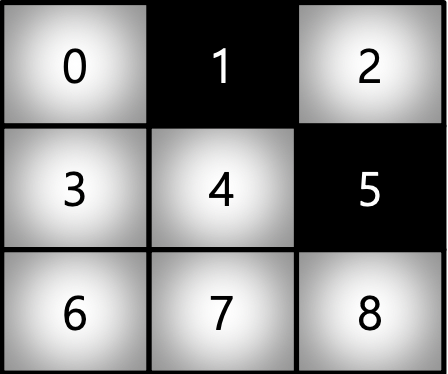

# 학습정리

- numpy
- 벡터
- 행렬

​    

## numpy

**어떻게 행렬과 메트릭스를 코드로 표현?** => numpy (파이썬 과학 처리 패키지)

- Numerical Python
- 파이썬의 고성능 과학 계산용 패키지
- Matrix와 vector와 같은 Array 연산의 사실상의 표준
- List에 비해 빠르고 메모리 효율적
- 반복문 없이 데이터 배열에 대한 처리를 지원

​     

### ndarray

- 하나의 데이터 type만 배열에 넣을 수 있다.

- List와의 가장 큰 차이점 => **dynamic typing not supported**

- 주소가 붙어있어 메모리에 접근성이 Python list보다 좋다

#### shape

numpy array의 dimension 구성을 반환

array의 크기, 형태 등에 대한 정보

array Rank에 따라 불리는 이름이 있음 

 

#### dtype

numpy array의 데이터 타입을 반환

각각의 element가 가지는 데이터 타입

#### nbytes

ndarray object의 메모리 크기를 반환 (bytes)

​     

   

### handling shape

#### reshape

array의 shape을 변경, element의 갯수는 동일

-1, size를 기반으로 선정 

#### flatten

다차원 array를 1차원 array로 변환

​      

​    

### indexing & slicing

#### Indexing

"," 표기법을 지원한다 	ex)[0, 0]

matrix일 경우 앞은 row, 뒤는 column

#### slicing

list와 달리 행과 열 부분을 나눠서 slicing이 가능함

matrix의 부분 집합을 추출할 때 유용

arr[startpoint : endpoint: step]

​    

​    

### creation function

#### arrange

array의 범위를 지정하여 값의 listf를 생성 (floating point도 가능)

list의 range()와 유사하지만 float형 step 도 가능

#### ones, zeros, empty

ones: 1로 가득찬 ndarray

zeors: 0으로 가득찬 ndarray

empty: shape만 주어지고 비어있는 ndarray생성

#### something_like

기존 ndarray의 shape와 동일한 shape의 ndarray를 반환

```python
test_matrix = np.arange(3)
result = np.ones_like(test_matrix)

# result = [1 1 1]
```

#### identity

단위 행렬을 생성

```python
#예시
three_identity = np.identity(n = 3, dtype=np.int8)

"""[[1 0 0]
 	[0 1 0]
 	[0 0 1]]
"""
```

#### eye

대각선이 1인 행렬

k값 시작,  index의 변경이 가능

```python
#예시
print(np.eye(N=3, M=5, k=1, dtype=np.int8))

""" 1번째 열에서 시작 (k = 1)
[[0 1 0 0 0]
 [0 0 1 0 0]
 [0 0 0 1 0]]
"""
```

#### diag

대각 행렬의 값을 추출함

```python
# 예시
test_matrix = np.arange(9).reshape(3, 3)
print(np.diag(test_matrix, k = 1))
"""
[1 5]
"""
```

##### 

#### random sampling

데이터 분포에 따른 sampling으로 array를 생성

```python
np.random.uniform(0,1,10).reshape(2,5) #균등분포
np.random.normal(0,1,10).reshape(2,5)	#정규분포
```

​     

​      

### Operation function

#### sum

ndarray의 값을 합친다

list의 sum 기능과 동일

#### axis

operation function을 실행할 때 기준이 되는 dimension 축

Ex) (3 (axis=0), 3 (axis=1),  4 (axis=2))

#### Mathematical function

**mean, std**

ndarrary의 element들 간의 평균 또는 표준 편차를 반환

이외에도 다양한 수학 연산자들 제공

Sin, cos, tan, acsin, arches, log, log10.... 등등

#### Concatenate

vstack, hstack

concatenate axis를 기준으로 붙인다.

​      

​      

### array operations

#### Element wise operations

array간 shape이 같을 때 일어나는 연산

각 위치별로 계산 

#### dot product

행렬 곱

dot함수를 사용하여 행렬 곱 사용

#### transpose

transpose 또는 T attribute 사용

#### broadcasting

shape이 다른 배열간 연산을 지원

서로의 shape이 맞지 않을경우 shape을 맞춘후 계산이 일어난다.

​      

​      

### comparisons

#### all, any

All => 모두 만족할 때 true

Any => 하나라도 만족할 때 true

#### comparison operation

numpy는 배열의 크기가 동일 할 때 element간 비교의 결과를 boolean type으로 반환

```python
#예제
test_a = np.array([1, 3, 0], float)
test_b = np.array([5, 2, 1], float)
print(test_a > test_b)

# [False  True False]
```

#### logical_and, logical_not, logical_or

타입이 boolen형들의 ndarray들을 and, not, or연산하여 반환

```python
# 예제
a = np.array([1, 3, 0], float)
print(np.logical_and(a > 0, a < 3))

#[ True False False]
```

#### where

np.where(조건, true인곳에 들어갈 값, false인곳에 들어갈 값)

```python
# 예제
a = np.array([1, 3, 0], float)
print(np.where(a > 0, 3, 2))

# [3 3 2]
```

np.where(조건) => true인 index 반환

```python
# 예제
a = np.array([1, 3, 0], float)
print(np.where(a > 0))
# (array([0, 1]),) 
```

Insane => 메모리값이 존재x

Isfinite => 메모리값이 넘어가는 값 찾을 때

#### argmax, argmin

array내 최대값 또는 최소값의 **index**를 반환 (axis 기준)

```python
# 예제
a = np.array([[1, 2, 4, 7], [9, 88, 6, 45], [9, 76, 3, 4]])
print(np.argmax(a, axis=1), np.argmin(a, axis=0))
#[3 1 1] [0 0 2 2]
```

​      

​     

## 백터

### 벡터란?

숫자를 원소를 가지는 list, array
$$
열 벡터 = \begin{bmatrix}
a \\ 
b \\
c
\end{bmatrix}

행 벡터 = \begin{bmatrix}
a & b & c\\
\end{bmatrix}
$$
백터의 차원 : 요소의 개수

**공간에서의 한 점을 나타낸다**

**원점으로부터의 상대적 위치를 나타낸다.**

​       

### 벡터 연산

스칼라곱 : 벡터에 양의 스칼라를 곱해주면 방향을 유지해준다. 음수를 곱할 경우 반대 방향으로 변경

같은 shape를 가지는 벡터는 연산 가능 (덧셈, 뺄셈 : 상대적 위치이동,  성분곱)

​        

### 노름

원점에서 부터의 거리

**L1 : 멘하튼 거리 ( 각 성분의 변화량의 절대값 )**

**L2 : 유클리드 거리 ( 피타고라스의 정리 )**

**code**

```python
def l1_norm(x):
	x_norm = np.abs(x)
	x_norm = np.sum(x_norm)
	return x_norm

def l2_norm(x):
	x_norm = x*x
	x_norm = np.sum(x_norm)
	x_norm = np.sqrt(x_norm)
	return x_norm
```

노름의 종류에 따라 기하학적 성질이 달라진다. => 머신러닝에서는 각 성질들이 필요할 때가 있다. (둘다 모두 사용)

​       

#### 두 벡터 사이의 거리

벡터의 뺄셈과 L1,  L2-노름을 이용해 두 벡터 사이의 거리를 계산할 수 있다

​       

#### 두 벡터 사이의 각도

**수식**
$$
cos\Theta = \frac {<x, y>} {||x||_2||y||_2}
$$
**Code**

```python
def angle(x, y):
	v = np.inner(x, y) / (l2_norm(x) * l2_norm(y))
	theta = np.argcos(v)
	return theta
```

​       

​       

## 행렬

### 행렬이란?

벡터를 원소로 가지는 2차원 배열

행(row)과 열(column) 이라는 인덱스를 가진다 => 특정 행, 열을 고정하면 행, 열 백터 

​        

### 행렬을 이해하는 방법 1

벡터: 공간에서의 한점 => 행렬은 여러개의 점을 의미

행렬의 i 번째 행 벡터는 i 번째 데이터를 의미 => i번째 행 j번째 열은 i번째 데이터의 j번째 변수의 값을 의미

​         

### 행렬을 이해하는 방법 2

벡터 공간에서 사용되는 연산자로 이해

행렬 곱을 통하여 다른 차원의 공간으로 보낼 수 있다.

M차원 공간 => n차원 공간 (m, n) * (n, 1) => (m * 1)

**패턴 추출, 데이터 압축** 

​       

### 행렬의 덧셈, 뺄셈, 성분곱, 스칼라곱, 행렬 곱셈

같은 shape를 가진 행렬끼리 덧셈, 뺄셈, 성분곱, 스칼라곱을 계산할 수 있다.

행렬 곱셈은 앞의 행렬의 i번째 행 벡터와 뒷 행렬의 j번째 열벡터 사이의 내적을 성분으로 가지는 행렬의 계산

numpy에서는 **@**연산 (dot)

​         

### 행렬의 내적

**np.inner** : 앞 행렬의 i번째 행 벡터와 j번째 행 벡터 사이의 내적을 성분으로 가지는 행렬을 구한다.

=> 수학에서 말하는 내적과는 다르다
$$
XY^T = np.inner(X, Y)
$$
​        

### 역행렬

연산을 거꾸로 되돌리는 행렬

행과 열 숫자가 같고 행렬식 determinant가 0이 아닌 경우에만 계산할 수 있다.

**Code**

np.linalg.inv로 구할 수 있다.

```python
X = np.array([[1, -2, 3],
              [7, 5, 0],
              [-2, -1, 2]])
print(np.linalg.inv(X))
print(X @ np.linalg.inv(X))

"""
[[ 0.21276596  0.0212766  -0.31914894]
 [-0.29787234  0.17021277  0.44680851]
 [ 0.06382979  0.10638298  0.40425532]]
 
[[ 1.00000000e+00 -1.38777878e-17  0.00000000e+00]
 [ 0.00000000e+00  1.00000000e+00  0.00000000e+00]
 [-2.77555756e-17  0.00000000e+00  1.00000000e+00]]
"""
```

역행렬을 계산할 수 없다면 **유사역행렬** or **무어 펜로즈 역행렬**
$$
if (n >= m)\ => \  A^+ =(A^TA)^{-1}A^T \ => \ A^+A=I \\
if (n <= m)\ => \  A^+ =(A^TA)^{-1}A^T \ => \ AA^+=I
$$
**Code**

```python
Y = np.array([[0, 1],
            	[1, -1],
            	[-2, 1]])
# n = 3 m = 2
print(np.linalg.pinv(Y))
print(np.linalg.pinv(Y) @ Y)
```

​       

### 응용

#### 연립방정식 풀기

m >= n 일 때 식을 만족하는 해중 1개를 얻을 수 있다 =>  데이터의 차원이 총 데이터개수보다 크기 때문
$$
Ax = b \\ =>x = A^+b \\ = A^T(AA^T)^{-1}b
$$
​      

#### 선형회귀분석

n >= m 일 때 데이터를 선형 모델로 나타내는 선형 회귀식을 찾을 수 있다. => 총 데이터의 개수가 데이터의 차원보다 크기 때문

**code**

```python
from sklearn.linear_model import LinearRegression
model = LinearRegression()
model.fit(X, y)
y_test = model.predict(x_test)

X_ = np.array([np.append(x, [1]) for x in X])
beta = np.linalg.pinv(X_) @ y
y_test = np.append(x, [1]) @ beta
```

​       

# 피어세션

### 공유할 내용, 어려웠던 내용

- numpy
  -  넘파이 모듈을 사용할 때 attribute를 받아서 사용하는 것과 numpy의 method를 하는 것의 차이
- 선형회귀
  - 어떻게 최솟값이 유도되는가? => http://piramvill2.org/?p=3224
- 유사역행렬 연립방정식 풀이
  - 의사역행렬의 기하학적 의미 => https://angeloyeo.github.io/2020/11/11/pseudo_inverse.html
  - 선형연립방정식 풀이 => https://darkpgmr.tistory.com/108
- numpy.arccos의 return 값은 radian => 각도로 변환하고 싶을시 rad2deg 사용
- 거리, 데이터 유사도 => https://m.blog.naver.com/PostView.nhn?blogId=cjh226&logNo=220810613028&proxyReferer=https:%2F%2Fwww.google.com%2F

​      

### ground rule

퀴즈 다음날 피어세션에서 다루기

​       

​       

# 과제진행상황

### 퀴즈 풀이

오늘 할당된 퀴즈는 큰 어려움 없이 해결하였습니다.


