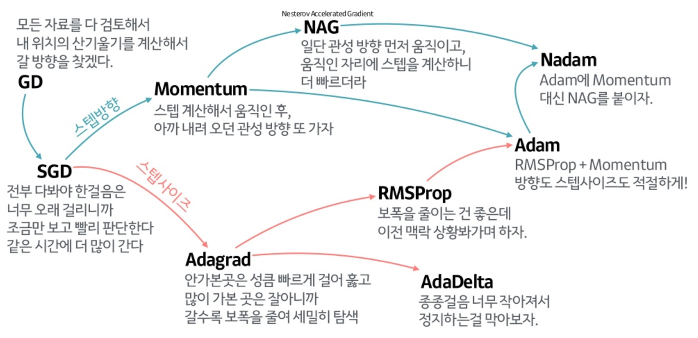

# 학습정리

- 경사하강법 (순한맛)
- 경사하강법 (매운맛)

​		  

​		   

## 경사하강법 (순한맛)

### 미분

변수의 움직임에 따른 함수값의 변화

주어진 점에서의 접선의 기울기

손으로 직접 계산하는 대신 컴퓨터가 계산가능

```python
#예제
import sympy as sym
from sympy.abc import x

print(sym.diff(sym.poly(x**2 + 2*x + 3), x))
#Poly(2*x + 2, x, domain='ZZ')
```

​              

### 미분의 사용

한 점에서의 접선의 기울기를 알면 어느 방향으로 점을 움직이여야 함수값이 **증가, 감소**하는지 알 수 있다.

미분값을 더하면 => 증가하는 방향 => 경사상승법 (극대값의 위치를 구할 때 사용)

미분값을 빼면    => 감소하는 방향 => **경사하강법** (극소값의 위치를 구할 때 사용)

​            

극값에 도달하면 접선의 기울기가 0 => 경사상승/경사하강법의 움직임이 멈춘다.

**경사하강법 알고리즘**


​            

### 벡터가 입력인 다변수 함수

편미분을 이용하여 미분

```python
#편미분
import sympy as sym
from sympy.abc import x, y
print(sym.diff(sym.poly(x**2 + 2*x*y + 3) + sym.cos(x + 2*y), x))
#2*x + 2*y - sin(x + 2*y)
print(sym.diff(sym.poly(x**2 + 2*x*y + 3) + sym.cos(x + 2*y), y))
#2*x - 2*sin(x + 2*y)
```

​            

각각의 변수별로 미분한 **편미분값들을 벡터의 element로 사용하는 gradient벡터**를 이용하여 경사 상승, 하강법에 사용

**경사하강법 알고리즘 (벡터)**


norm => gradient 벡터의 크기 => gradient 벡터의 크기가 0이 되면 극소점!

​          

​           

## 경사하강법 (매운맛)

​            

### 경사하강법으로 선형 회귀 계수 구하기  

 : 정답 레이블과의 L2 거리

선형 회귀 목적식은 위와 같고 이를 최소화 하는 베타를 찾아야 하므로 아래와 같은 그레디언트 벡터를 구해야 한다.

: 각각을 편미분한 그레디언트 벡터

#### 유도


=>    : 미분한 결과값 (n : 데이터의 개수)

​            

​           

경사하강법 알고리즘은 아래와 같다.


​             

==> 같은 방식으로  대신  을 사용하여 이를 최소화 하는 베터값을 찾으면  식이 아래와 같이  좀 더 간단해 진다.


​           

​          

### 경사하강법의 한계점

볼록(convex)한 함수에 대해서는 적절한 학습률과 학습횟수를 선택했을 때 수렴이 보장된다

=> 선형 회귀의 경우 **목적식**은 **회귀계수**(베타)에 대해 볼록함수이기 때문에 수렴이 보장된다.

=> 하지만 **비선형회귀 문제**의 경우 목적식이 **볼록하지 X**을 수있다. 따라서 수렴이 항상 보장되지는 않는다.

​       

​             

### 확률적 경사하강법 (SGD)

모든 데이터를 사용하여 업데이트 하는 대신 데이터를 한개 또는 일부분만 활용(mini batch)하여 업데이트

모든 데이터를 사용하는 것이 아니라 계속해서 **목적식이 변경**되기 때문에 경사하강법의 문제점을 어느정도 해결

=> 볼록이 아닌 목적식에도 사용이 가능하므로 머신러닝에 더 경사하강법보다 효율적

​              

미니배치를 사용하여 모든 데이터를 사용하여 계산하는 것이 아니라 속도, 메모리 측면에서도 더 좋다.

​        

​       

# 피어세션

### 공유할 내용, 어려웠던 내용

- SGD의 시간복잡도인 O(d^2/b)에서 d^2이 어디서 나왓는지

  - 데이터의 차원수 d => 행렬 연산을 하기 때문에 d^2

- 그레디언트 벡터를 구하는 미분법

- 브로드캐스트

  - https://sacko.tistory.com/16

- 그레디언트 벡터 그리기

  - ```python
    import sympy as sym
    import numpy as np
    import matplotlib.pyplot as plt
    
    x, y = sym.symbols('x y') # symbol 설정
    fun = x**2 + y**2 # func 설정
    
    # 미분 함수 정의
    gradfun = [sym.diff(fun, var) for var in (x,y)] # 미분
    numgradfun = sym.lambdify([x, y], gradfun) # 미분 함수
    
    X,Y = np.meshgrid(np.arange(-5,6, 0.5),np.arange(-5,6, 0.5)) # 범위 설정
    graddat = numgradfun(X,Y) # gradient 계산
    
    # graph
    plt.figure()
    plt.quiver(X,Y,graddat[0],graddat[1])
    plt.show()
    ```

- GD, SGD, Mini-batch GD 차이

  - https://bioinformaticsandme.tistory.com/134

- Optimizer 종류

  - 

​     

​        

​        

# 과제 진행 상황

### 퀴즈 풀이

할당된 퀴즈는 큰 어려움 없이 해결.