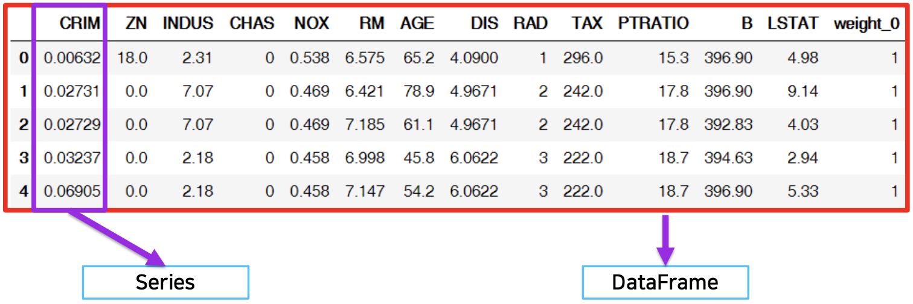
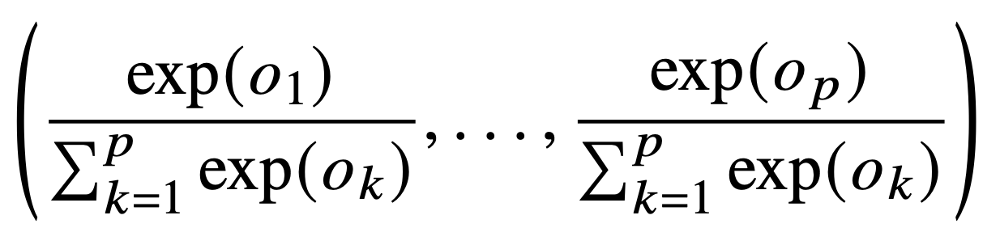
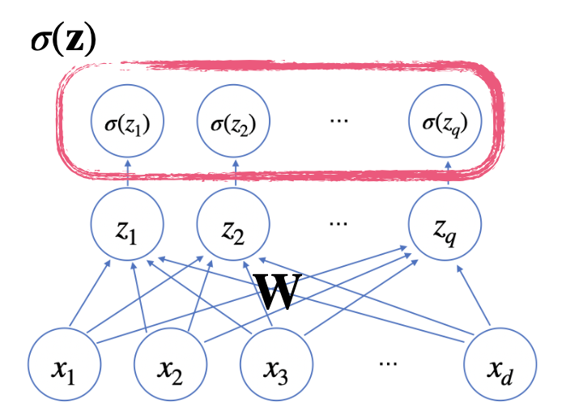
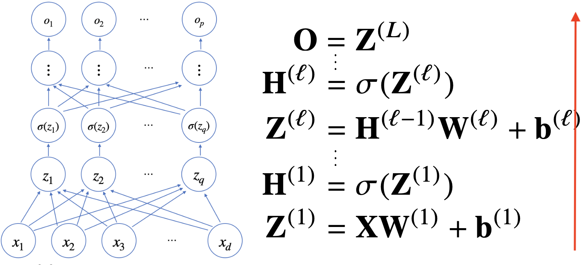
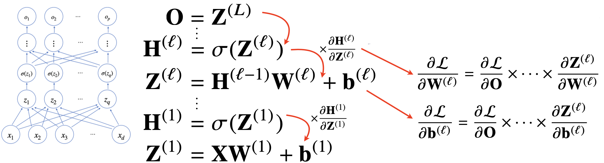

# 학습정리

- pandas
- 딥러닝 학습방법 이해하기

​      

​       

## pandas

구조화된 데이터의 처리를 지원하는 라이브러리

numpy와 통합하여 강력한 스프레드시트 처리 기능을 제공

인덱싱, 연산용 함수, 전처리 함수 등을 제공

데이터 처리 및 통계 분석을 위해 사용

​       

### series

**DataFrame**(전체를 포함하는 object) 중 하나의 **Column**에 해당하는 데이터의 모음 object

데이터가 있고 데이터에 접근할 수 있는 index(숫자, 문자)가 있다. = >  **dict** 을 사용할 경우 (key => index, value => data)

as.type => 타입을 변경

**.value, .index**로 값, index만 호출 가능하다.

​      

### dataframe

**series**가 모아서 Data Table이 만들어진다.

접근하기 위해서 index와 columns를 모두 알아야한다. (테이블 형태)

보통 csv, excel를 호출하여 data frame으로 만들어 사용한다.

**구성**

        


**columns 호출, series 데이터**

property 형태로 가져올 수 있다 (ex df.first_name)

dict타입을 호출하듯이 가져올 수 있다. (ex df["first_name"]) 

​          

**indexing**

loc - index location

```python
s = pd.Series(np.nan, index=range(10, 0, -1))
print(s.loc[:3])
"""
10   NaN
9    NaN
8    NaN
7    NaN
6    NaN
5    NaN
4    NaN
3    NaN
"""
```

iloc - index position

```python
s = pd.Series(np.nan, index=range(10, 0, -1))
print(s.iloc[:3])
"""
10   NaN
9    NaN
8    NaN
"""
```

​         

**삭제**

del : 메모리 주소 삭제

drop : 메모리 주소를 삭제 하는것이 아니라 drop이 된 dataframe을 return  

=> inplace로 바로 변경 가능

​        

​         

### Selection and drop

column의 이름을가지고 가져올 수 있다 => **series**타입

 list 형태로 여러개의 이름이 주어지면 여러개의 column을 추출하는 것이 가능 => **dataframe**타입

​           

**Index number를 이용한 selection**

column 이름없이 하용하는 index number는 **row** 기준으로 표시된다.

=> 모든 column이 나온다.

```python
df[:3]
```

column과 같이 사용 할 경우 **해당 column**만

```python
dp["account"][:3]
```

Boolean index를 사용하여 True인 값만 추출 가능

```python
print(df["account"][df["account"] < 200000])
```


**data를 추출하는 방식**

column과 index number

```python
df[["name", "street"]][:2]
```

column과 index name

```python
df[[211829, 320563], ["name", "street"]]
```

column number와 index number

```python
df.iloc[:2, :2]
```


​        

**index 재설정**

df.index = list

df.reset_index() => 값 자체는 변화하지 않음

=> 값을 변화시키고 싶으면 drop옵션을 True, 

=>inplace 옵션 dp 자체를 변화 (dataframe 값은 왠만하면 유지하는 것이 좋다.)

​       

**data drop**

index number로 삭제가능

한개 이상 index number로 drop

**axis**를 이용하여 columns 삭제가능

​      

### dataframe operations

**series operation**

index를 기준으로 연산수행 => 안겹치는 index가 있을 경우 NaN값으로 반환

​         

**dataframe operation**

column과 index를 모두 고려한다.

add operation을 사용할 때 fill_value를 사용하여 NaN값을 0으로 변환

​     

**series + dataframe**

axis를 기준으로 **row broadcasting** 실행

​    

### lambda, map, apply 

series type의 데이터에도 map 함수 사용가능

function 대신 dict, sequence형 자료등으로 대체 가능


=> .replace를 사용하여 데이터 변환 기능만 수행 할 수도 있다.

​    

**apply**

Series 전체에 해당 함수를 적용(**column**)에 해당 함수를 적용

입력 값이 series 데이터로 입력 받아 handling 가능

   

**applymap**

series 단위가 아닌 element 단위로 함수를 적용

Series 단위

​    

### pandas built in functions

**describe**

Numeric type 데이터의 요약 정보를 보여준다.

**unique**

series data의 유일한 값을 반환

**isnull**

Column 또는 row중 NaN값을 가지는 index를 반환

=> sum과 같이 이용하여 null인 값들의 합을 알 수 있다.

**sort_values**

column값을 기준으로 데이터를 sorting (ascending => 오름차순으로 정렬)

**Correlation, Covariance**

상관계수와 공분산을 구하는 함수 

화면에 표시할 최대 행 수 => **pd.options.display.max_rows**

**value_count**

값들의 개수

​       

​         

## 딥러닝 학습방법 이해하기

O = X(전체 데이터 (n, d)) * W(가중치 (d, p)) + b(n, p)

각각의 데이터별 연산으로 데이터의 차원이 변경되는 것을 의미한다.

​         


### 소프트 맥스 연산

모델의 출력을 확률로 해석 할 수 있게 변환해주는 연산

분류 문제를 풀 때 선형모델과 소프트맥스 함수를 결합하여 예측

**소프트 맥스 함수**

softmax(o) =  

​          

​        

### 신경망

신경망 => 선형 모델 + 활성화 함수




​          

위와같은 신경망을 여러층 합성 => 다층 퍼셉트론 (MLP)

이론적으로 2층 신경망으로도 임의의 연속함수를 근사할 수 있지만 층이 깊을수록 목적함수를 근사하는데 필요한 뉴런의 숫자가 빨리 줄어들어 효율적인 학습이 가능하다.

​         

​       

### 다층신경망

**forward propagation**



​            

​           

**Back propagation**

딥러닝은 역전파알고리즘을 이용하여 각 층에 사용된 파라미터 ( W(가중치), b(편향) )를 학습

=> 윗 층부터 역순으로 계산



 

 연쇄적으로 미분값을 전달하여 가중치를 변경해 준다.

​       

**예제 (2층신경망)**

  

아래식은 위의 2층신경망 구조에서 손실함수에 대한 W(1)의 미분값을 구하는 역전파 식


​              

​         

# 피어세션

### 공유할 내용, 어려웠던 내용

- Series는 numpy array인데 여러가지 타입이 들어간다?
  - 다른 타입일 경우에 object타입으로 바뀌어 들어간다
- activation function을 사용하는이유
  - 선형모델만으로는 데이터를 표현하기 힘들기 때문에 활성화 함수를 사용하여 비선형으로 만들어준다.
- Leaky ReLU
  - ReLU함수의 문제점을 해결해 준다. (Dying ReLU 문제) 
- 왜 softmax함수를 사용할까?
  - https://m.blog.naver.com/wideeyed/221021710286
- vector는 대문자로 표기, vector의 element는 소문자로 표기

​     

​      

# 과제진행상황

할당된 퀴즈는 큰 어려움 없이 해결.