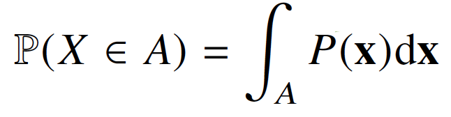

# 학습정리

- pandas II
- 확률론 맛보기

​        

​        

## pandas II

​      

### Group by

spl에서의 groupby와  같다 

```python
df.groupby("묶음의 기준이 되는 컬럼명들")["적용받는 컬럼명"].std()
```

1개 이상의 column을 묶을 수 있다.  => 여러개의 column으로 groupby를 할 경우 index가 여러개 생성

```python
# 2개의 column으로 groupby => 2개의 index
h_index = df.groupby(["Team", "Year"])["Points"].sum()
h_index.index
"""
MultiIndex([('Devils', 2014),
            ('Devils', 2015),
										.
										.
										.
            ('Royals', 2015),
            ( 'kings', 2015)],
           names=['Team', 'Year'])
"""
```

**unstack()** => group으로 묶여진 데이터를 matrix 형태로 전환

**swaplevel()** => index level(순서) 변경

**sort_index()** => 주어진 index level로 정렬

**operations** => index level을 기준으로 기본 연산 수행가능

​       

Groupby에 의해 split된 상태( 제너레이터 ) 를 추출가능

=> 특정한 그룹의 정보만 호출 가능

```python
grouped = df.groupby("Team")

for name, group in grouped:
    print(f"Team : {name}")
    print(group)
    
# 특정 그룹호출
grouped.get_group("Devils")
```


#### Aggregation

요약된 통계정보를 추출

```python
#sum
grouped.agg(sum)

#특정 한 컬럼에 대한 여러개의 function을 apply
grouped["Points"].agg([np.sum, np.mean, np.std])

#dict타입으로도 가능 (key를 index로 가지는)
df_phone.groupby("month", as_index=False).agg({"duration": "sum"})
```


#### transformation

Key값 별로 요약된 정보가 아닌 개별 데이터의 변환을 지원

단 max, min처럼 Series 데이터에 적용되는 데이터들은 **key값으로 Grouped된 데이터 기준**

​     

#### filter

특정 조건으로 데이터를 검색할 때 사용

**Boolean 조건이 존재 해야한다.**

```python
grouped.filter(lambda x: x["Points"].max() > 800)

"""
    Team	Rank	Year	Points
  0	Riders	1	2014	876
  1	Riders	2	2015	789
  					.
  					.
  					.
  10	Royals	1	2015	804
  11	Riders	2	2017	690
"""
```

​        

### Pivot table

Index축은 groupby와 동일

Column에 추가로 labeling값을 추가

value에 numeric type 값을 aggreation 하는 형태

```python
df_phone.pivot_table(
    values=["duration"],
    index=[df_phone.month, df_phone.item],
    columns = df_phone.network,
    aggfunc="sum",
    fill_value=0
)
```

​       

### Croostab

**두 칼럼에 교차 빈도, 비율, 덧셈 등을 구할 때 사용**

Pivot table의 특수한 형태

```python
pd.crosstab(
    index=df_movie.critic,
    columns=df_movie.title,
    values=df_movie.rating,
    aggfunc="first",
).fillna(0)
```


### merge

sql에서 merge와 같은 기능

두개의 데이터를 하나로 합침

**"how"** 파라미터로 left join, right join, outer join, inner join 표현가능

```python
#inner join
pd.merge(df_a, df_b, on="subject_id")
#left join
pd.merge(df_a, df_b, on="subject_id", how="left")
#right join
pd.merge(df_a, df_b, on="subject_id", how="right")
#outer join
pd.merge(df_a, df_b, on="subject_id", how="outer")
```

index를 base로도 join이 가능

```python
pd.merge(df_a, df_b, right_index=True, left_index=True)
```


### concat

같은 형태의 데이터를 붙이는 연산작업

axis를 기준으로 이루어진다.

```python
#아래로
df_new = pd.concat([df_a, df_b])
#옆으로
df_new = pd.concat([df_a, df_b], axis=1)
```

​     

### persistence

database connection (sqlite3)

XLS  persistence : 엑셀 추출코드

Pickle : to_pickle, read_pickle 사용


## 확률론 맛보기


딥러닝은 확률론 기반의 기계학습 이론에 바탕을 두고 있다.

기계학습에서 사용되는 손실함수들의 작동 원리는 데이터 공간을 **통계적**으로 해석해서 유도

Ex) 

- 회귀 분석에서 L2노름은 예측오차의 분산을 최소화하는 방향으로 학습
- 분류 문제에서 사용되는 교차엔트로피는 모델 예측의 불확실성을 최소화하는 방향으로 학습		

확률변수는 확률분포에따라 **이산형, 연속형** 으로 구분하게 된다.

​      

**이산형 확률변수**

확률변수가 가질 수 있는 경우의 수를 모두 고려하여 더하여 모델링한다.


**연속형 확률변수**

데이터 공간에 정의된 확률변수의 밀도 위에서의 적분을 통하여 모델링한다.



​      

**주변확률분포**

여러개의 변수로 이루어진 결합확률분포를 통하여 하나의 변수로만 이루어진 확률함수(주변확률분포)를 구한다.

ex) X의 주변확률분포는 확률변수 X만을 고려한다.

=>. 이산확률변수의 주변확률분포는 해당 확률변수에 대한 확률만을 고려

​	연속확률변수의 주변확률분포는 다른 변수의 적분을 통하여 해당 확률변수에 대한 확률만을 고려

참고 자료 : https://blog.naver.com/mykepzzang/220837645914

​         

**조건부확률분포**

조건부확률분포는 데이터 공간에서 입력 X와 출력 y 사이의 관계를 모델링  (입력변수x에 대해 정답이 y일 확률)

**특정 클래스가 주어진 공간에서의 확률분포를 보여준다.**

분류 문제에서 softmax 함수는 **가중치** 행렬 * 데이터에서 **추출된 특징** 을 이용하여 계산하여 각 class별 확률을 계산한다. ( **조건부 확률** )

회귀문제에서는 **조건부기대값**을 추정 (보통 적분) => **L2노름**을 최소화하는 함수와 일치 

​       

**몬테카를로 샘플링**

기계학습의 많은 문제들은 대부분 확률분포를 모른다.

=> 확률분포를 모를 때 데이터를 이용하여 기대값을 계산할려면 **몬테카를로 샘플링** 방법을 사용해야한다.

독립추출만 보장된다면 대수의법칙에 의하여 **수렴성을 보장**한다.

​    

**몬테카를로 방법을 활용한 원주율 근사값 구하기**

x좌표 (0 ~ 1), y좌표 (0 ~ 1)을 무작위 추출을 N번 반복한다.

각각의 N개의 좌표를 가지고 (0, 0)과의 거리를 측정한후 1보다 작은것과 큰것을 분리한다.

나온 비율을 가지고 넓이를 추정한 후 원의 반지름을 구할 수 있다.


