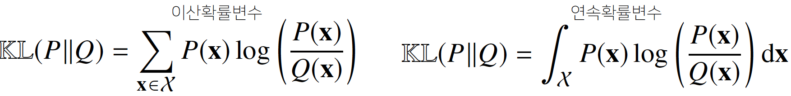

# 학습정리

- 시각화 도구
- 통계학 맛보기

​         

## 시각화 도구

### matplotlib

파이썬의 대표적인 시각화 도구

다양한 graph를 지원하고 pandas와 연동이 가능하다.

​             

Graph는 원래 figure 객체에 생성된다 => pyplot 객체 사용시 **기본 figure**에 그래프가 그려지는 것

figure안에 axes로 구성되어 Figure위에 여러개의 Axes를 생성 가능하다. (subplot)

```python
fig = plt.figure()
fig.set_size_inches(10, 10)

ax = []
colors = ["b", "g", "r", "c", "m", "y", "k"]
for i in range(1, 7):
    ax.append(fig.add_subplot(2, 3, i))
    x = np.arange(50)
    y = np.random.rand(50)
    c = colors[np.random.randint(1, len(colors))]
    # color 속성을 사용하여 그래프 색 표시, linestyle 속성을 사용하여 그래프 선
    ax[i - 1].plot(x, y, color = c, linestyle="dashed")
    # subplot별 title
    plt.title(f"random value {i}")
plt.show()
```


​                   

**legend** 함수로 범례 표시, 위치등 속성 지정

**style**함수를 이용하여 style 지정가능

```python
plt.style.use("ggplot")
plt.plot(X_1, Y_1, color="b", linestyle="dashed", label="cos")
plt.plot(X_2, Y_2, color="r", linestyle="dotted", label="sin")
plt.legend(shadow=True, fancybox=True, loc="lower right")
```


​      

#### scatter

scatter함수를 사용하여 scatter 그래프작성 가능

```python
N = 50
x = np.random.rand(N)
y = np.random.rand(N)
colors = np.random.rand(N)
area = np.pi * (15 * np.random.rand(N)) ** 2
#c로 color 지정, marker로 scatter 모양 지정, s로 사이즈지정, alpha 투명도
plt.scatter(x, y, s=area, c=colors, alpha=0.5, marker="o")
plt.show()
```


#### Histogram, boxplot

```python
# histrogram
X = np.random.normal(size=1000)
plt.hist(X, bins=100)
plt.show()
```


```python
#boxplot
data = np.random.randn(100, 5)
plt.boxplot(data)
plt.show()
```


### seaborn

기존 matplotlib에 기분 설정을 추가

복잡한 그래프를 간단하게 만들 수 있는 wrapper

​              

#### lineplot

```python
# Plot the responses for different events and regions
print(fmri["event"].unique())
# ['stim' 'cue']

# dataframe을 바로 그릴 수 있다
sns.set_style("whitegrid")
# hue를 이용하여 주어진 data에서 나누어 그릴 수 있다.
sns.lineplot(x="timepoint", y="signal", hue="event", data=fmri)
```

​               

#### scatterplot

```python
# lineplot과 유사하게 사용
sns.scatterplot(x="total_bill", y="tip", hue="time", data=tips)
```

​            

#### countplot

````python
# lineplot과 유사하게 사용
sns.countplot(x="smoker", hue="time", data=tips)
````

​        

#### predefined plots

- Viloinplot : boxplot에 distribution을 함께표현
- Stripplot : scatter와 category정보를 함께 표현
- Swarmplot : 분포와 함께 scatter를 함께 표현
- Pointplot : category별로 numeric의 평균, 신뢰구간 표시
- Regplot : scatter + 선형함수를 함께 표시

​            

​          

## 통계학 맛보기

통계적 모델링은 적절한 가정 위에서 **확률분포를 추정** 하는 것이 목표 => 기계학습과 통계학이 공통적으로 추구하는 목표

유한한 개수의 데이터만 관찰해서 모집단의 분포를 정확하게 알아내는 것은 불가능 => 근사적으로 확률분포를 추정

​        

**모수적 방법론**

특정 확률분포를 따른다고 선험적으로 가정하여 해당 분포를 결정하는 모수를 추정하는 방법

=> 기계적으로 확률분포를 가정X, 데이터를 생성하는 원리를 고려

**비모수적  방법론**

특정 확률분포를 가정하지 않고 데이터에 따라 모델의 구조 및 모수의 개수가 유연하게 바뀌는 방법론

=> 기계학습의 많은 방법론은 비모수 방법론에 속한다.

​           

데이터의 확률분포를 가정했다면 모수를 추정 할 수 있다. => 원래 데이터에서의 성질, 정보들을 취합가능

통계량의 확률분포 => **표집분포** ( 표뵨평균, 표본분산의 확률분포 ) 

표뵨평균의 표집분포는 N이 커질수록 정규분포를 따른다. **( 중심극한정리 ) ** 

​      

**최대가능도 추정법** ( MLE )

확률분포마다 사용하는 모수가 다르므로 적절한 통계량이 달라진다.

=> 이론적으로 가장 가능성이 높은 모수를 추정하는 방법 : **최대 가능도 추정법 MLE**


**로그가능도**

가능도함수에 log값을 취한 값으로 아래와 같다.


데이터의 숫자가 적으면 상관이 없지만 **데이터의 숫자가 커지면 컴퓨터의 정확도로 가능도를 계산하기 불가능**해진다.

=> 가능도의 곱셈 => 로그가능도의 덧셈  : 컴퓨터로 연산이 가능

경사하강법을 사용시에 미분연산을 사용하게 되는데 **로그 가능도를 사용하면 연산량을 O(n^2)에서 O(n)으로 줄어든다.**

​       

**최대가능도 추정법 예제**

(베르누이분포, 카테고리분포, 정규분포)

https://datascienceschool.net/02%20mathematics/09.02%20%EC%B5%9C%EB%8C%80%EA%B0%80%EB%8A%A5%EB%8F%84%20%EC%B6%94%EC%A0%95%EB%B2%95.html#id16

​           

**딥러닝에서 최대가능도 추정법**

최대가능도 추정법을 이용하여 기계학습 모델을 학습할 수 있다.

딥러닝 모델의 가중치를   이라고 표기할 때 분류 문제에서 소프트맥스 벡터는 카테고리분포의 모수를 모델링 

원 핫 벡터로 표기한 정답레이블 y를 관창데이터로 이용하여 소프트맥스 벡터의 로그가능도를 최적화할 수 있다.


​          

기계학습에서 사용되는 손실함수들은 모델이 학습하는 확률분포와 데이터에서 관찰되는 **확률분포의 거리**를 통하여 유도

**확률분포 사이의 거리**

- 총 변동거리
- 쿨백 라이블러 발산
- 바슈타인거리

​         

**쿨백 라이블러 발산**

쿨백 라이블러 발산은 아래와 같이 정의

 

=>   

분류 문제에서 정답레이블을 P, 모델 예측을 Q라 두면 **최대가능도 추정법은 쿨백 라이블러 발산을 최소화 하는것과 같다**.

​          

​        

# 피어세션

### 공유할 내용, 어려웠던 내용

- 표본 분산에서 n이 아닌 n-1을 나눠주는 이유?
  - https://m.blog.naver.com/sw4r/221021838997
  - https://angeloyeo.github.io/2020/03/23/sample_variance.html
- 모집단분포? 표본분포? 표집분포?
  - https://m.blog.naver.com/PostView.nhn?blogId=bboomm22&logNo=220768020794&proxyReferer=https:%2F%2Fwww.google.com%2F
- 최대가능도
  - https://datascienceschool.net/02%20mathematics/09.02%20%EC%B5%9C%EB%8C%80%EA%B0%80%EB%8A%A5%EB%8F%84%20%EC%B6%94%EC%A0%95%EB%B2%95.html
- further question (3번)
  - 3개, 7개로 나누어진 표본
  - theta는 모수를 의미
  - 가능도를 plot한다.
- 확률과 가능도
  - https://jjangjjong.tistory.com/41
  - http://rstudio-pubs-static.s3.amazonaws.com/204928_c2d6c62565b74a4987e935f756badfba.html
- 그래프관련 라이브러리
  -  plotly  : Interactive 한 라이브러리. 
  - tableau : 시각화 어플

​      

​     

# 과제 진행 상황

주어진 문제중 1문제를 틀리게 되었는대 문제는 아래와 같았다

**정답 레이블을 one-hot 벡터로 표현한다면 하나의 정답 레이블 벡터의 크기는 1이다.**

원 핫 인코딩을 하면 정답 class만 1이되고 나머지 class는 0이되어 벡터의 크기를 계산하면 1개의 1과 나머지의 0으로 구성되어 있기 때문에 맞다고 판단하여 "예"를 선택하였는데 오답처리가 되었다.

=> 차원수를 물어 본 질문일까?