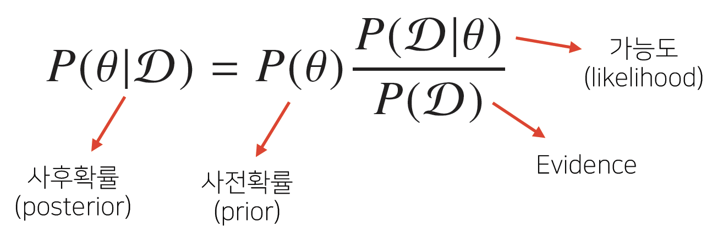
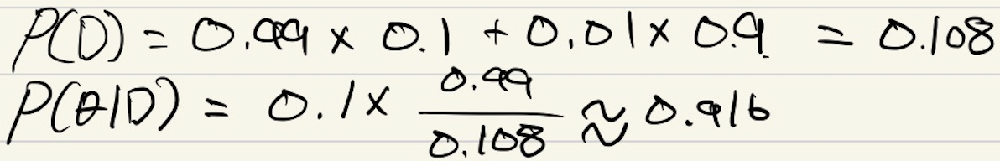
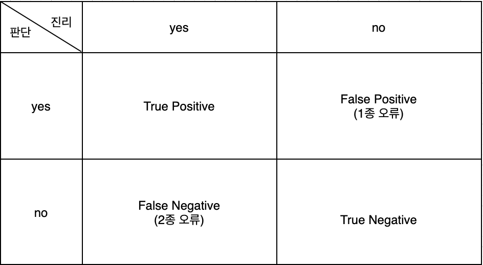
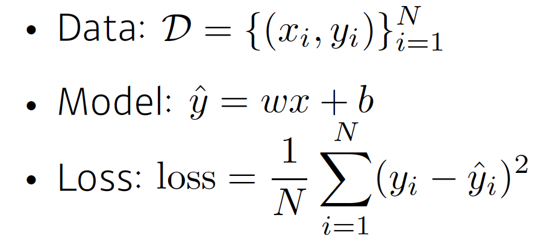
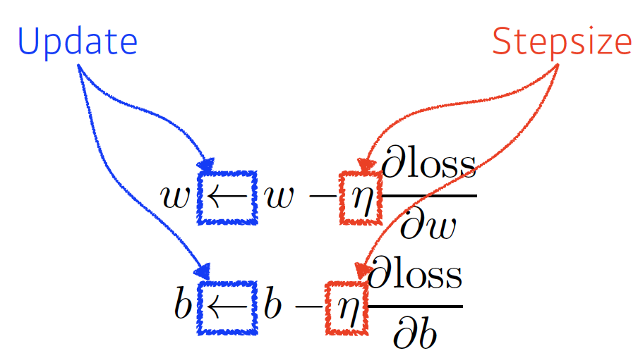
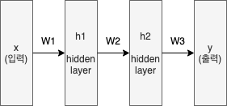

# 학습정리

- 베이즈 통계학 맛보기
- Historical Review
- NN_MLP
- 데이터셋 다루기

​          

​           

## 베이즈 통계학 맛보기

조건부확률 P(A|B) : 사건 B가 일어난 상황에서 A가 발생할 확률을 의미

=>베이즈정리 : 조건부 확률을 이용하여 정보를 갱신하는 방법

​             

**예제**

- COVID-99의 발병률 10%

- 실제로 걸렸을 때 검진될 확률 99%

-  오검진될 확률 1%

- 질병에 걸렸다고 검진 결과가 나왔을 때 정말로 감염되었을 확률은?

  ​         

​           

**조건부 확률의 시각화**

**데이터의 종류에 따라 1종, 2종 오류의 중요도가 다르다**

ex) 의료 데이터 => 1종오류보다 2종 오류의크기가 더 중요하다.

​          

**베이즈 정리를 통한 정보의 갱신**

새로운 데이터가 들어왔을 때 앞서 계산한 **사후확률**을 사전 확류로 사용하여 갱신된 사후확률을 계산 할 수 있다.

=> 정확도 향상

​                            

조건부 확률을 **인과관계를 추론**할 때 함부로 사용해서는 안된다.

인과관계는  **데이터 분포에 강건한 예측모형**을 만들때 사용

=>  조건부 확률기반 예측모형에 비해 데이터의 분포가 바뀌어도 정확도가 크게변화X

​               

인과관계를 알아내기 위해서는 **중첩요인의 효과를 제거**하고 원인에 해당하는 변수만의 인과관계를 계산해야한다.

Ex) 키와 지능과의 상관관계가 있을까?

=> 나이라는 중첩효과를 제거하지않으면 상관관계가 있다고 나온다

=> 나이라는 중첩효과를 제거하여 인과관계를 계산

​            

​        

## Historical Review

**좋은 Deep learner가 되기위한 3가지 요소**

- implementation Skills
- Math Skills
- Knowing a lot of Papers

​            

**Deep Learning의 4가지 요소**

- data
- model
- loss function
- Algorithm

​        

**Historical Review**

- AlexNet(2012)
- DQN(2013)
- Encoder / Decoder (2014)
- Adam Optimizer(2014)
- Generative Adversarial Network
- Residual Networks
- Transformer
- BERT
- Big Language Models
- Self Supervised Learning

​             

​             

## NN_MLP

**Neural Networks** : 찾고자하는 함수를 근사하는것으로 affine transform에 이은 비선형 변환(활성화 함수)으로 이루어진 계층을 쌓아 만든다.

선형회귀 : 입력과 출력이 1차원으로 입력과 출력을 연결하는 모델

**예시**

각각의 파리미터 (w, b)를 update시켜야한다.

=>각각의 파라미터(w, b)에 대한 편미분후 편미분 값을 이용하여 update (역전파) 

**활성화 함수**

**Nonlinear transform**으로 만약 활성화 함수를 사용하지 않는다면 선형변환과 다른게 없다!

주어진 문제마다 잘 맞는 활성화 함수가 다르기 때문에 잘 고려하여 사용해야한다.

​                             

**Multi-Layer Perceptron**

입력으로 데이터를 받아 hidden layer를 거쳐 출력층으로 간다.

​          

**Loss function**

정답레이블과 예측모델에서 나온 결과값을 차이를 나타내는 함수

Loss function을 최소화 하는 방향으로 학습을 진행한다.

MSE, CE, MLE등등 많은 방법이 있고 모델에 맞는 Loss함수를 사용하는 것이 중요

​          

## 데이터셋 다루기

**Dataset**

- Data를 가지고있는 객체
- __ len __     __ getitem __ 을 구현해야한다
- DataLoader를 이용하여 Dataset에 있는 데이터를 불러올 수 있다.

​       

**DataLoader**

- Dataset을 인자로 받아서 data를 뽑아낸다.

​        

notMNIST data를 이용하여 실습

​           

​            

# 피어세션

### 공유할 내용, 어려웠던 내용

- Colab안에서 git clone
- 가능도 함수, 확률
  - 이번 강의에서는 왜 가능도 함수를 확률이라고 했을까?
- relu를 사용하는 이유
  - https://joonable.tistory.com/2
- ResNet이후 딥러닝 네트워크가 더 딥해질수 있었던 이유
  - https://medium.com/@codecompose/resnet-e3097d2cfe42
- bottleneck 구조
  - https://hwiyong.tistory.com/45
  - https://junstar92.tistory.com/106

​          

​                

# 과제진행상황

MNIST 데이터셋을 가지고 MLP모델을 학습시키는 과제로 전반적인 코드는 제공되었고 일부분을 채워서 코드를 완성시키는 문제였다.

강의를 보면서 진행하면 코드를 완성시키는 것은 큰 어려움없이 끝낼 수 있었다.

완성된 코드를 다시 리뷰하여 조금더 익숙해졌다.