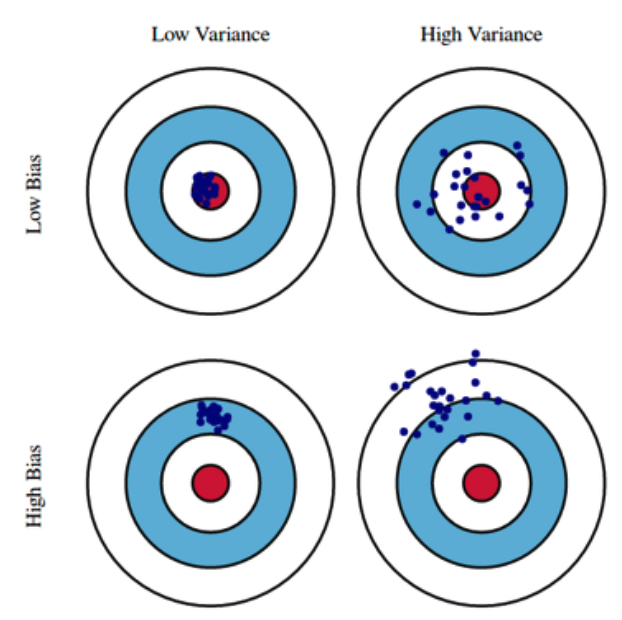
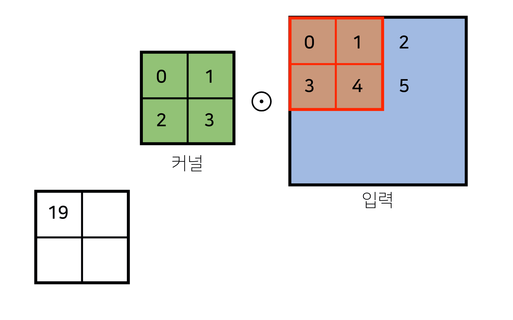

# 학습정리

- Optimization
- CNN 첫걸음

​           

## Optimization

​        

### Important concept in Optimization

**Generaliztion**

일반화 성능을 의미 한다.

training data 정확도와 test data 정확도 사이의 차이를 의미한다. (Generaliztion Gap이 크면 **overfitting**)

일반화 성능이 좋다고 좋은 모델이라고 할 수는 없다.

=>ex) train data의 정확도 자체가 낮아 test data와의 gap이 작다고 해서 좋은 모델이라고 할 수 없다. (**Underfitting**)

​       

**Cross validation**

주어진 data set을 K개로 나누어 K-1개로 학습하고(train data), 1개로 test하는것을(validation data) K번 반복한다.

=> 평균값

​         

**Bias and Variance**

Variance : 입력이 비슷할 때 출력이 유사한 값이 나오는가?

bias : target에 얼마나 가까운 위치에 있는가?

cost를 최소화 하는것은 bias, variance, noise로 분해할 수 있다.

bias와 variance는 서로 상반된다. (**Trade off**) => 하나가 줄면 다른 하나가 증가

​            

**Bootstrapping**

여러개의 모델을 사용하여 각각의 모델이 동일한 data가 들어왔을 때 출력값을 확인하는 방법

**Bagging**

여러개의 학습 set을 만들어서 여러개의 모델을 만들고 각각의 모델들이 투표 혹은 평균값을 내어 output을 정한다. => 앙상블

**Boosting**

Weak learners들을 합쳐 1개의 Strong 모델을 만든다.

=> Ex) 3분류 문제에서 1개는 잘 분류되지만 2개가 분류가 잘 안될 경우 1개를 분류하는 모델과 그다음 잘 분류가 안되는 2개의 라벨을 분류하는 모델을 2개를 사용하여 1개의 strong 모델을 만든다.

​           

### Pratical Gradient Descent Methods

**Batch-size Matters**

Large batch methods => sharp minimizers

Small-batch-methods => flat minimizers

=> Flat minmizer가 일반화 성능이 더 높다.

​     

**Graident Descent**

미분값 (Graident)를 이용하여 파라미터를 갱신

​         

**Momentum**

momentum이라는 이전 값의 방향을 가진 변수를 포함한 gradient를 이용하여 update

**Nesterov Accelerated Gradient**

**Adagrad**

Sum of graient squares

각 파라미터가 얼만큼 변화했는가를 계산하여 많이 변화된 것은 조금만 변화시키고 변화가 별로 없었던 파라미터는 많이 변화시킴

=> Sum of graient squares를 분모로 두어 변화가 많이 잃어나면 lr이 주는효과가 있다.

=> 학습이 오래 지속되어 Sum of graient squares계속 커지게 되면 lr이 0으로 수렴하여 일정 시간이 지나면 학습이 X

​              

**Adadelta**

Adagrad의 문제를 해결하기위하여 모든 기록을 계산하는 것이 아니라 정해진 window size만큼만의 정보를 가지고 사용한다.

=> lr이 없다.

​           

**RMSprop**

Adagrad와 유사한 형태로 분모에 모든 기록을 계산하는 것이 아니라 window size만큼의 기록만 계산하여 사용한다.

​           

**Adam**

모멘텀 개념과  adaptive learning개념을 합친 것으로 최근에 많이 사용된다.

4개의 hyperparameter(m, v, lr, e)가 있는데 이 4개의 파라미터를 조정하여 좋은 효과를 볼 수있다.

​      

### Refularization

학습을 규제하여 overfitting을 방지한다.

​      

**Early stopping**

overfitting이 일어나기 전에 멈추는 방법

​     

**Parameter Norm penalty**

파라미터가 너무 커지지 X게하여 function space를 부드럽게 해준다.

​       

**Data Augmentation**

데이터의 크기를 늘려주는 방법

Ex) image 데이터일 경우 회전 변환, 반전 등을 이용하여 데이터의 개수를 늘려 줄 수 있다.

​         

**Noise Robustness**

데이터, weight등에 노이즈를 추가하여 학습시킨다.

​          

**Label Smoothing**

데이터 2개를 섞는 것으로 input과 ouput을 둘다 mix해준다.

**Dropout**

Forward pass에서 렌덤으로 설정한 비율만큼의 뉴런을 zero 설정한다.

​    

**Batch Normalization**

각 층의 파라미터의 값을 정규화 해준다.

​               

## CNN 첫걸음

커널을 입력백터 상에서 움직여 가면서 선형모델과 합성함수가 정용되는 구조

적용되는 커널은 항상 같고 커널사이즈에 대응되는 크기만큼만 사용하여 연산이 적용되고 주어진 신호에 국소적(local)로 적용

=> 커널은 공통이기 때문에 NN의 Weight 파라미터 수 에비하여 파라미터수가 적다

kernel의 종류에 따라 다양한 영상처리를 할 수 있기 때문에 **영상처리에서 많이 사용**된다.

1차원 연산 뿐만 아니라 다양한 차원의 커널을 사용하여 계산가능 (데이터의 차원, 성격에 따라 커널이 달라진다.)

**2차원 커널**

      							     

​       

**출력크기 = 입력크기 - 커널크기 + 1**

Ex) (28, 28) 입력을 (3, 3)커널로 2D-Conv 연산시 출력의 shape는  (26, 26)

**3차원 커널**

3차원 Convolution의 경우 2차원 Convolution 연산은 체214널 수만큼 진행한다.

=> **이때 커널을 n개 사용하면 출력의 체널수는 n이된다.**

​            

**Convolution 연산의 역전파**

커널이 모든 입력데이터에 대하여 공통으로 적용되기 때문에 역전파를 계산할 때도 convolution연산이 나온다.

=> 각 커널에 들어오는 모든 그레디언트를 더하면 convolution연산과 같다. (미분값을 커널로하여 연산)

​           

​         

# 피어세션

### 공유할 내용, 어려웠던 내용

- Pytorch Dataset
  - numpy나 pandas 데이터프레임을 그대로 사용하면 안되는 것인가? => tensor로 바꾸어 사용
- Nesterov Accelerate Gradient
  - https://m.blog.naver.com/sw4r/221231919777
- stacking
  - https://lsjsj92.tistory.com/558
- EMA
  - Adam과 RMSprop에서의 EMA
  - https://hansololee.github.io/optimization/exponentially_weighted_averages/
- cross validation을 올바르게 사용하는 방법?
  - 데이터셋의 레이블별로 균등하게 나누어야한다. => stratified k-fold cross validation
  - https://scikit-learn.org/stable/modules/cross_validation.html
- pytorch의 ImageFolder 라이브러리를 사용하면 편리하게 notMNIST 데이터셋 만들기 가능
  - https://ndb796.tistory.com/373
- Bias and Variance Tradeoff
  - https://opentutorials.org/module/3653/22071

​          

# 과제진행상황

**퀴즈풀이**

CNN에 관한 문제가 나왔는데 큰 어려움없이 풀었다. 

하지만 1번 문제를 제대로 읽지 않고 문제를 풀어 1번문제를 틀리게 되었다.

​               

**Optimiziation Assignment**

Optimization에 따라 어떻게 학습이 진행되는지 알아보는 과제였다.

저번주 과제와 마찬가지로 빈칸을 채우는 방식으로 제공되었는데 역시 큰 어려움 없이 해결하였다.