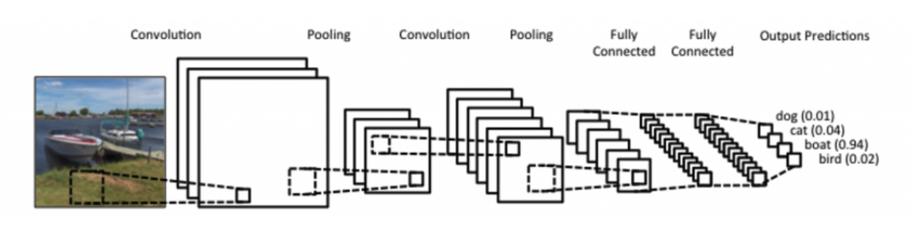
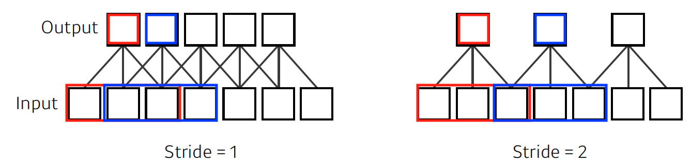
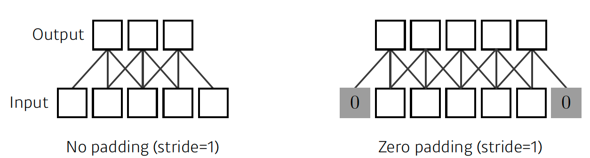
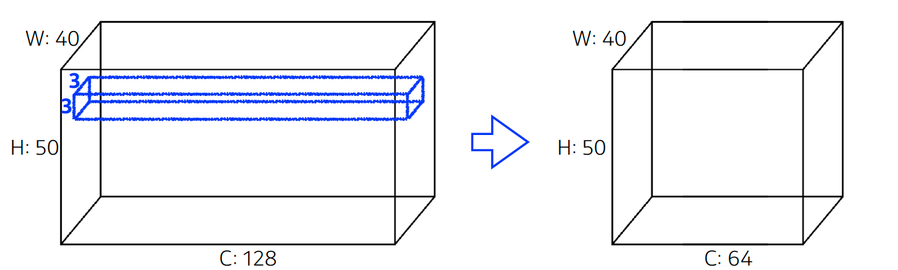
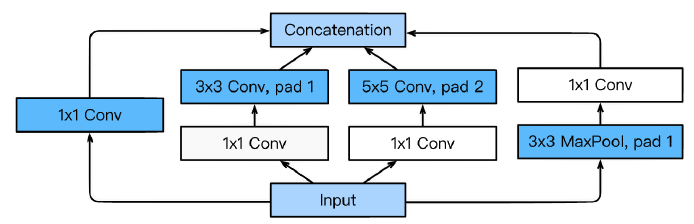
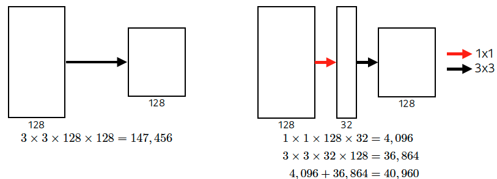
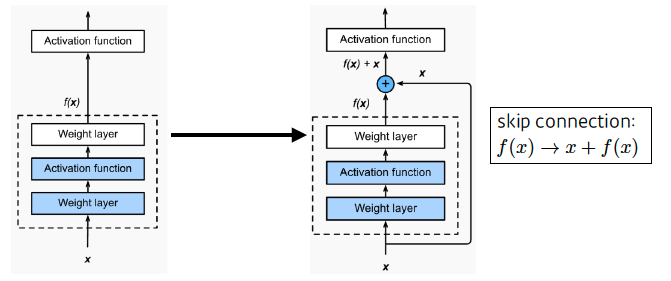
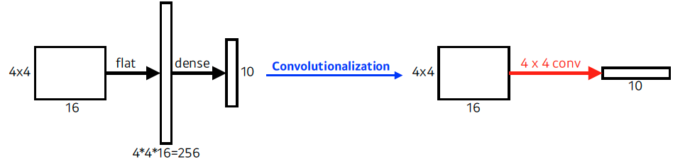
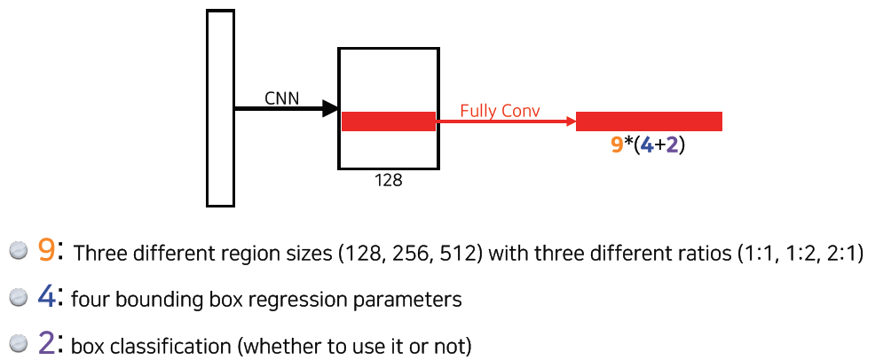

 

# 학습정리

- Convolutional Neural Network
- Modern CNN
- Computer Vision Applications

​          

## Convolutional Neural Network

고정된 커널이 input data를 돌면서 연산을 수행하여 출력

ex) 커널(5, 5, 3) , RGB 이미지 (32, 32, 3) => 출력 (28, 28, 1)

출력의 체널수를 늘리고 싶다면 커널의 개수를 늘려서 여러개의 출력을 뽑는다.

ex) 커널(5, 5, 3) * 4 , RGB 이미지 (32, 32, 3) => 출력 (28, 28, 4)

​          

#### Convolutional Neural Network

Convolution layer, pooling layer, fully connected layer로 이루어져있다.

**Convolution layer, Pooling layer** : feature extraction

**Fully connected layer** : decision making

​        

파라미터수가 많아지면 학습하기 어려워지고 일반화 성능이 떨어진다

=> 각 layer별 파라미터수, 전체 파라미터수를 아는것이 좋다.

​            

#### Stride

커널이 이동할 때 몇칸씩 이동하는지를 의미한다.

Ex) stride가 1일때 kernel이 1칸씩이동, 	stride가 2일때  kernel이 2칸씩 이동

2dim일경우 파라미터가 2개(W, H)가 필요하다.

​         

#### Padding

input 데이터의 겉에 부분에 값을 넣어주어 **출력 사이즈를 늘려주는 기법**

padding을 잘 사용한다면 input size와 output size가 같게된다.

Ex)zero padding을 사용하여 양 끝에 0을 넣어주어 output size가 input size와 같게해준다.

​              

#### Convolution Arithmetic

Convolution layer의 파라미터수 : 커널의 파라미터수 * 커널의 개수

Ex) 

=> 커널을 64개를 사용하여야지 출력 커널의 체널이 64가 될 수있기 때문에 파라미터수는 3 * 3 *128 * 64  이다.

**Conv layer는 고정된 kernel을 사용하기 때문에 FC층의 파라미터수보다 적다**

=>Conv층을 깊게 쌓고 FC층을 줄이는 방법으로 파라미터의 수를 줄일 수 있다.

​         

**1*1 Convolution**

(1 * 1 * input 체널크기 * output 체널 크기)의 커널을 사용하여 W, H는 유지하면서 체널수를 줄이는 방법이다.

한번에 연산하는 것 보다 1*1 Convolution을 사용하여 체널수를 줄인 이후 연산하여 **파라미터수를 줄일 수 있다.**

​          

## Mordern_CNN

#### AlexNet

- GPU 부족으로 인하여 2개의 network으로 나누어져 있다. 
- 5개의 conv layer와 3개의 dense layer
- Relu activatation 사용
- Data argument 사용
- Dropout 사용

#### VGGNet

- 3 * 3 커널을 사용하여 depth를 늘렸다.
  - 3 * 3커널을 여러번 사용하는 것이 파라미터수가 더 적기 때문
- 1 * 1 convolution for fully connected layers
- Drop out 사용

​          

#### Google Net

- Network in network 구조사용

- Inception blocks 

  - 여러개로 퍼졌다가 합쳐진다.

  - 

  - 1X1 Conv를 이용하여 파라미터수를 줄일 수 있다.

    

​           

#### ResNet

- 층을 깊게 쌓았을 때 생기는 문제를 skip connection으로 해결

  - skip connection : input을 출력에 더하는 것

    

- Batch Norm을 cone 뒤에다 쌓았다 

  - 아직 논란 (Batch Norm을 어디다 위치하는가?, 사용을 하는가 마는가?)
  - Bottlenect architecture사용하여 parameter수를 줄인다.

​          

#### DenseNet

- ResNet과 달리 input을 더하는 것이 아니라 concatenation한다.
- 계속 concatenation이 될 경우 차원수가 크게 증가하여 파라미터수가 증가
  -  이를 해결하기 위하여 1*1 conv를 사용하여 차원수를 낮춰준다.
- Dense Block -> Transition Block 구조의 반복

​        

​         

## Computer Vision Applications

#### Semantic Segmentation

이미지 픽셀이 어떤 label에 속하는지 판단

자율주행에 사용된다

**Fully Convolutional Network**

fully connected layer를 사용하지 않고 커널을 사용한 convolution연산을 사용한다.

=> hitmap 구조로 나타낼 수 있다.

=>어떠한 input size에도 동작하지만 oupt dim이 줄어들어 이를 늘려주는 Deconvolution연산을 사용한다.

​           

#### Detection

- R-CNN

  - input이미지를 받아 약 2000개의 region proposal를 추출한다.
  - 각각의 propposalemfdmf AlexNet을 이용하여 연산한다.
  - SVM으로 분류한다.

- SPPNet

  - R-CNN에서는 2000번의 CNN을 돌려 분류했지만 SPPNet에서는 1번만돌려 해결

- Fast R-CNN

  - input 이미지와 bounding box 집합을 이용하여 convolutional feature map을 구한다.
  - 각각의 region마다 ROI pooling을 이용하여 fixed length feature을 구한다.

- Faster R-CNN

  - Fast R-CNN에 Region Proposal Network를 추가하여 구성

  - Region Proposal Network : bounding box를 뽑는 Network를 학습

    => 객체 포함 유무만 수행 (2진분류)

- YOLO
  - 원본 이미지를 동일한 크기의 그리드로 나누고 각 그리드의 중앙을 중심으로 predefined shape으로 지정된 bounding box의 개수를 예측하고 이를 기반으로 계산
  - 속도가 매우 빠르다
  - bounding box와 class분류를 한번에 진행한다.

​       

# 피어세션

### 공유할 내용, 어려웠던 내용

- YOLO
  -  전체 영역을 SxS로 쪼갠 뒤, 그 영역을 포함하는 직사각형을 이후에 Set하는 구조를 띈다.
  - https://blogs.sas.com/content/saskorea/2018/12/21/%EB%94%A5%EB%9F%AC%EB%8B%9D%EC%9D%84-%ED%99%9C%EC%9A%A9%ED%95%9C-%EA%B0%9D%EC%B2%B4-%ED%83%90%EC%A7%80-%EC%95%8C%EA%B3%A0%EB%A6%AC%EC%A6%98-%EC%9D%B4%ED%95%B4%ED%95%98%EA%B8%B0/
- Fully Convolutional Network
  - hitmap은 어떻게 만들어지는가?
- convolution 연산 뒤 channel을 sum 하는 이유?
- 코드 작성할 때 end-line 추가하기

### 공통 과제

과일 데이터셋 만들기

각자 맡은 과일에대한 dataset을 월요일까지 만들기

​          

# 과제 진행 상황

CNN Assignment

이전 과제와 마찬가지로 빈칸을 채우는 방식으로 제공되었다.

CNN을 사용한 MNIST classification 코드를 빈칸을 채우는 문제였는데 강의와 함께 큰 어려움 없이 해결하였다.

