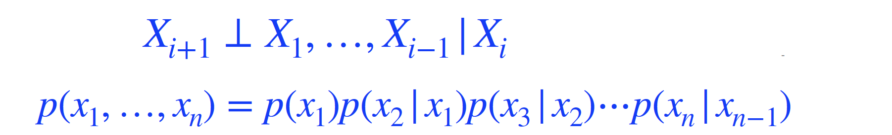
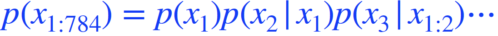
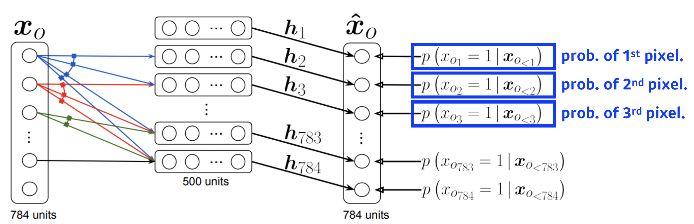
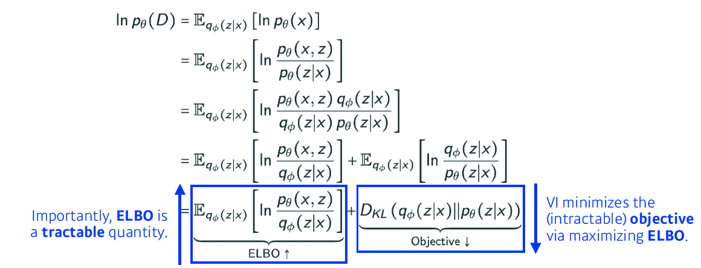
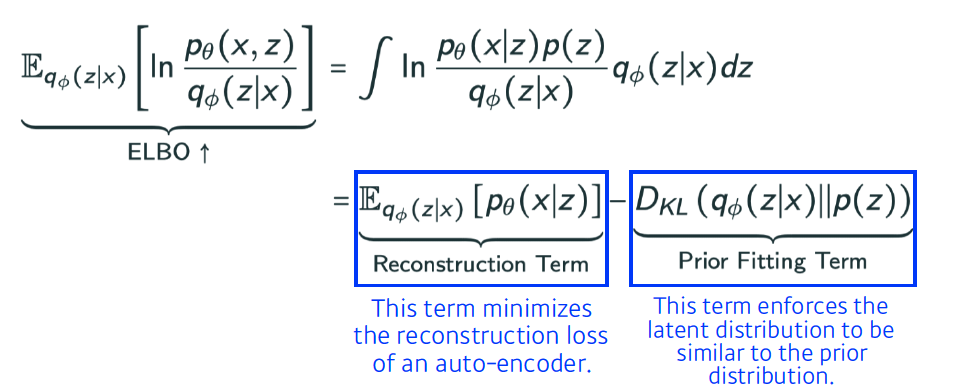
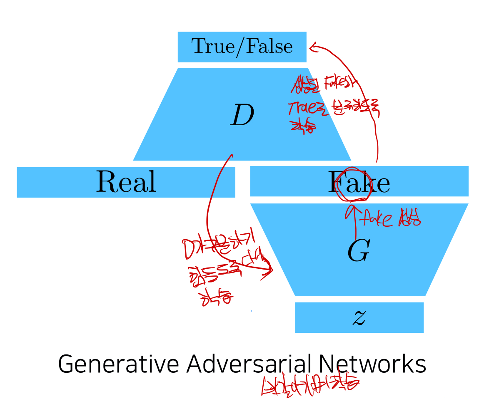

# 학습정리

- Generative Model

## Generative Model

​        

**Generation**

새로운 sample을 생성 할 수 있다.

ex) 개 이미지들을 이용하여 개 처럼 보이는 이미지를 생성 할 수 있다.

​          

**Density estimation**

입력 x 가 개 처럼 보이는지 아닌지 (확률 값을 얻어 낼 수 있는 모델)

=> anomaly detection

​             

**Unsupervised representation learning**

주어진 이미지들의 공통된 특징을 찾을 수 있다.

=> feature learning

​           

**categorical distribution** 에서 m개를 뽑는다고 가정했을 때 m-1개의 파라미터가 필요하다.

n개의 binary pixcel에서  필요한 파라미터수

- number of case: 2^n
- **parameter : 2^n - 1**

=> 너무 많은 파라미터수가 필요하다

​        

파라미터 수를 줄이기 위하여 **Independence하다고 가정**

- number of case : 2^n
- **parameters : n**

​        

파라미터의 수가 n으로 줄었지만 이미지의 pixel이 서로 independence하다는 것을 실제로는 있을 수 없는 가정

=> Conditioal Independence (**Markov assumption**)

부분적으로만 dependece하다.

ex) i + 1번째 픽셀은 i번째 픽셀에만 dependent 하고 나머지에는 independent하다라는 가설

​	=> **parameters : 2n - 1**

모두가 dependence 하다고 가정 했을 때와 모두가 independence하다고 가정 했을 때 적절하게 그 사이를 찾는것이 			중요하다.

​            

**Auto-regressive Model**

**chain rule을 사용**

​       

이전 하나의 dependent 한 것을 의미한다.

- i 번째 pixel이 i-1번째 pixel에 dependent
- i 번째 pixel이 1 ~ i-1번째 pixel에 dependent

위의 2가지 경우 모두 **Auto-regresive Model**

이미지에서 Auto-regresive Model을 활용할려면 **Ordering이 필요하다.**

​            

**NADE**

i번째 pixel은 i-1개의 입력에 dependent

=> Auto regressive Model

입력차원이 계속 달라져 Weight가 계속 커진다.

**확률을 계산 할 수 있는 모델**

​         

​      

**Variation Auto-encoder**

Variational inference

- Posterior distribution : observation이 주어졌을 때 내가 관심 있어하는 확률분포

- Variational distribution : Posterior distribution을 최적화 할 수 있게 근사한 분포

  => KL divergence를 활용 하여 minimizes

**ELBO tractable**

ELBO를 키움으로써 posterior distribution과 variation distribution 사이의 거리를 줄인다.          

**VA limitation**

- It is an intractable model (hard to evaluate likelihood). 
- The Prior fitting retm must be diffentiable, hence it is hard to use diverse latent prior distributions
- most case use an isotropic Gaussian 

**GAN**

**Generator와 discriminator를 서로 상호 작용하면 Generator의 성능을 높이는 것**

**GAN Objective**

True General distribution과 학습하고자하는 Generator 사이에 Divergence를 최소하는 것

​                

- DCGAN
  - 이미지 도메인
  - rick relu 사용
- Info-GAN
  - c라는 랜덤 클레스를 집어 넣어주어 특정 모드에 집중 할 수 있게 해준다.
- Text2Image
  - 문장이 주어지면 이미지를 반환
- Puzzle-GAN
  - 이미지안의 부분을 가지고 이미지를 복원
- CycleGAN
  - Cycle-consistency loss 사용
  - 2개의 gan을 사용 
- Star-GAN
  - 이미지를 모드에 따라 control 할 수 있게 한다.
- Progressive-GAN
  - 고차원의 이미지를 만들 수 있다
  - 저차원부터 점점 차원을 늘려 고차원의 이미지를 만든다.

​          

​              

# 피어세션

### 공유할 내용, 어려웠던 내용

- Auto regressive
  - 이전 rnn 수업에서의 auto regressive과 naive sequence model과 차이
- LSTM
  - https://medium.com/a-paper-a-day-will-have-you-screaming-hurray/day-4-pixel-recurrent-neural-networks-1b3201d8932d
- RGB joint distribution의 파라미터수 이유?
  - 255 * 255 *255
- 다차원 행렬의 matmul
  - https://bowbowbow.tistory.com/27
- 한 번에 데이터 여러 개 다운받으려면 chrome driver를 설치한 이후 이용
  - Chrome 버전에 맞는 driver를 설치후 사용
  - --chromedriver 옵션 뒤에 다운받은 drive 경로를 넣어 사용
- view, reshape, transpose, permute의 차이
  - https://sanghyu.tistory.com/3
- 가능도 함수
  - https://ko.wikipedia.org/wiki/%EA%B0%80%EB%8A%A5%EB%8F%84

​          

​          

# 과제 진행상황

주어진 과제가 없었다.