# 학습정리

- RNN 첫 걸음
- LSTM
- Transformer

​             

 ## RNN 첫 걸음

**sequence data**

소리, 문자열, 주가 데이터등과 같이 이벤트의 발생 순서가 중요한 데이터를 의미

독립동등분포 가정을 잘 위배 하기 때문에 과거 정보에 손실이 발생하게 된다며 데이터의 확률분포도 바뀌게 된다.

​             

조건부확률을 이용하여 앞으로 발생할 데이터의 확률분포를 다룰 수 있다.

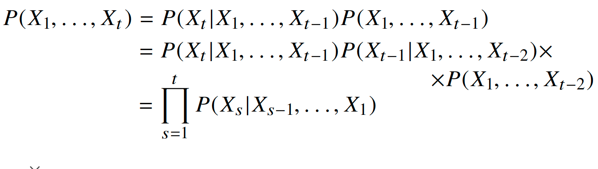

**=> 초기 시점(1)부터 바로직전 시점(s-1)까지의 정보를 이용하여 모델링**

위의 조건부 확률식은 과거의 모든 데이터들을 이용하지만 실제로는 **모든 과거 정보들이 필요하지는 않다.**

​           

**sequence data를 다루기 위해서는 길이가 가변적인 데이터를 다룰 수 있는 모델이 필요**

- 고정된 길이만큼의 sequence data만 활용 (fix the past timespan)

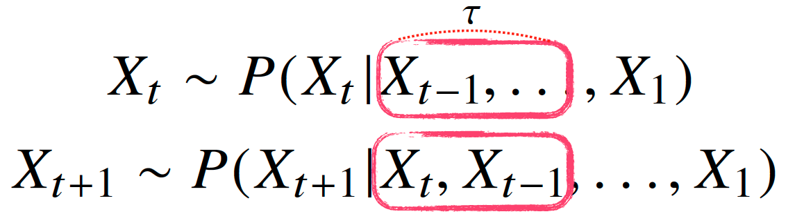

- 바로 직전 정보, 직전 정보를 제외한 나머지 정 보들을 잠재변수(H)로 인코딩 하여 활용

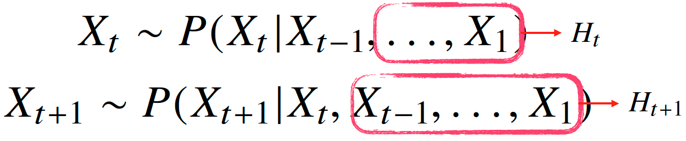

​	=>**잠재변수(H)를 신경망을 통하여 반복하여 사용하여 패턴을 학습하는 모델이 RNN**

​             

​              

**RNN**

이전 순서의 잠재변수와 현재의 입력을 활용하여 모델링

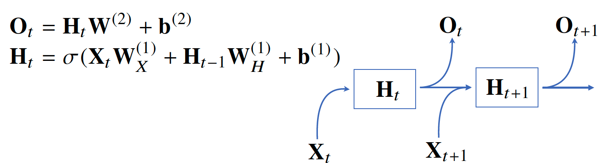

=> **가중치들은 t에 따라 변하지 않는다.** (데이터만 변경)

​           

**BPTT**

RNN의 역전파 방법

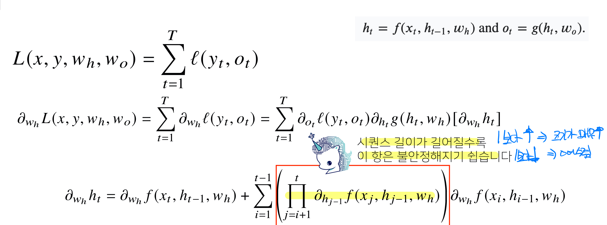

시퀀스 길이가 길어지는 경우 BPTT를 통한 알고리즘 계산이 불안정

- 빨간 박스 안의 미분값이 1보다 클 경우 계속 곱해지면서 크기가 매우 커진다.
- 빨간 박스 안의 미분값이 1보다 작을 경우 계속 곱해지면선 0에 수렵하게 된다

=> 계산이 불안정 해지므로 길이를 끊는 것이 필요하다 (gradient를 나누어 전달하는 방법) truncated BPTT

**이러한 문제를 해결하기 위해 등장한 RNN 네트워크 (LSTM, GRU)**

​                 

## LSTM

vanilla rnn은 비교적 최근의 정보는 잘 유지하지만 먼 과거의 정보를 유지 하기 힘들다는 문제가 있다.

=>  Vanishing / exploding gradient

​          

**LSTM**은 이러한 문제점을 해결

**구조**

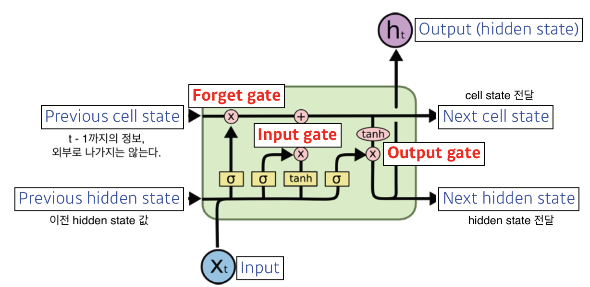

- Forget gate

  - 어떤 데이터를 버릴것? (이전 hidden state 와 input을 사용하여 결정

  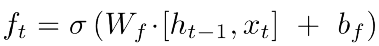

- Input gate

  - 어떤 정보를 cell state에 올릴 것인가?

  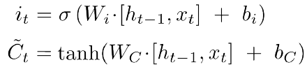

- update cell

  - 새로운 cell state를 update

  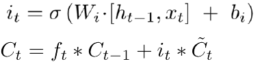

- Output gate

  - update된 cell state를 사용하여 output으로 보낼 값을 결정

  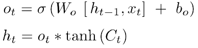

​          

## transformer

attention 개념에 기반한 첫번째 sequence transduction model

**Attention**

출력 단어를 예측하는 매 시점마다 인코더에서의 전체 입력 문장을 해당시점에서 예측해야할 단어와 연관이 있는 입력 단어 부분에 집중해서 (attention) 다시 한 번 참고하는 것

​           

**Transformer**는 encoding 부분, decoding부분	그리고 그 사이을 이어주는 connection들로 이루어져 있다.

encoding 부분은 여러개의 encoder를 쌓아 올려 만든것 이고, decoding 부분은 encoding 부분과 동일한 개수만큼의 decoder을 쌓은 것을 의미

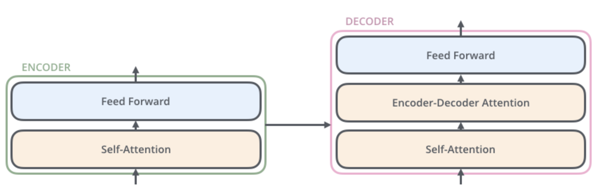

encoder들은 self-Attention layer와 Feed Forward Neural Network 으로 이루어져 있다.

decoder들은 2가지 레이어를 모두 가지고 있지만 그 사이에 encoder-Decoder Attention이  포함되어있다.

=> 입력 문장 중에서 각 타임 스텝에서 가장 관련 있는 부분에 집중할 수 있도록 해준다.

​              

**Encoder**

- 입력단어들을 embedding 알고리즘을 이용하여 vector로 변환시켜준다.

  - Ex) 각 단어들을 크기가 512인 벡터로 embed

    =>모든 encoder들은 크기 512인 벡터의 List를 입력으로 받는다. (첫번째 encoder은 word embedding)

- 각 단어에 해당되는 vector들은 encoder 내부의 두개의 sub layer으로 들어간다.

  - Self-Attention

    - 입력된 vector들로부터 Query벡터, Key벡터, Value벡터를 생성 (각 vector마다 3개의 Weight이 존재)

    - score 계산 : 현재 단어의 Query 벡터와 다른위치에 있는 단어의 key vector의 내적으로 계산 

      => Self Attention 할려는 현재위치의 단어를 encode 할 때 다른 단어들에 대해서 얼마나 attention해야할지 결정

    - Key 벡터의 사이즈의 제곱근으로 나누어 준다.

    - softmax를 통하여 각 점수들을 양수로 만들고 합을 1로 만들어준다.

    - 각 단어들의 value 벡터에 softmax를 통과한 점수들을 곱한다.

      =>attention 하고싶은 단어들은 남겨두고 관련이 적은 단어들은 비중을 줄이기 위하여

    - 점수들이 곱해진 weighted value값들을 모두 합친다.

      => self-attention의 출력값 (Z행렬)

  - Feed-forward

- multi headed attention

  - 모델이 다른 위치에 집중하는 능력을 확장시켜준다

  - 각각의 head를 만들기 위하여 각각의 다른 Query, Key, Value, (3개의 Weight)가 존재한다.

    => 여러개의 Z행렬(self attention의 출력) 생성

  - 여러개의 Z행렬을 합치고 다른 Weight 행렬을 이용하여 차원을 변경해준다.

- Positional Encoding

  - 모델이 입력문제에서 단어들의 순서에 대하여 고려할 수 있게 해준다.
  - 모델이 학습하는 특정한 패턴을 따르는데, 이러한 패턴은 모델이 각 단어의 위치와 시퀀스 내의 다른 단어 간의 위치 차이에 대한 정보를 알 수 있게 해준다.
  - Positional Encoding을 추가해주면 이후 self-attention을 통하여 Query, Key, Value 벡터들로 투영되었을 때 단어들 간의 거리를 늘릴 수 있다.

- encoder내의 sub-layer가 residual connection으로 연결되어 있으며, 그 이후에는 layer-nomalization 과정을 거친다.

  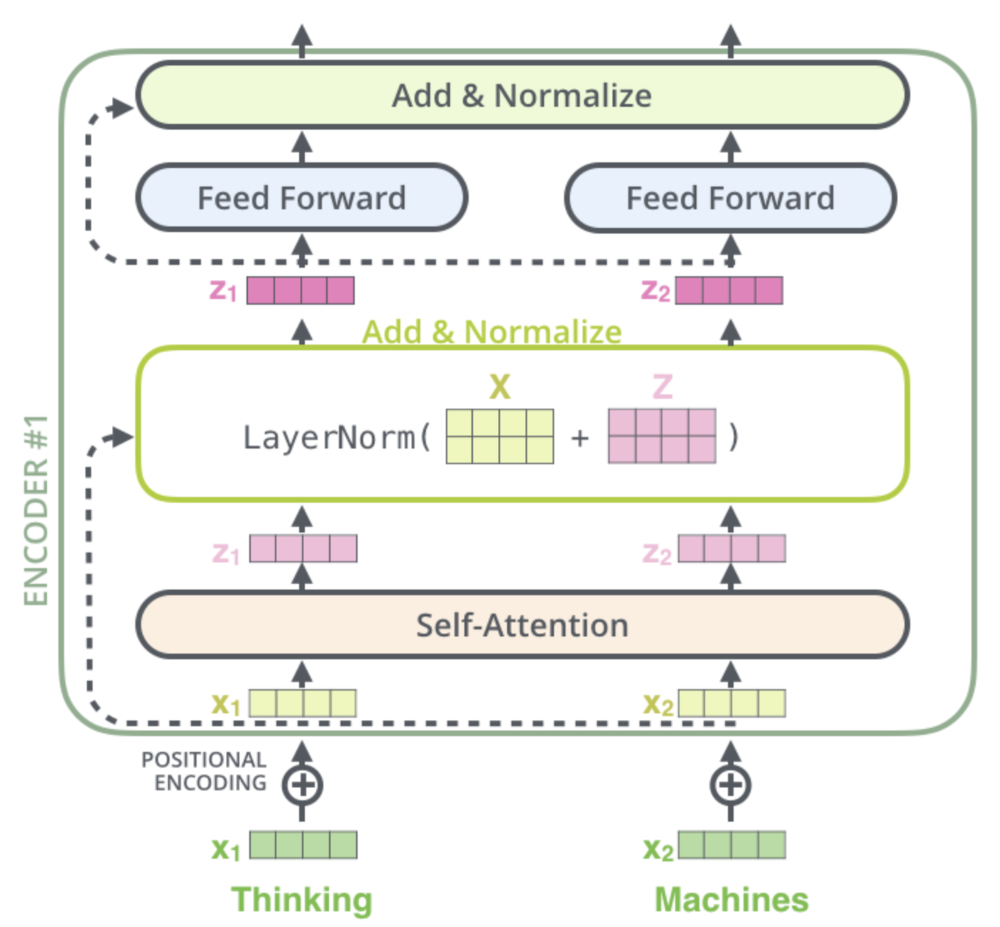

  ​            

  ​            

**decoder**

- encoder의 각 부분과 decoder의 각 부분은 유사하게 작동

- decoding 단계의 각 스텝은 output sequence의 한 element를 출력

- decoder가 출력을 완료했다는 기호인 <end of sentence>를  출력할 때 까지 반복

- encoder와 마찬가지로 각 decoder를 거쳐 올라간다.

  - Decoder에서의 self attention layer은  encoder와는 조금 차이가 있다.

    => Decoder 에서는 현재 위치의 이전 위치들만 attend할 수 있다 (masking)

​            

**Linear Layer**

여러 개의 decoder를 거치고 난 후에는 벡터 하나가 남게 되는데 이 벡터를 linear layer와 softmax layer를 이용하여 단어로 변환

​       

참고문서 : https://nlpinkorean.github.io/illustrated-transformer/

​       

# 피어세션

### 공유할 내용, 어려웠던 내용

- GRU의 reset gate와 update gate
  - https://yjjo.tistory.com/18
- Transformer
  - 각 단어마다 vector를 생성하는데 어떻게 상관관계를 유추하는가?
  - input과 Output의 크기가 다른데 어느 과정에서 바뀌는것 인가>
- Bidirectional LSTM
  - http://intelligence.korea.ac.kr/members/wschoi/nlp/deeplearning/Bidirectional-RNN-and-LSTM/
- 코랩 런타임 끊김방지
  - https://teddylee777.github.io/colab/google-colab-%EB%9F%B0%ED%83%80%EC%9E%84-%EC%97%B0%EA%B2%B0%EB%81%8A%EA%B9%80%EB%B0%A9%EC%A7%80

# 과제 진행 상황

LSTM Assignment, Multi-head-Attention Assignment

이전 과제와 마찬가지로 빈칸을 채우는 방식으로 제공되었다.

이전과 마찬가지로 실습과제에서 다루었던 코드이기에 빈칸을 채우는대에는 문제가 크게 없었지만 이외에 전반적인 코드가 어려웠던 과제였다. 이론강의와 관련 자료들을 조금더 찾아보고 익숙해 진 이후 전반적인 코드를 다시 리뷰할 생각이다.