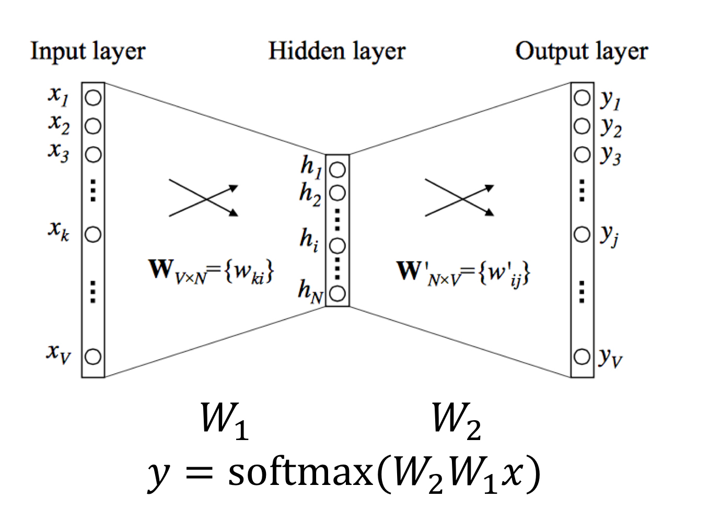
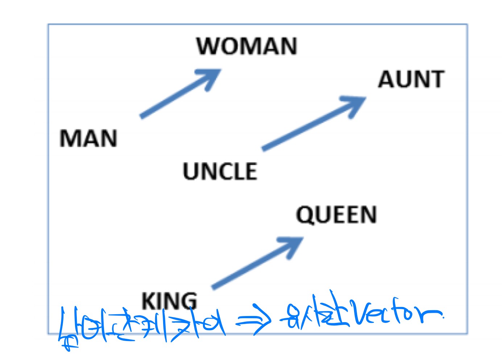
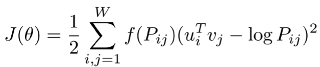

# 학습정리

- Intro to NLP
- Bag-of-Words
- Word Embedding : Word2Vec, Glove

## Intro to NLP

​           

### Natural language processing

Low-level-parsing

- Tokenization, stemming (어간 추출)

Word and pharse level

- NER, POS tagging, noun-phrase chunking, dependency parsing, coreference resolution

Sentence level

- Sentiment analysis, machine traslation

Multi-sentence and paragraph level

- Entailment prediction (문장간의 관계 고려), question answering, dialog systems, summarization

​         

### Text mining

- Extract useful information and insights from text and document data

- Document clustering

- Highly related to computational social science

  ​																																																													         

### Information retreval

- 검색 기술 ( 이미 어느정도 발전)
- recommendation system

### Trends of NLP

- Word embedding : 단어를 잘 나타내는 vector로 표시
- RNN-family models (LSTM, GRU)
- Attention modules and Transformer models => 성능이 좋아 대부분 transformer 구조를 사용

​          

​         

## Bag-of-Words

Deep learning 기술을 사용하기 이전에 사용

**step1** 

예제 문장에서 중복단어들을 제거하여 Vocabulary set을 만든다.

**step2**

Vocabulary set의 단어들을 one hot vector로 변환

- 각 단어간의 유클리드 거리는 **root 2**

- 각 단어들간의 consine similarity(내적)은 0

**step3**

예제 문장들을 이루는 단어들의 one hot vector의 합으로  표현

**Step4**

NaiveBayes Classifier => 분류

​           

​             

## Word Embedding : Word2Vec, Glove

​         

### Word Embedding

단어를 vector로 표현하는 것

비슷한 단어들을 표현하는 vector들의 거리는 짧고 서로 다른 단어들을 표현하는 vector들의 거리는 멀다.

ex) cat, kitty 사이의 거리는 짧다.

​           

### Word2Vec

단어를 표현한는 vector를 찾는대 사용하는 알고리즘

비슷한 문맥에 있는 단어들은 비슷한 의미를 가진다고 가정

근처에 있는 단어들은 서로 연관이 있다고 가정

정해진 **window가 문장을 이동**하면서 input단어와 output 단어를 정하고 위와 같은 네트워크를 통과 시켜면서 학습한다.

​         

**Analogy Reasoning**

 비슷한 관계인 2개의 단어 vector의 거리는 유사하다.	 **Ex) 남여 성별**

위와 같은 관계를 이용하여 벡터의 연산을 통하여 단어간의 관계를 알 수 있다.

​          

**Intrusion Detection**

여러 단어가 주어졌을 때 나머지 단어와 의미가 가장 상이한 단어를 찾는다.

=>  각 단어별로 유클리드 거리를 평균내어 평균거리가 가장 먼 단어를 찾는다.

​           

### Glove

count 기반과 예측기반을 모두 사용, 전체적인 통계 정보를 반영한다.

​       

Co-occurrence Probability(동시 등장 확률) matrix를 계산

embedding 된 중심 단어와 주변 단어와의 내적이 Co-occurrence Probability와 같도록 학습

=> **손실 함수 : **  

 작은 데이터에서 효율적이고, 속도가 빠르다

​         

​              

# 피어세션

### 공유할 내용, 어려웠던 내용

- word2vec 실습
  - Window size이동 나머지를 버리는 이유
  - Squeeze : 크기가 1일 차원을 제거
- tqdm 라이브러리
  - https://tqdm.github.io
- MLE vs MAP
  - https://niceguy1575.tistory.com/entry/MLE-vs-MAP-Maximum-Likelihood-or-Maximum-a-Posteriori
- Glove
  - https://wikidocs.net/22885

​           

​                   

# 과제 진행상황

주어진 코드에 빈칸을 채우는 방식으로 제공된 과제로 큰 어려움 없이 해결하였다.