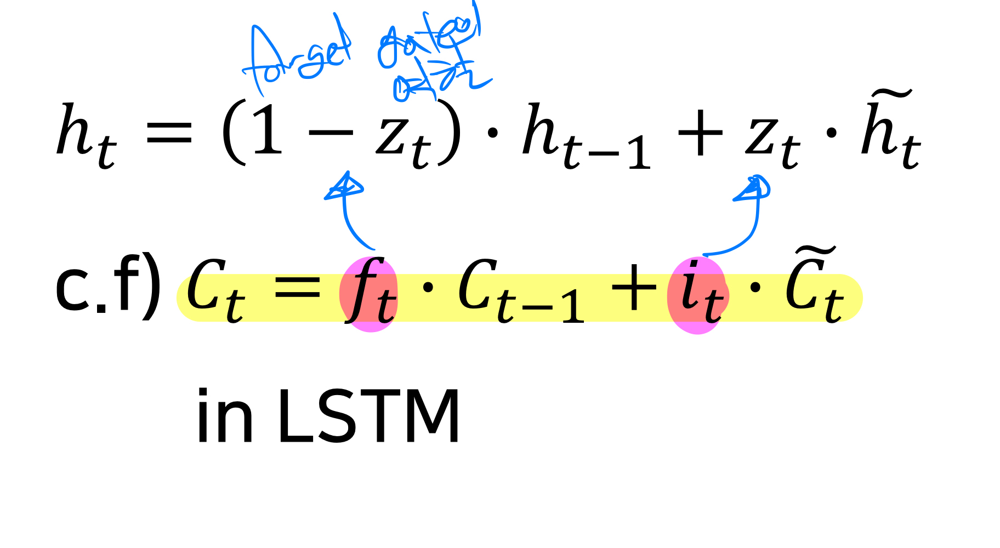

# 학습정리

- Basics of Recurrent Neural Networks (RNN)
- Type of RNN
- Character-level Language Model
- LSTM, GRU

​          

## Basics of Recurrent Neural Networks (RNN)

**이전 hidden-state vector**와 **현재 time step의 input vector**를 이용하여 **현재 시점의 hidden state vector**를 계산

매 time step 마다 **같은 함수와 set of parmeters**를 사용

출력이 필요한 경우 hidden state vector를 이용하여 output layer를 계산

​          

**RNN calculate**

                    

​           

​                    

## Type of RNNs

**one to one**

- standard Neural Network
- sequence data를 다루는 것이 아닌 일반적인 NN

​          

**one to many**

- 1개의 입력을 받아 여러개를 sequence 하게 출력
- 첫 입력 이외의 데이터는 첫 입력과 같은 사이즈의 0 텐서로 제공
- Image Captioning : 입력으로 이미지를 받아 해당이미지에 대한 설명글을 순차적으로 작성  

​           

**Many to one**

- sequence data가 주어지고 1개의 출력
- Sentiment Classification : 감정 분석

​             

**Sequence to Sequence**

- 입력데이터와 출력 데이터가 모두 sequence
- Machine Translation : 기계번역, 입력데이터를 모두 읽은 후에 출력
- Video classification on frame level : frame 단위의 영상 분류, 입력이 주어지는 즉시 분류

​           

​              

## Character-level Language Model

vocabulary : 중복을 제거한 고유한 문자열

ex) "hello" => [h, e, l, o]

vocabulary를 one hot encoding으로 사용

​     

**input layer** : 현재 time step에서의 input

**hidden layer** : 과거의 정보를 가지고 있는 vector,  현재 time step에서의 hidden layer는 직전의 hidden layer와 현재 input으로 계산

**output layer**: hidden layer vector를 NN을 통과시켜 얻은 vector로 input layer와 동일한 차원을 가진다. 이를 softmax를 통과시켜 확률값으로 표현할 수 있다.

rnn의 역전파를 계산할 때 아래 그림과 같이 output을 모두 계산하여 그 이후 역전파를 계산 할려면 많은 자원이 필요하다

=> 일정 단위로 분리하여 제한된 길이 만큼만 학습

Hidden layer의 차원중 1개를 결정하고 이 차원이 time step에 따른 변화를 관찰하면 해당 차원이 어떤 역할을 하는지 관찰 할 수 있다.

​         

**RNN의 한계점**

지속적으로 같은 Weight를 계속 곱하기 때문에 역전파 과정에서 Gradient vanishing, exploding 문제가 발생 할 수 있다.

=> LSTM, GRU등장

​         

​            

## LSTM, GRU

**LSTM**

RNN과 다르게 이전 time step에서 2개의 정보를 사용한다. (Cell state, hidden state)

- forget gate

  

  시그모이드 활성화 함수를 통과하였기 때문에 비율로 나타난다.

  => Forget gate (위의 식)에서 나온 값을 cell state와 element wise 곱을 해주면서 이전 time step에서 넘어온 cell state 정보를 얼마나 잊을(보존할) 것인가?

- Input gate

  

  시그모이드 활성화 함수를 통과하였기 때문에 비율로 나타난다.

- Gate gate

  

  Cell state를 새로 업데이트 하기 위한 값으로 input gate의 결과 값과 곱해져 특정 비율만큼 cell state를 update 해준다.

  

  => 새로 update 된 cell state는 forget gate와 cell sate, input gate와 Gate gate를 곱한 값과 같다.

- output gate

  

  시그모이드 활성화 함수를 통과하였기 때문에 비율로 나타난다.

  현재 step의 hidden state는 output layer의 결과와 Cell state를 tanh로 활성화 시킨 값을 element wise 곱해준 값이다.

  => hidden state는 cell state를 일정 비율로 반영한 값

  => Cell state : 완전한 정보,  hidden state : 필터링된 정보

​           

​             

**GRU**

LSTM을 경량화한 모델로 Cell state과 hidden state를 합쳤다.,

​          

**LSTM, GRU가 Gradient vanishing, exploding 문제를 해결 할 수 있는 이유**

동일한 값(Weight)를 지속적으로 곱하는 연산이 아니라 전 time step의 그때그때 서로 다른 값으로 이루어진 forget gate를 곱하고 필요로하는 정보를 덧샘으로 만들었기 때문

​         

​           

# 피어세션

### 공유할 내용, 어려웠던 내용

- RNN 역전파 many to many
  - https://m.blog.naver.com/PostView.nhn?blogId=chunjein&logNo=221589624838&proxyReferer=https:%2F%2Fwww.google.com%2F
- Konlpy download
  - https://webnautes.tistory.com/1394
- Gradient Vanishing/Exploding
  - https://ratsgo.github.io/deep%20learning/2017/10/10/RNNsty/
- try, except문 동작속도
  - https://m.blog.naver.com/PostView.nhn?blogId=dudwo567890&logNo=220308445699&proxyReferer=https:%2F%2Fwww.google.com%2F
- 마스터 클레스 질문 5가지 선정
  - 다양한 AI 관련 프로그래밍 혹은 모델을 디자인 하다 보면, 다양한 라이브러리와 스킬, 기술들을 사용하는 경우가 많은데, 교수님은 이러한 정보들을 얻는 방법이 어떻게 되나요??
  - 여러가지 AI 분야중 전망이 좋다고 생각되는 분야가 있을까요?
  - 신입 AI 개발자에게 요구하는 역량은 어느정도라고 생각하시나요?? 혹은 이정도는 알고 취업을 하는게 좋겠다 라는 정도의 기준이 있나요?
  - 자연어 처리에 대해서도 여러 분야로 나뉘는데 현재  가장 활발하게 연구되는 분야에 대해서 알고 싶습니다.
  - 현업에서는 Dataset들을 어떻게 구하게 되나요?

​         

​             

# 과제 진행상황

오늘 과제 역시 주어진 코드에 빈칸을 채우는 방식으로 제공된 과제로 큰 어려움 없이 해결하였지만 전체 코드중 이해가 가지 않았던 부분들이 있어 전체 코드를 리뷰하는 방식으로 학습 하였다.