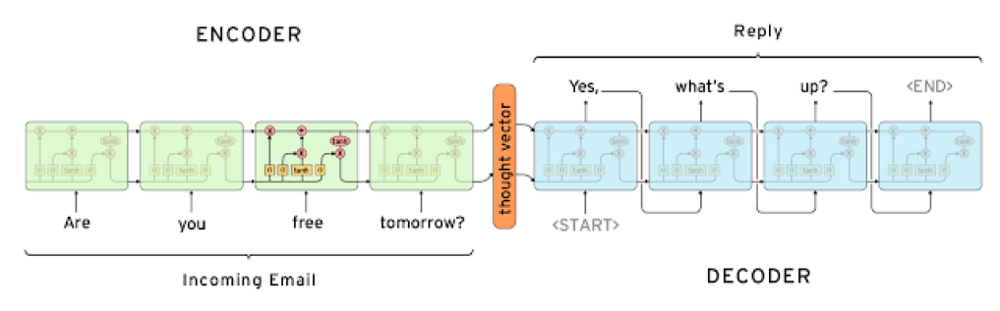
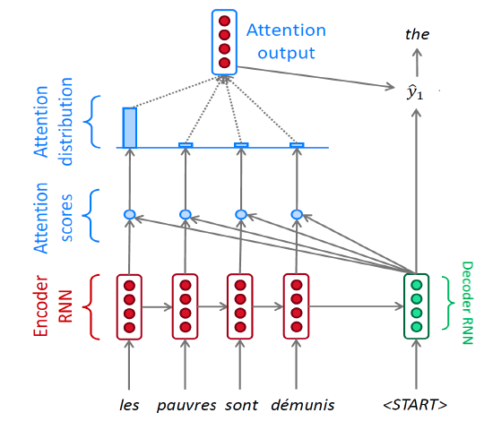
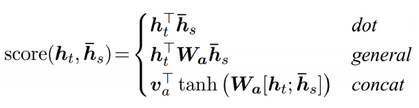
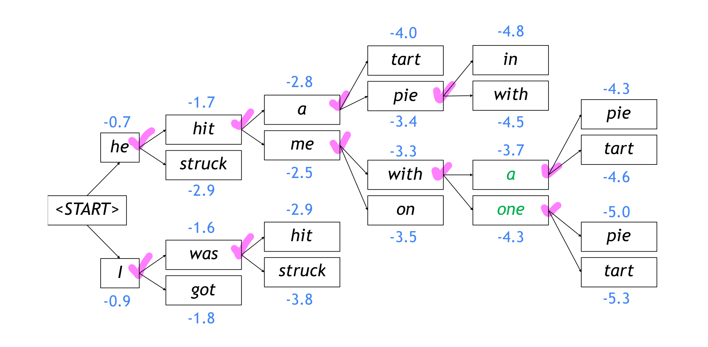
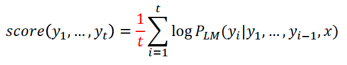
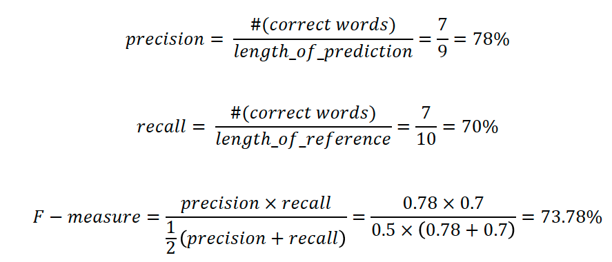
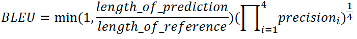

# 학습정리

- Seq2seq with Attention
- Beam search
- BLEU score

## Seq2seq with Attention

**seq2seq model**

2개의 RNN 모델(LSTM)을 encoder decoder로 사용한다.

encoder를 통과한 마지막 hidden state가 Decoder의 처음 hidden state로 들어가 다음 단어를 예측하는 구조

encoder의 모든 단어 vector에 대한 정보가 마지막 hidden state vector로 표현 되기 때문에 **길이가 긴 문장을 다루는대 있어서 문제가 발생** => **attention 개념 도입**

​            

**Attention**

Seq2seq구조의 문제를 해결하기 위하여 마지막 hidden state vector만을 사용하는 것이 아니라 encoder의 각 hidden state를 모두 고려

- encoder의 각 time step별 hidden state를 decoder 현제 시점의 hidden state와의 내적을 통하여 현 time step의decoder hidden state와 encoder의 hidden state들의 유사도를 구한다.

  => 이러한 유사도가 **Attention scores**

- 구해진 Attention score들을 softmax층을 통과시켜 확률분포로 나타낸다.

  => 이러한 확률 분포가 **Attention distribution**

- 각 Attention distribution과 맞는 Encoder의 hidden state들을 곱하여 현 시점의 Decoder의 hidden state과의 관계를 고려한 가중평균을 구한다.

  =>이러한 가중평균이 **Attention output**

- Attention output과 Decoder의 hidden state를 concat하여 output layer의 입력으로 사용하여 다음 출력 값을 예측한다.

- 위와 같은 구조를 decoder가 마지막 단어를 예측할 때 까지 반복

​          

**Attention 구조의 장점**

이러한 attention 구조는 encoder의 각 부분에 집중하기 때문에 기계 번역 분야에서 좋은 성능을 보인다.

일반적인 seq2seq가 가지고 있었던 긴 문장에 대한 문제점을 해결

Gradient Vanishing문제에도 도움이 된다.

decoder에서 나온 단어가 어떤 단어에 영향을 많이 받았는지(집중 했는지) 알 수 있다.

​            

**Teacher forcing**

학습단계에서 decoder가 잘못된 결과를 예측했다면 그다음 입력단어가 다음input으로 들어가는 상황이 발생하게 되어 학습이 느려진다.

이를 보안하기 위하여 학습단계에서는 다음 input으로 decoder가 잘못 예측 했다 하더라도 예측한 결과가 아닌 정답 input을 넣어주어 학습속도를 향상 시킬 수 있다. 

하지만 실제 사용과는 거리가 있는 방법이기에 모든 학습에서 사용하기 보다는 학습 초기에만 사용하는 방법을 이용한다.

​       

**Different Attention Mechanisms**

Attention score를 구하는 방법을 달리하여 계산 할 수 있다. 

ex) Luong attention, Bahdanau attention

위와 같이 학습가능한 행렬을 통과 시켜주는 방법 (General),

encoder와 decoder의 hidden state를 concat시켜 NN에 통과하는 방법으로 스칼라 값을 얻는 방법(concat)등이 있다.

​             

## Beam search

**Greedy decoding**

decoding 단계에서 현재 time step에서 가장 좋아 보이는 단어를 1개만 선택하는 형태

=> 잘못된 단어를 선택 했을 때 다른 대안이 없어 돌아가지 못한다는 단점이 있다.

​          

**Exhaustive search**

모든 가능성을 따지는 방법으로 모든 가능한 단어들을 탐색하는 방법이다.

=> 가장 좋은 문장을 찾을 수는 있겠지만 모든 가능성을 탐색하는 방법이기에 너무 많은 시간이 소비된다.

​        

**Beam search**

차선책으로 Greedy방법과 Exhaustive 방법의 중간지점이다.

매 time step마다 **정해진 K개의 경우의 수만 고려하는 방법** (K는 주로 5 ~ 10 사이의 값을 사용한다.)

각 hypothesis는 곱셈으로 연결되는 대신 log를 취한 덧셈으로 계산하다. (**log probability**)

먼저 완료된 hypotheses가 있다면 저장

=> **Exhaustive처럼 최적의 해를 보장해주지는 못하지만 훨씬 효율적인 방법**

ex) Beam size : K=2 예제

**Beam search 를 종료하는 조건**

- 지정한 time step에 도달 하였을 때
- 지정한 n개의 hypotheses가 끝났을 때

​           

**Beam search 평가 방법**

길이가 긴 문장은 지속적으로 음수가 더해지는 문제가 발생

=> 길이에 대하여 Nomalize 하여 해결

​          

## BELU score

완료된 모델을 평가하는 방법

**F-measure**

**Precision 과 recall의 조화평균**

=> **흐름을 고려하지 못한다는 단점이 있다.**

ex) 정답문장과 단어들만 같고 순서가 다른문장의 F-measure의 값은 100%

​            

**BLEU**

**N-gram overlap** 을 사용하여 연속하는 단어가 겹치는지를 이용하여 score를 계산한다.

각 **N-gram size마다 precision**을 구하여 **기하평균을 구한다.**

Brevity penalty를 사용하여 정답 문장보다 짧을경우 문장길이 비율에 따라 페널티를 부여한다.

ex) 1 ~4 까지의 길이를 사용할경우

​           

​              

# 피어세션

- ppt 37 페이지
  - 4 - gram : 4/6 가 맞는가? => 1/6으로 변경
  - 변경된 BLEU : 33%
- 2월 16일자 과제 2번제 문제에서 들어갈 값?
- RNN구조가 층으로 쌓여 있을때 weight를 어떻게 공유하는가?
  - 다른 layer들도 서로 공유를 하는가?, 같은 layer끼리만 공유하는가?
- 문자열을 효율적으로 concat하는 방법
  - https://www.notion.so/2021-02-17-_-4b1db6a9755c4aeb8e28929f129c0f20

# 과제 진행 상황

pytorch library 중 하나인 fairseq을 이용해 번역 모델을 학습하는 과제였다.

처음 사용해 보는 라이브러리라 사용법을 찾아보고 각 파라미터의 의미를 찾아보며 과제를 진행하였다.

 목표했던 BLEU score는 큰 어려움 없이 달성하였다.

