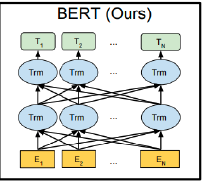
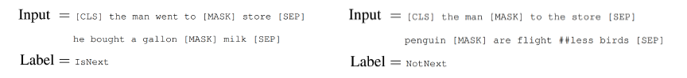
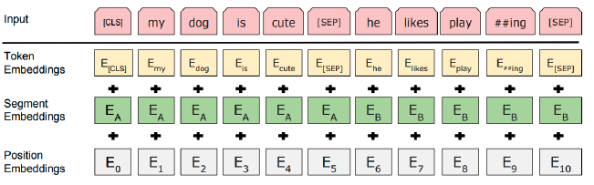
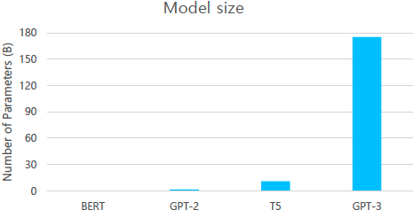
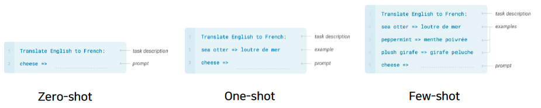
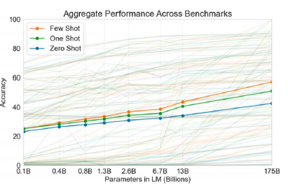
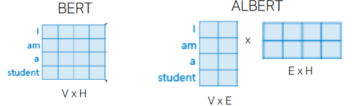
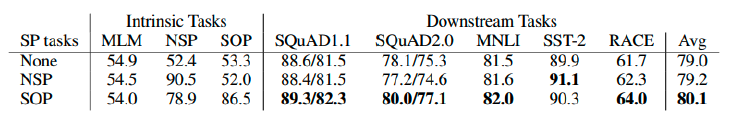
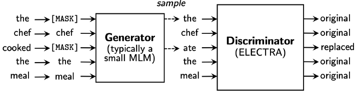

# 학습정리

- Self-Supervised pre-Training Models
- Advanced Self-Supervised pre-Training Models

​           

## Self-Supervised pre-Training Models

### GPT-1

- OpenAI에서 개발한 모델
- Transformer와 유사한 구조를 사용

- **다음 단어를 예측하는 방식으로 학습** => 따로 레이블이 필요가 없기 때문에 많은 데이터를 사용하여 학습가능

  사진

- 이미 학습된 모델의 output layer를 원하는 방식으로 변경하여 transfer learning으로 사용한다.

  => 새로운 output layer 학습 시키는 lr은 상대적으로 높은값을 사용하고 이미 학습된 transformer 모델 부분의 lr은 낮게 사용

​          

### BERT

현재 pretrained model로 많이 사용

자연어에서는 단순히 이전문맥만 혹은 이후 문맥만 확인 하는것이 아니라 **양쪽의 문맥을 확인한다**.

=> BERT에서는 이를 해결하기위하여 input 데이터의 일부분을 Mask를 사용하여 Mask **앞뒤 모든 부분을 고려하는 방식으로 학습**

- 전체 input에서 15%정도를 예측해야하는 단어로 설정
- 예측해야하는 단어중 80%정도의 단어는 Mask를 사용
  - 예측해야하는 모든 단어를 Mask로 변환시키게 된다면 Mask라는 Token에 익숙해진 모델이 되기 때문에 실제 입력문장과 다른 특성을 보일 수 있기 때문
- 예측해아하는 단어중 10%정도는 random한 단어로 변경
- 예측해야하는 단어중 10%정도는 원래단어를 그대로 사용

​        

**문장 level의 tesk를 위하여 Next Sentence Prediction**

- [CLS] : 다수 문장의 시작을 알리는 토큰 (classification embedding), 	[SEP] : 비교하고자하는 문장을 분리하는 토큰
- 문장이 서로 연속적인지 아닌지 2진분류

​            

**Learning Positional encoding**

transfomer와 같이 positional encoding을 바로 사용하는 것이 아니라 학습을 시켜 사용

​          

**Segment Embedding**

각 단어별 position 뿐만아니라 여러 문장단위의 position을 더한다.

​        

​           

## Advanced Self-Supervised pre-Training Models

### GPT-2

GPT-1의 모델의 구조를 거의 비슷하게 사용

=> 단순히 layer수를 늘려서 사용한다.

input data의 수를 늘려서 사용 (40GB)

Zero-shot-setting으로 수행가능

​        

**Natural Language Decathlon : Multitask Learning as Question Answering**

모든 종류의 자연어 관련 task는 질의응답 형식으로 변환이 가능하다

​        

**Dataset**

웹 커뮤니티 사이트(Reddit)에서 crawling을 통하여 데이터를 얻음

- 사람들에 의해서 정해진 외부 link를 이용하여 가져온다.
- 좋아요 수 (3 이상)를  기준으로 기준 이상인 글들을 가져온다.

Byte pair encoding(BPE)를 통하여 전처리 사용

​       

### GPT3

GPT2에 비하여 파라미터수를 엄청나게 늘렸다.(175bilion)

96개의 attention layer와 3.2M개의 batch size를 사용

​       

**Few-shot Leaners**

- Zero shot : example없이 예측하고자하는 자연어만 가지고 예측
- One-shot : 1개의 example이 주어진다. 
- Few-shot : 몇개의 example이 주어진다.

layer가 깊어질수록 Acc의 증가폭이 Few shot이 가장 가파르게 나타난다.

​       

### ALBERT

**Large model의 문제점**

- 많은 메모리를 필요로 한다.

- 많은 training 시간을 요구한다.

  ​     

**Solution**

- Factorized Embedding Parameterization

  - Embedding layer의 dim를 줄이는 방법으로 파라미터 수를 줄인다.

  - 줄인 차원을 원래 차원으로 돌리는 연산을 수행

  - CNN의 1*1 convolution 연산과 유사

    

- Cross-layer Parameter sharing

  - 서로 다른 self attention block 파라미터들을 공통으로 사용
  - Shared-FFN : feed forword network 파라미터만 공통으로 사용
  - Shared-attention : attention 파라미터만 공통으로 사용
  - All-shared : FFN, attention 파라미터들을 모두 공통으로 사용

- Sentence Order Prediction'

  - 다음문장인지 아닌지 판별하는 일은 BERT에게 쉬워서 큰 도움이 되지 않는다.

  - 연속된 두 문장인지 아닌지를 판별하는 일이 아니라 연속된 2문장의 순서를 예측하는 모델로 변경

    => 논리적인 판단이 필요하기 때문

    

    SOP가 전반적으로 더 높은 성능을 보인다.

​        

​            

### ELECTRA

Generator와 Discriminator 2개의 모델을 가지고 사용

**Generator** : Bert모델과 같이 예측해야하는 단어들을 예측한 문장을 생성하는 모델

**Discirminator** : Generator가 예측한 문장들에서 각 단어들이 예측한 단어인지 아닌지 판단하는 모델

=> Pre trained 모델로 사용할 때는 **Discirminator**를 사용한다

​                    

### 경량화 모델

**DistillBERT**

- **큰 size의 layer(teacher)**가 예측한 확률 분포를 정답 layer로 하는 작은 사이즈의 모델
- teacher 모델의 확률 분포를 ground trues로 사용, 큰 size의 모델을 잘 묘사할 수 있도록 학습

**TinyBERT**

- 최종 확률 분포뿐만 아니라 각 파라미터, 중간 결과 값도 비슷해지도록 학습
- layer의 차원이 다를 수 있으므로 차원을 축소해주는 layer도 같이 학습