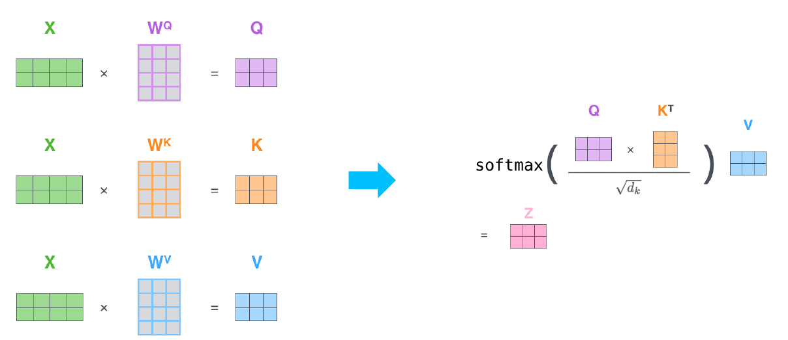
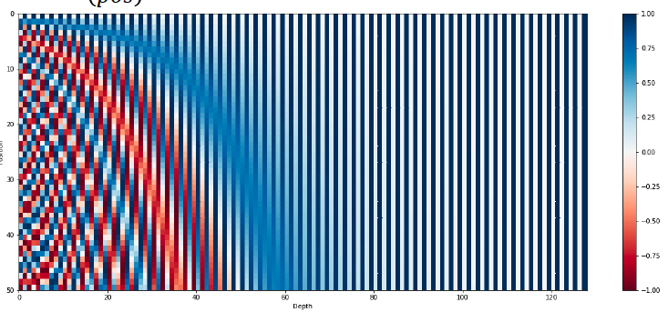

# 학습정리

- transformer

​         

## transformer

RNN 모델을 사용하지 않고 Attention 구조를 활용한 encoder decoder를 통하여 작동

**self attention**

- 각 단어의 embedding vector를 Query, Key, Value로 나타낸다.

    Query, Key, Value로 나타내기 위하여 각각의 layer를 통과시켜 값을 얻는다. 

- Query, Key, Value를 얻었으면 attention 값을 얻고자하는 단어의 Query Vector와 모든 단어들의 Key vector들을 내적하여 **유사도(attention value)**를 얻고 이 값을 softmax layer에 통과 시켜 **확률 분포attention distribution**을 얻는다.

- 얻어진 확률 분포와 문장내 모든 단어들의 Value vector를 곱하여 **가중평균(attention output)**을 얻는다.

위의 과정을 통하여 encoder에 들어가는 문장의 각 단어들의 embedding vector들이  **self attention을 통하여 문장 안에서의 다른 단어들과의 관계를 포함하는 h로 표현된다.**

​           

gpu를 효율적으로 사용하기위하여 행렬의 형태로 만들어 한번에 계산

softmax에서 Query,Key vector의 차원수로 나누어 준다. (Scaled Dot Product Attention)

**Query와 Key의 차원수에 따라 Query와 Key를 내적한 값의 분산이 달라진다.**

=> softmax의 분포가 달라지게되어 문제가 발생한다.

=> 차원의 1/2승을 나누어 주는 방식으로 분산을 일정하게 유지시켜준다.

​          

**Multi-Head Attention**

Single attention의 문제점 => 다른 단어와 상호 작용하는 방향이 1개이다.

=> Multi-Head Attention 으로 해결가능

 각 단어가 1개의 Query, Key, Value에 mapping 되는 것이 아니라 여러개의 **서로 다른 Query, Key, Value를 이용하여 여러개의 Attention output을 얻는 방법**

얻어진 여러개의 Attention output을 concat하고 concat된 vector를 layer를 통과시켜 차원을 변경해준다**(입력 vector와 같은 차원)**

​           

​             

**Positional Encoding**

Attention 모델의 문제점은 순서가 바뀌어도 똑같은 결과가 나온다는 점이다. 즉 sequence를 고려하지 못하는 문제

=> **이를 해결하기 위하여 Positional Encoding이라는 값을 입력 벡터에 더해 주어 위치값을 가지게 한다.**

문장에서의 단어의 위치, 각 단어를 나타내는 embedding vector에서의 차원에 따라 다른값을 더해주어 문제를 해결한다.

​            

​         

**Encoder**

- Positional encoding을 더한 입력 벡터가 들어오면 Multi head attention을 통과시킨다.

- Add

  - 입력 vector를 Multi-head Attention을 통과시켜 얻은 output vector와 입력 Vector를 concat (Residual connection)
  - 이를 위하여 Multi-head Attention의 output vector의 차원은 input vector와의 차원과 같아야한다.

- Norm

  - 각각의 word vector를 평균이 0이고 분산이 1이 되도록 normalize한다.

  - 각 sequence vector를 차원별로 affine transform

    

- Feed forward  layer(NN)를 통과 시키고 Add와 Norm 과정을 다시 거친다. 

​          

​           

**Masked Self attention**

decoder에서의 self attention으로 decoder에서는 단어를 예측할 때 그 이후에 나오는 단어에 영향을 받으면 안된다.

=>**이후에 나오는 정보들을 차단 (Masked Self attention)**

- 이후에 나오는 단어들의 확률 값을 0으로 변경해준다.

  

- 확률의 합이 1이되도록 다시 scale 해준다.

​          

​                                         

**Decoder**

- decoder의 이전 출력을 입력으로 받아 positional encoding을 더해주어 입력으로 사용한다. (seq2seq모델과 마찬가지로 첫 input으로는 SOS 토큰이 들어온다.)
- 입력을 Masked Multi-Head Attention에 통과시켜 얻은 결과를 encoder와 같이 Add와 Norm을 거쳐 **attention output을 얻는다.**  (Seq2seq 모델에서의 decoder hidden state 역할)
- **encoder에서의 output을 Key와 Value**로, 이전 단계에서 얻은 **decoder의 output을  Query**로 사용하여 Multi head attention 연산을 수행한다. (Seq2seq 모델에서의 attention)
- Feed forward  layer(NN)를 통과 시키고 Add와 Norm 과정을 다시 거친다.
- Linear층을 통과 시켜 vocab size와 동일한 차원으로 만들어주고 얻은 값을 softmax연산을 통하여 확률 분포로 표현하여 다음 단어를 예측

​       

# 피어세션

- RNN 레이어가 여러층일 때 어떻게 동작하는가?
  - https://www.edwith.org/bcaitech1/forum/50315
- Pdf 8쪽 
  - self attention에서는 Query크기와 Key의 크기가 같아야하지 않을까?
- Transformer의 decoder의 train과 test의 진행 과정이 어떻게 될까?
- Byte Pair Encoding
  - https://wikidocs.net/22592

# 과제 진행 상황

바이트 페어 인코딩을 구현 해보는 과제 였는데 일부분을 채워 구현하는 과제였다

바이트 페어 인코딩이 무엇인지 모르는 상태였기에 새로 찾아보고 구현하는데 어려움이 있었다.

이전과제들보다 어렵게 느껴지는 과제였다.

