# 학습정리

- 그래프란 무엇이고 왜 중요할까?
- 그래프 관련 인공지능 문제
- 그래프 관련 필수 기초 개념
- 그래프의 표현 및 저장
- 실제 그래프 vs 랜덤 그래프
- 작은 세상 효과
- 연결성의 두터운 꼬리 분포
- 거대 연결 요소
- 군집 구조

​           

## 그래프란 무엇이고 왜 중요할까?

**그래프** (Network)

- **정점 집합**(Node)과 **간선 집합**(Edge, Link)으로 이루어진 수학적 구조
- 하나의 간선은 두 개의 정점을 연결
- 모든 정점쌍이 간선으로 연결되는 것은 X
- **G(그래프)** = (**V(정점)**, **E(간선)**)

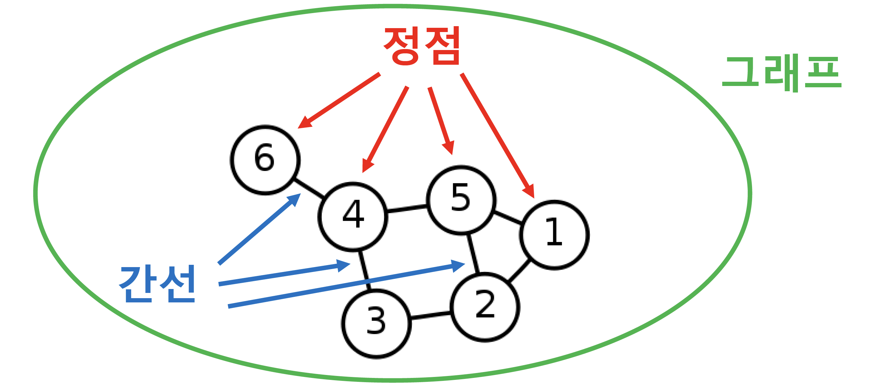

**복잡계**

구성 요소간의 **복잡한 상호 작용**

ex) 사회 : 70억인구로 구성된 복잡계

​                       

**복잡계를 표현하는 방법**

=> Graph : 복잡계를 표현하고 분석하기 위한 언어,  상호작용 표현하기 위한 수단으로 널리 사용되고 있다.

=> Graph를 **복잡계가 등장하는 많은 분야**에 활용 	ex) 전산학, 물리학, 생물학, 화학, 사회과학

​            

## **그래프 관련 인공지능 문제**

- **정점 분류 문제**
  - 트위터에서의 공유(retweet) 관계를 분석하여 각 사용자의 정치적 성향 예측
  - 단백질의 상호작용을 분석하여 단백질의 역할 예측 

- **연결 예측 문제**
  - 페이스북 소셜 네트워크 진화 방향 예측

- **추천(Recommendation) 문제**
  - 사용자에게 필요한 물건 예측
  - 구매후 만족도 예측

- **군집 분석(Community Detection) 문제**
  - 연결 관계로 부터 사회적 무리를 예측
- **랭킹 및 정보 검색 문제**
  - Web이라는 그래프에서 원하는 정보, 중요한 정보를 예측
- **정보 전파, 바이럴 마케팅 문제**
  - 정보는 네트워크를 통해 어떻게 전달?
  - 정보 전달의 최대화

​          

## 그래프 관련 필수 기초 개념

**방향** 

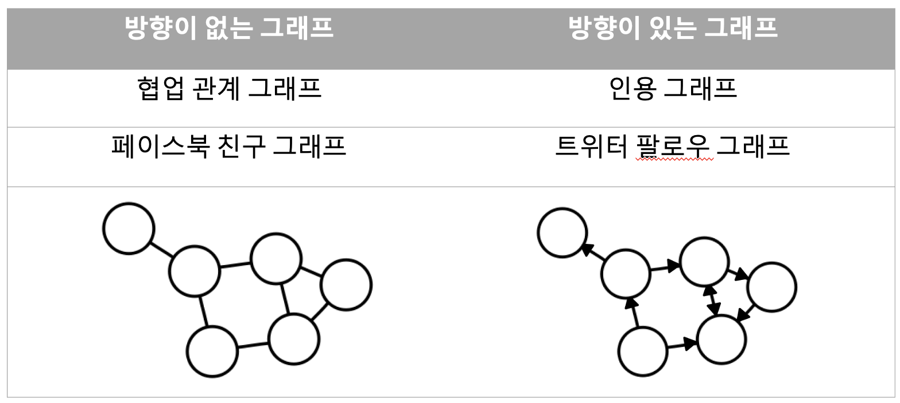

​          

**가중치**

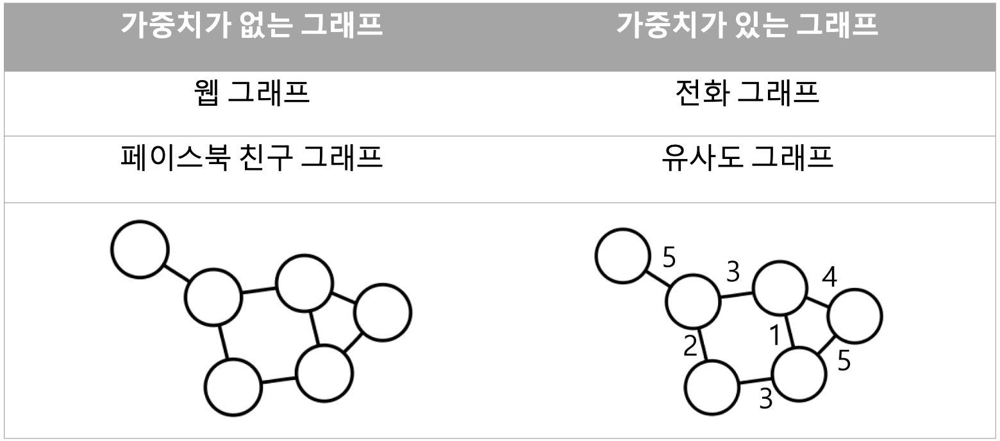

​       

**노드 종류**

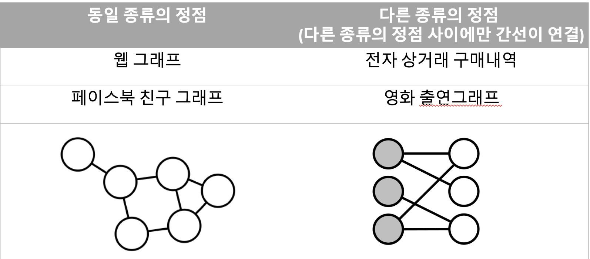

Ex) 

        	 **방향성이 없고 가중치가 있는 이종 그래프**

​             

**Neighbor** 

한 정점에서 그 정점과 연결된 다른 정점들을 의미

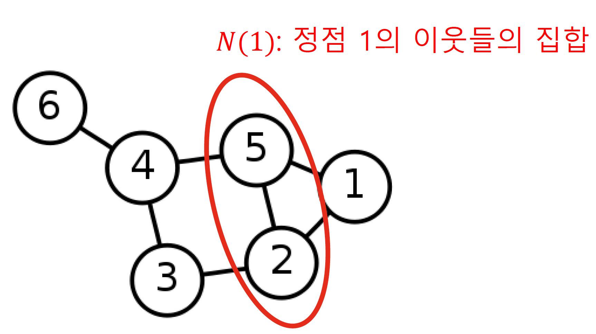

방향성이 있는 graph에서는 나가는 이웃과 들어오는 이웃을 따로 저장

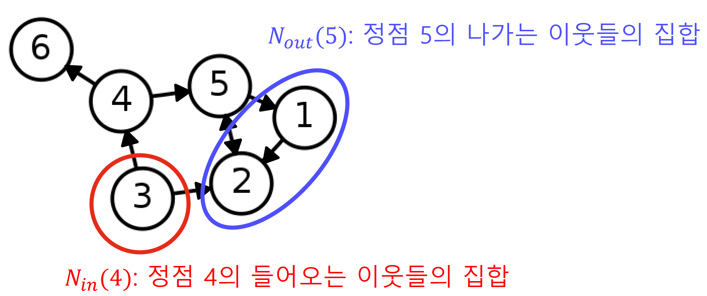

​             

​               

## 그래프의 표현 및 저장

**간선 리스트**

- 그래프를 간선들의 리스트로 저장

- 각 간선들을 해당 간선들이 연결하는 두 정점의 순서쌍으로 연결
- 방향성이 있을경우 (출발점, 도착점) 순서로 저장
- 그래프를 단순하게 표현 할 수 있으나 비 효율적

​         

**인접 리스트**

- 각 정점의 이웃들을(간선으로 이어져 있는 node)를 리스트로 저장
- 방향성이 있을경우 2개의 리스트(out, in)로 각각 저장

​        

**인접 행렬**

- 정점 i와 정점 j가 서로 연결 되어있는경우 행렬에서의 i행, j열의 원소가 1

  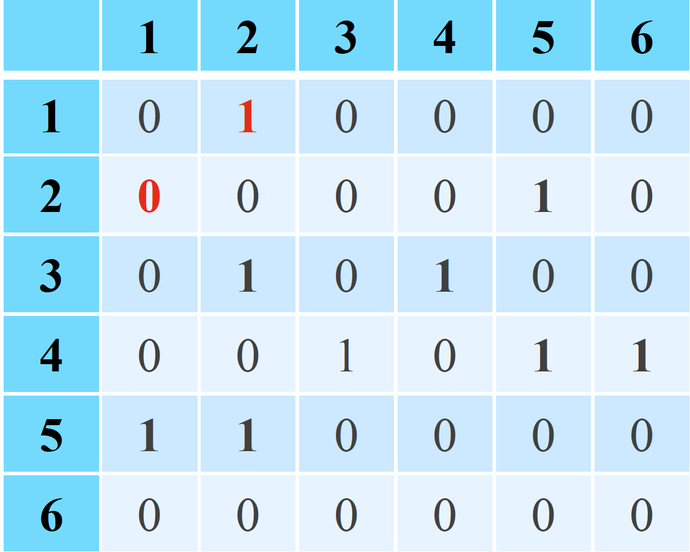

- 가중치가 있는 그래프일 경우 1이 아닌 가중치값을 가지는 행렬

​       

## 실제 그래프 vs 랜덤 그래프

**실제 그래프**

- 다양한 복잡계로 부터 얻어진 그래프
- 소셜 네트워크, 전자상거래, 구매 내역, 인터넷 그래프 ... 등

**랜덤 그래프**

- 확률적 과정을 통하여 생성한 그래프
- 에르되스와 레니가 제안한 랜덤 그래프 모델 G(n, p)
  - 임의의 두 정점 사이에 간선이 존재하는지 여부는 동일한 확률 분포에 의해 결정
  - n개의 정점을 가진다.
  - 임의의 두 개의 정점 사이에 간선이 존재할 확률 : p
  - 정점간의 연결은 독립적

​        

## 작은 세상 효과

**경로**

- (u,v)의 경로는 u에서 시작하여 v에서 끝나야한다.
- 경로에서 연속된 정점은 서로 간선으로 연결 되어 있어야 한다

**거리**

- u와 v사이의 거리는 u와 v사이의 최단 경로의 길이

**지름**

- 정점간 거리의 최대값

​              

**실제 그래프에서 임의의 2 정점 사이의 거리는 멀지 않다** => **작은 세상 효과**

Ex) msn 메신저 그래프에서 정점 간의 평균 거리는 7

이러한 작은 세상 효과는 렌덤 그래프 에서도 존재!

=> 하지만 모든 그래프에서 존재하는 것은 아니다.

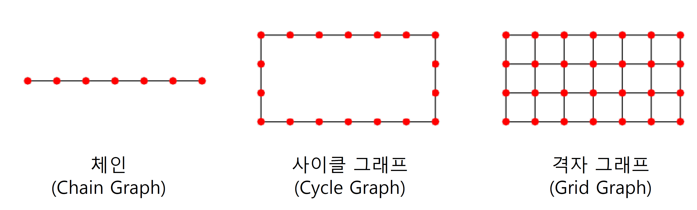

**위와 같은 형태의 그래프에서는 작은 세상효과가 존재하지 X**

=> 서로간의 거리가 먼 정점들이 존재하고 그래프의 크기가 커질 수록 그 거리는 멀어진다.

​           

## 연결성의 두터운 꼬리 분포

**연결성**

정점의 연결성은 해당 정점과 연결된 간선의 수를 의미한다.

=> 해당 정점의 이웃들의 수

방향성이 있는 graph에서의 연결성은 2가지로 나눈다.

- 나가는 연결성 : 해당 정점에서 나가는 간선의 수
- 들어오는 연결성  : 해당 정점으로 들어오는 간선의 수

​           

**실제 그래프의 연결성 분포는 두터운 꼬리를 가진다.**

=> 연결성이 매우 높은 Hub 정점이 존재함을 의미한다.

ex) 유명연예인의 sns계정을 매우 높은 연결성을 가진다.

​        

**랜덤 그래프의 연결성 분포는 높은 확률로 정규분포와 유사하다.**

연결성의 매우 높은 Hub 정점이 존재할 가능성 0에 가깝다.

​          

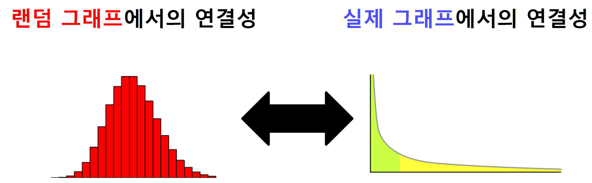

​             

## 거대 연결 요소

**연결 요소**

- 연결 요소에 속하는 정점들은 경로로 연결 가능
- 다른 정점을 추가할 수 없다 => **연결가능한 모든 정점들이 들어가 있어야 한다.**

​        

**실제 그래프에는 거대 연결 요소가 존재**

=> 대부분의 **정점이 하나의 연결요소에 모여있는것을 의미**

Ex) MSN 메신저 그래프는 99.9%의 정점의 하나의 거대 연결요소에 포함

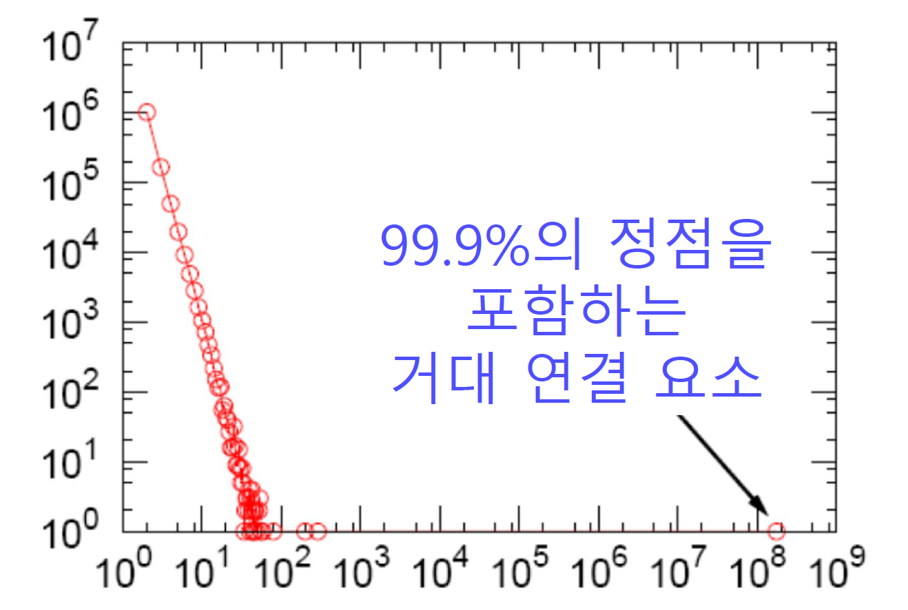

**랜덤 그래프에도 높은 확률로 거대 연결 요소가 존재** ( 단 평균 연결성이 1보다 충분히 커야한다.)

​        

## 군집 구조

**군집**

ㅇ

- 집합에 속하는 정점 사이에는 많은 간선들이 존재

- 집합에 속하는 정점과 그렇지 않은 정점 사이에는 적은 수의 간선이 존재

  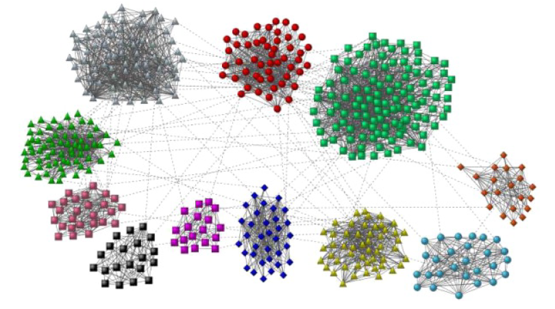

  ​         

**지역적 군집 계수 (Local Clustering Coefficient)** 

=> **한 정점에서의 군집 형성 정도**

정점 i의 이웃 쌍중 간선으로 직접 연결된 것의 비율을 의미

해당 정점의 지역적 군집 계수가 높으면 **정점의 이웃들도 높은 확률로 서로 연결되 있다는 것을 의미**

=> **정점i와 이웃들은 높은 확률로 군집을 형성**

​             

예제) 

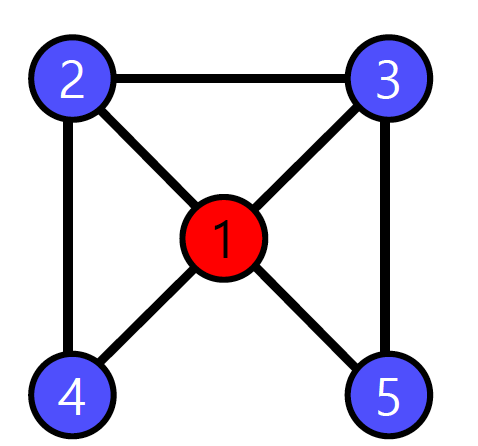

위의 그래프에서 정점 1의 이웃은 (2, 3, 4, 5)

=> 이웃 쌍 : (2, 3), (2, 4), (2, 5), (3, 4), (3, 5), (4, 5) => **6개**

이웃 쌍중 연결 되어 있는 쌍 : (2, 3), (2, 4), (3, 5) =>**3개**

**정점 1의 지역적 군집 계수** : 3/6

​        

**이웃이 없는 즉 연결성이 0인 정점에서는 지역적 군집 계수가 정의되지 X**

​          

**전역 군집 계수 (Global Clustering Coefficient)**

=>전체 그래프에서의 군집 형성 정도를 측정

**각 정점에서의 지역적 군집 계수를 평균낸 값** (연결성이 없는 정점은 제외)

​        

**실제 그래프**에서는 군집 계수가 높다 => 많은 군집이 존재

**랜덤 그래프**에서는 군집 계수가 높지 않다.

​       

**실제 그래프에서만 군집 계수가 높은이유**

- 동질성 : 유사한 정점끼리 간선으로 연결될 가능성이 높다.
  - 같은 동네에 사는 같은 나이의 아이들이 친구로 연결되는 경우
- 전이성 : 공통 이웃이 있는경우 공통이웃이 **매개 역할**을 하여 연결될 가능성이 높다.
  - 친구를 서로에게 소개해주는 경우

## 피어세션

- set
  - remove : 삭제하고자 하는 값이 없으면 에러 발생
  - discard : 삭제 하고자 하는 값이 없어도 정상종료, **존재하지 않음을 보장**
- 앙상블 코드 리뷰
- 희소 행렬의 표현 방식과 간선 리스트와의 차이
- 다익스트라 최단경로 알고리즘

​          

# 과제 진행 상황

오늘 강의에서 배웠던 내용인 인접 리스트 방식과 인접 행렬 방식으로 그래프를 표현하고 표현된 그래프의 node와 edge를 삭제 추가하는 연산을 구현해 보는 과제였다.

인접 리스트 방식은 딕셔너리로 인접 행렬방식은 numpy로 구현하였다. 구현 이후 조원 분의 팁 으로 remove대신 discard라이브러리를 사용하여 구현하였다.

