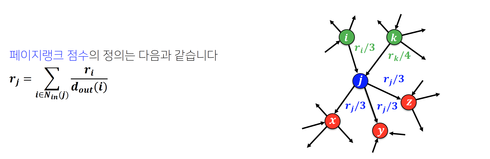
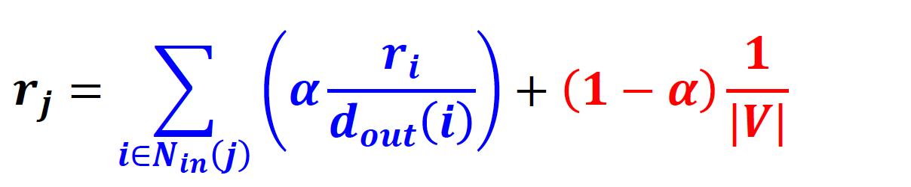
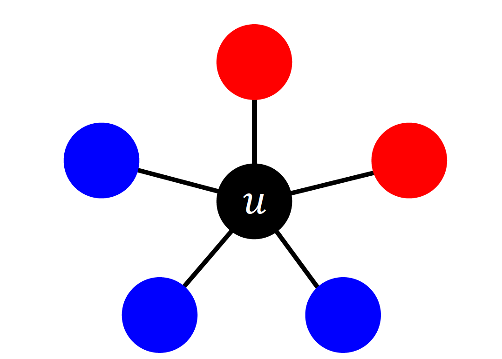
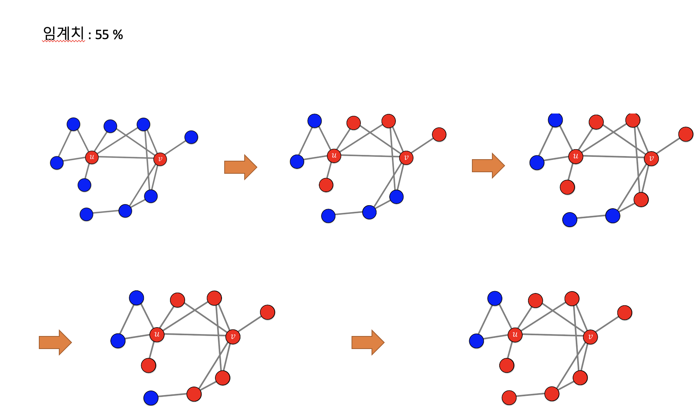
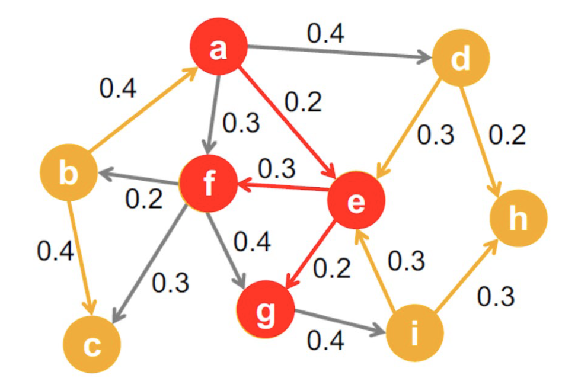

# 학습정리

- 페이지랭크
- 의사결정 기반의 전파 모형
- 확률적 전파 모형
- 바이럴 마케팅과 전파 최대화 문제

## 페이지 랭크

**웹**

웹페이지와 하이퍼링크로 구성된 **거대한 방향성이 있는 그래프**

**정점** : 웹 페이지

**하이퍼링크** : 웹페이지에서 나가는 간선

**키워드 정보** : 웹페이지가 포함하고 있는 정보

​            

### 첫 번째 시도

웹을 거대한 디렉토리로 정리
**문제점**

- 웹페이지 수가 증가함에 따라 카테고리의 수와 깊이도 계속해서 커진다.
- 현재는 수십 수백억 개의 웹페이지가 존재
- 카테고리 구분이 모호한 경우 문제 발생

​         

### 두 번째 시도

키워드에 의존한 검색앤진

**문제점**

- 악의적인 웹페이지에 취약하다.
- 특정 키워드를 여러번 포함시켜 악성 웹페이지에 여러번 포함시켜 해당 키워드가 검색 되었을 때 악성 웹페이지가 결과로 나올 수 있다.

=> **페이지 랭크** :  사용자 키워드와 관련성이 높고 신뢰할 수 있는 웹페이지를 찾을 수 있는 방법

​            

### 페이지 랭크

투표를 통하여 키워드와 관련성이 높고 신뢰 할 수 있는 웹페이지를 찾는다.

웹페이지 작성자가 다른 웹 페이지의 하이퍼 링크를 포함

=> 작성자가 **하이퍼 링크의 웹페이지는 안전 하다고 판단.**

=> **하이퍼 링크**를 통하여 투표 (다른 많은 웹페이지에서 해당 웹주소의 하이퍼 링크를 사용했다면 신뢰도가 높다.)

​         

하지만 단순히 다른 웹페이지의 하이퍼링크 인용 수를 count 하는 것으로는 **악용의 소지가 있다.**

ex) 여러개의 웹 사이트를 통하여 신뢰도가 높아 보이도록 조작 

​         

**가중투표**

- 관련성이 높고 신뢰할 수 있는 웹 사이트의 투표를 더 중요하게 간주

- 반대로 관련성이 상대적으로 낮고 신뢰할 수 없는 사이트의 투표는 덜 중요하게 간주

- (자신의 페이지랭크 점수 / 나가는 이웃의 수) 만큼의 가중치로 투표

  

- 재귀적으로 계산, 페이지랭크값이 수렴 할 때 까지 반복

페이지 링크는 가중투표 방식을 이용하여 악용의 소지를 방지한다.

​           

**페이지 랭크의 계산**

- 각 웹 페이지 i의 페이지랭크 점수를 동일하게 초기화 (1/웹페이지 수)

- 아래 식을 이용하여 웹 페이지의 페이지랭크 점수를 갱신 

  (하이퍼링크를 통하여 이동할 확률 + **순간이동을 통하여 이동할 확률**)

  

  

  단순히 해당 웹페이지에 있는 링크들로만 계산한다면 **아래와 같은 문제가 발생할 수 있다.**

  - 반복곱이 항상 수렴하는 것은 아니다.
  - 반곱곱이 항상 합리적인 점수로 수렴하는 것을 보장할 수 없다.

  아래와 같은 **방법**으로 해결

  - 현재 웹페이지에 하이퍼링크가 없다면 임의의 웹페이지로 순간이동

  - 현재 웹 페이지에 하이퍼링크가 있다다면, 특정 확률로 임의의 웹페이지로 이동

    

- 페이지랭크 점수가 수렴하였으면 종료 아닌경우 다시 페이지랭크점수를 계산

​        

​          

## 의사결정 기반의 전파 모형

**자신이 원하는대로 결정**

ex) 카카오톡 vs 라인 어떤것을 사용?

**주변 사람들의 의사결정이 본인의 의사결정에 영향을 미친다.**

ex) 주변에 대부분이 카카오톡을 사용한다면 라인을 이용하는것이 불편하다.  => 카카오톡 사용

=> **주변 사람들의 의사결정을 고려하여 본인의 의사결정을 내리는 경우에 의사결정 기반의 전파 모형을 사용**

​         

**선형 임계치 모형 (Linear Threshold Model)**

가장 간단한 형태의 의사결정 기반 전파모델

**예시)**

u의 이웃중 빨간색을 선택한 비율 **p**, 빨간색을 선택 했을 때 이득 **a**

u의 이웃중 파란색을 선택한 비율 **1-p**, 파란색을 선택 했을 때 이득 **b**

- 위의 예시에서 u의 이웃이 빨간색을 선택할 경우  **p*a**
- 위의 예시에서 u가 파란색을 선택할 경우 **(1-p)*b**

=> a를 선택하기 위해서는 **p*a > (1 - p) * b**를 만족하여야 한다.

=> 해당식을 정리하면 **p > b / (a + b)** 이때  **b / (a + b)** 값을 **임계치라고 한다.**

​           

**ex)**

​         

​         

## 확률적 전파 모형

**자신의 의사로 결정하는 모형이 아니라 확률적 과정을 통하여 전파될 때 사용**

ex) 코로나 바이러스 전파

​         

**독립 전파 모형 (Independent Cascade Model)**

가장 간단한 형태의 확률적 전파 모형

- 간선 (u, v)의 가중치는 u가 감염되었을 때 u가 v를 감염시킬 확률을 의미
- 서로 다른 이웃이 점염되는 확률은 독립적

​        

## 바이럴 마케팅과 전파 최대화 문제

### 바이럴 마케팅

- 소비자들로 하여금 상품에 대한 긍정적인 입소문을 내게 하는 기법
- 소문의 시작점이 중요하다. (**시드 집합**)
- 입소문이 전파되는 범위가 영향을 받기 때문

​        

### 전파 최대화 문제

시작점을 어떻게 선택하여야 하는가?

**그래프, 전파 모형, 시드 집합의 크기가 주어졌을 때 전파를 최대화 하는 시드 집합을 찾는 문제**

V개의 정점, 시드집합의 크기가 k개일 때 경우의 수는 V! / (K! * (V - K!)) 이다.

=> **너무나 많은 경우의 수가 탄생한다. (비용이 너무 많이든다)**

​         

### 정점 중심성 휴리스틱

모든 경우의 수를 탐색하는것이 너무 많은 비용이 발생하기 때문에 정점의 중심성이 높은 순으로 K개를 선택하는 방법

**정점의 중심성**

- 페이지랭크 점수
- 연결 중심성
- 근접 중심성
- 매개 중심성

**합리적인 방법이지만 최고의 시드 집합을 찾는다는 보장은 없다.**

​          

### 탐욕알고리즘

- 탐욕 알고리즘은 시드 집합의 원소를 한번에 1개씩 탐색

- seed집합을 1개씩 정하고 정해진 seed집합과 합쳐서 전파를 최대로하는 원소를 찾아 seed집합에 추가한다..

- seed집합의 수가 목표하는 크기가 되었을 때 중단한다.

​        

독립 전파 모형의 경우에서 탐욕 알고리즘은 정확도가 어느정도 보장된다.

=> **탐욕 알고리즘으로 찾은 시드 집합에 의한 전파의 평균 크기 >= (1 - 1/e) * 최고의 시드집합에 의한 전파의 평균크기**

​        

# 피어세션

- mutable vs immutable
  - https://medium.com/@meghamohan/mutable-and-immutable-side-of-python-c2145cf72747
- vec: DefaultDict[int, float] = defaultdict(float)
  - 타입힌트
- Edge
  - edge를 추가할 때 node도 같이 추가
- Subgraph의 역할
  - 키워드를 포함 한 문서들로 이루어진 graph를 반환하여 관련있는 노드들만 pagerank를 구해줄 수 있도록 한다.

​         

​              

## 과제 진행 상황

이번 과제는 pagerank를 계산하는 알고리즘을 구현해보는 과제였다.

처음에 과제 설명을 제대로 보지 않고 진행하여 psudocode가 주어진줄 몰라 주어진과제 수행에 어려움이 있었으나 이후 주어진 자료들을 사용하여 해결하였다.

주어진 자료들을 잘 확인후 일을 진행하는 습관을 가지자....

