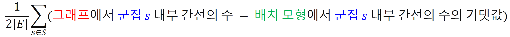
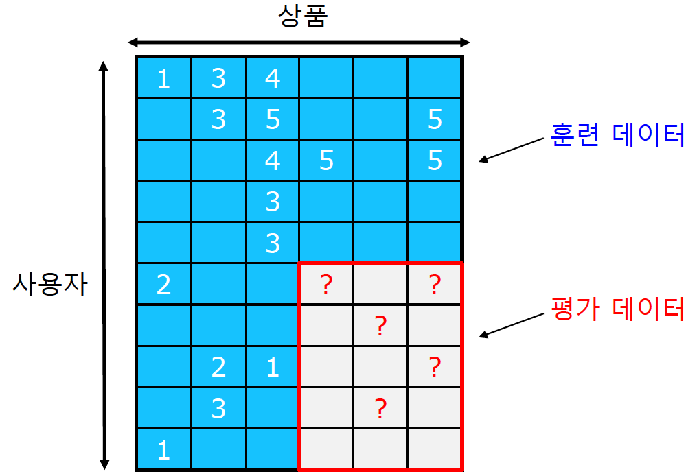

# 학습정리

- 군집구조와 군집 탐색 문제
- 추천시스템

​          

## 군집 구조와 군집 탐색 문제

#### 군집

- 집합에 속하는 정점 사이에는 서로간에 많은 간선이 존재
- 서로 다른 집합에 속해있는 정점 사이에은 상대적으로 적은 간선이 존재
- 수학적으로 엄밀한 정의는 X

​            

#### 실제 그래프에서의 군집

- sns의 군집들은 사회적 무리를 의미하는 경우가 많다
  - 고등학교 군집, 대학교 군집, 동아리 군집 등등...
  - 부정 행위와 관련된 계정들이 군집을 이룬다 (follower 늘리기)
- 키워드 - 광고주 그래프에서는 동일한 주제들의 키워드들이 군집을 이룬다
- 뉴런간의 연결 그래프에서는 뇌의 기능적 구성 단위들 끼리 군집을 이룬다.

​            

#### 군집 탐색 문제

그래프를 여러 군집으로 잘 나누는 문제 (클러스터링 문제와 유사)

​                 

**배치 모형** : 각 정점들의 **연결성을 보존한 상태**에서 간선들을 무작위로 재배치 하여 얻은 그래프

=> 배치 모형에서 두 정점 사이에 **간선이 존재할 확률은 두 정점의 연결성에 비례**

​              

**군집성**    

군집 탐색의 **성공 여부**를 판단하기 위하여 사용,  **군집의 성질(군집 내의 정점들 사이에는 많은 간선이 존재한다.)를 이용**하여 계산

=> 항상 -1 ~ 1사이의 값을 가진다.

군집 내부의 간선수가 클수록 **값이 1에 가까워진다**. => 군집성이 1에 가까워질 수록 군집의 성질을 잘 만족하고 있다.

보통 0.3~0.7 정도의 값을 가질 때, 유의미한 군집을 찾았다고 할 수 있다.

​         

#### 군집 탐색 알고리즘

**Girvan-Newman 알고리즘**

대표적인 하향식(Top-Down) 군집 탐색 알고리즘, 전체 그래프에서 탐색을 시작하여 간선을 순차적으로 제거

=> 다른 군집을 연결하는 **다리 역할의 간선을 삭제**하여 군집을 분리한다.

​             

**매개 중심성**을 이용하여 다리역할의 간선을 찾는다.

**매개 중심성**

- 정점 간의 최단 경로에 놓이는 횟수를 계산
- 정점 간에 최단 경로가 여러개일 경우 최단 경로중에 매개 중심성을 구하고자 하는 edge를 포함하는 비율을 계산

**매개 중심성이 높을수록 다리역할**의 간선이라 판단

**Girvan-Newman 알고리즘**은 매개 중심성이 높은 간선을 순차적으로 제거

=> 제거후 매개중심성을 다시 계산, 간선이 모두 제거 될 때 까지 반복

간선의 제거 정도에 따라 입도가 다른 군집 구조가 나타난다.

간선의 제거 정도는 **군집성**이 최대가 되는 지점을 복구

​                   

**Louvain 알고리즘**

대표적인 상향식 알고리즘, 개별 정점에서 시작하여 점점 큰 군집을 형성

=> 군집성을 기준으로 합쳐나간다.

- 개별 정점으로 구성된 크기 1의 군집으로부터 시작
- 각 정점을 군집성이 최대가 되도록하는 기존 혹은 새로운 군집으로 이동 => 군집성이 증가하지 X 때까지 반복하여 군집을 만든다
- 만들어진 각각의 군집을 한 정점으로 하는 군집 레벨의 그레프를 얻어 다시 새로운 단위의 군집을 만든다.
- 1개의 정점(군집)만이 남을 때 까지 반복

​                   

**중첩이 있는 군집 구조**

Ex) 소셜 네트워크에서 개인은 여러 사회적 역할을 수행 => 1개의 군집에 속한것이 아니라 여러 군집에 속한다.

=>위에서 살펴본 2개의 알고리즘 (Girvan-Newman, Louvain)은 군집간의 중첩이 없다고 가정

​               

**중첩 군집 모형**

중첩이 있는 군집을 찾아내기 위하여 **중첩 군집 모형을 가정**

- 각 정점은 여러 개의 군집에 속할 수 있다.
- 같은 군집에 속해 있는 두 정점이 직접 연결될 확률을 P
- 두 정점이 여러 군집에 동시에 속할 경우 간선 연결 확률은 독립적
  - 1 - (1 - P_a)*(1 - P_b) = > 둘다 아닐 확률을 빼주는 방식
- 서로 어느 군집에도 속하지 않는 두 정점은 아주 낮은 확률로 연결

=> **위의 가정에 따라 각 정점들은 다른 정점으로 연결될 확률을 가진다.**

​             

**그래프 확률**

**그래프 확률 = 아래 확률들의 곱**

- 그래프의 각 간선의 두 정점이 모형에 의해 직접 연결될 확률

- 그래프에서 직접 연결되지 않은 각 정점 쌍이 모형에 의해 직접 연결되지 않을 확률

​          

**중첩 군집 탐색**

그래프의 확률을 최대화 하는 중첩 군집 모형을 찾는 과정

​          

**완화된 중첩 군집 모형**

각 정점이 각 군집에 속해 있는 정도를 실숫값으로 표현 => 중간 상태를 표현 할 수 있게 됬다.

=> **익숙한 최적화 도구(경사하강법 등)을 이용하여 모형을 탐색**

​         

## 추천시스템

사용자별 구매를 예측하거나 선호를 추정 하는것

**그래프 관점에서의 추천 시스템**

- 미래의 간선을 예측하는 문제
- 누락된 간선의 가중치를 추정하는 문제

​            

#### 내용 기반 추천시스템의 원리

각 사용자가 구매 혹은 만족했던 상품과 유사한 것을 추천하는 방식

- 동일한 장르의 영화를 추천
- 동일한 감속의 영화 혹은 배우가 출연한 영화를 추천
- 동일한 카테고리의 상품을 추천
- 동갑, 같은학교 출신의 사람을 추천

​          

내용 기반 추천은 **4가지 단계**로 이루어진다.

- 사용자가 선호 했던 상품들의 상품 프로필을 수집
  - 상품 프로필 : 상품의 특성을 나열한 벡터  ex) 영화일 경우 감독, 장르, 배우등을 표현한 벡터
- 사용자 프로필을 구성하는 단계
  - 사용자가 선호한 상품의 상품 프로필을 선호도에 따라 가중 평균하여 계산한 값
- 사용자 프로필과 추천할 후보군의 다른 상품 프로필을 매칭하는 단계
  - 사용자 프로필 벡터와 상품 프로필 벡터의 코사인 유사도를 사용하여 계산
  - 코사인 유사도가 높을 수록 과거 선호 했었던 상품들과 유사
- 사용자에게 상품을 추천하는 단계
  - 3번째 단계에서 계산한 코사인 유사도가 높은 상품들을 추천한다.

​       

​     

#### 협업 필터링 추천 시스템

**취향의 유사도**

취향의 유사성은 상관계수를 통하여 측정

**두 사용자가 같은 취향을 큰 값을 가진다.**

협업 필터링은 **3단계**로 이루어진다.

- 유사한 취향의 사용자들을 찾는다.

  - 상관계수를 통하여 취향의 유사도가 높은 사용자들을 찾는다.

- 유사한 취향의 사용자들이 선호한 상품을 찾는다.

  - 1단계에서 구한 상관계수와 상품의 평점의 가중평균을 계산하여 상품을 찾는다.

    

- 해당 상품을 추천한다.

​       

#### 추천시스템의 평가

훈련데이터와, 평가 데이터로 분리

=> 평가 데이터는 주어지지 않았다고 가정하고 평가데이터를 예측하는 방식

예측된 평가 데이터와 실제 데이터와의 오차를 측정하여 평가

- MSE
- RMSE

​        

**다른 평가 방식**

- 추정한 평점으로 순위를 매긴 후, 실제 평점으로 매긴 순위와의 상관 계수를 계산
- 추천한 상품중 실제 구매로 이루어지는 것의 비율 계산
- 추천의 순서 혹은 다양성까지 고려하는 지표

​          

​            

# 피어세션

- 중첩 군집 모형

  - 그래프 확률 => 중첩 군집 모형이 주어졌을 때 같은 그래프가 만들어질 확률

- 과제중 Algorithm 3에서 왜  norm()^2을 해주는것 인가?

  

  과제중 Algorithm 3에서 왜  norm()^2을 해주는것 인가?

  - 관측 데이터에 대한 과적합을 줄이는 것
  - https://velog.io/@vvakki_/Matrix-Factorization-2

- 추천 시스탬 논문 공유

  - Toward the Next Generation of Recommender Systems: A Survey of the State-of-the-Art and Possible Extensions

​        

# 과제 진행 상황

오늘 과제는 UV 분해를 활용하여 추천시스템을 구현하는 과제였다. 이전 과제들과 마찬가지로 전반적인 코드가 주어지고 구현을 해야하는 부분들을 구현하여 전체 코드를 동작시키는 과제였다. 과제를 수행하는데는 큰 어려움이 없었으나 과제중 이해가 안가는 알고리즘 부분이 있어 해당부분을 피어세션시간에 조원분들이 해결해 주었다. 오늘은 어제 했던 실수를 하지 않기 위하여 주어진 자료들을 모두 읽고 과제를 진행하여 어제보다는 빠른 시간안에 끝맺을수 있었다.