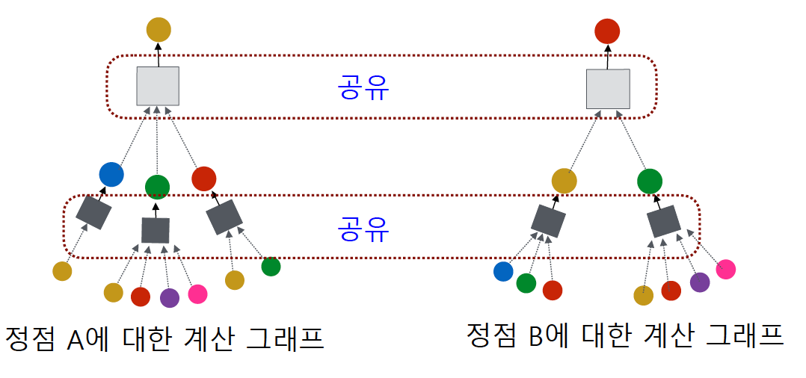

# 학습정리

- 그래프 신경망

​         

## 그래프 신경망

#### 귀납식 정점 표현 학습

**변환식 정점 표현학습** : 학습의 결과로 정점의 **임베딩 자체**를 얻는다는 특징

**귀납식 정점 표현학습** : 학습의 결과로 정점을 **임베딩으로 변화시키는 함수 (인코더, 정점의 부가 정보도 활용 가능)**를 얻는 방법

​     

변환식 정점표현 학습의 단점

- 학습이 진행된 이후에 추가된 정점에 대해서는 임베딩을 얻을 수 없다.
- 모든 정점에 대한 임베딩을 미리 계산하여 저장해 두어야 한ㄷ자.
- 정점이 속성 정보를 가진 경우에 이를 활용할 수 없다.

=> **귀납식 정점 표현으로 해결**

​         

#### 그래프 신경망

귀납적 정점 표현 학습의 한 종류

**그래프**와 **정점의 속성 정보 (m 차원 벡터)**를 입력으로 받아 사용

이웃 정점들의 정보를 집계하는 **단계(layer)을 반복**하여 임베딩을 얻는다.

입력 층의 임베딩으로는 각 정점의 속성 벡터를 사용

​         

대상 정점마다 집계되는 구조를 **계산 그래프**라고 부른다.

서로 다른 정점의 계산그래프간에도 각 층 별 집계 함수를 공유한다.

=> 각 정점별로 **다른 구조를 가지기 때문에** 층별로 동일한 집계함수를 **사용하기 위해서는 이웃들의 정보를 평균내어 사용**한다.

**신경망 구조**

**손실함수** 

비지도 학습 : graph에서의 각 정점간의 관계를 유지하는 것을 목표

지도학습 : 혹은 후속과제의 손실함수를 이용하여 end to end 학습 **(임베딩 이후에 별도의 분류기를 사용하는 것 보다 정확도가 대체로 높다.)**

**그래프 신경망**

**End to End**

​        

#### 그래프 신경망 변형

**그래프 합성곱 신경망**

기존의 그래프 신경망은 **이전 층에서의 자기 자신의 임베딩과 이웃들의 임베딩을 다른 신경망으로 학습**

그래프 합성곱 신경망은 이전 층에서의 **자기 자신의 임베딩과 이웃들의 임베딩을 같은 신경망으로 학습**하고 같이 정규화

​        

**GraphSAGE**

기존 그래프 신경망은 **자기 자신의 임베딩과 더하여 사용**했지만

dasx이웃들의 임베딩을 **AGG함수를 이용하여 합친후** **자신의 임베딩과 concat** 하여 사용한다.

**AGG 함수**

- mean
- pool
- LSTM

​          

#### 그래프 신경망에서의 attention

기존 신경망에서는 이웃들의 정보를 동일한 가중치로 평균을 내어 사용

=> **그래프 attention 신경망에서는 가중지 자체도 학습을 하여 사용 (self attention)**

- 해당 층의 정점 i의 임베딩에 신경망을 통과시켜 새로운 임베딩을 얻는다.
- 정점 i와 정점 j의 새로운 임베딩을 연결한 후 **어텐션 계수(모든 정점이 공유하는 학습변수)**를 내적
- 내적한 결과에 softmax를 적용하여 확률값을 얻는다.

​         

**멀티헤드 어텐션**

여러개의 attention을 동시에 학습한뒤 결과를 concat하여 사용

​        

#### 그래프 표현학습 (그래프 임베딩)

그래프 전체를 벡터의 형태로 표현

=> 그래프의 분류등에 활용된다.

​      

**그래프 풀링**

정점 임베딩들로 부터 그래프 임베딩을 얻는 과정

=> 평균등 단순한 방법보다 그래프의 구조를 고려한 방법을 사용할 경우 후속 과제에서 더 높은 성능을 보인다.

​	ex) 군집구조를 활용하여 계층적으로 집계

​     

#### 지나친 획일화 문제

그래프 신경망의 층 수가 증가하면서 정점의 임베딩이 서로 유사해지는 현상을 의미

=> 작은 세상 효과와 관련이 있다. 층이 증가할 수록 거리가 1씩 증가하기 때문

​        

- JK 네트워크

  - 마지막 층의 임베딩 뿐만 아니라 모든 층의 임베딩을 같이 사용

    

- APPNP

  - 0번째 층을 제외하고는 신경망 없이 집계함수를 단순화 하여 사용

    

​          

#### 그래프 데이터의 증강

그래프에도 누락되거나 부정확한 간선이 있을 수 있고 이를 데이터 증강을 통하여 보안가능

=> 임의 보행 방법을 통하여 정점간의 유사도를 계산하고 유사도가 높은 정점간의 간선을 추가하는 방법

​        

# 피어세션

- 그래프 신경망의 활용
  - 새로운 그래프에 따로 학습이 필요없이 적용이 가능한가?
- 획일화 문제의 잔차항과 집계함수의 B 항이 같은것인가?
- 학습에 사용된 정점과 사용되지 않은 정점들
  - 학습된 encoder로 사용되지 않은 정점들도 벡터화 가능
- 모델 test시 넣어주는 input의 형태는 어떤 형태인가?
- 변환식 정점 표현 학습이 학습시키는 것
- 제곱 연산시 **가 np.pow() 보다 약간 빠르다

​         

# 과제 진행 상황 

오늘 과제는 퀴즈 형식으로 이번주에 배운 내용들을 테스트 하는 내용이였다 큰 어려움없이 해결 가능했지만 햇갈리는 부분을 피어세션 시간에 팀원에게 물어보아 해결하였다.