# 학습정리

- 노드 임베딩
- 추천 시스템

​           

## 노드 임베딩

#### 정점 표현 학습

그래프의 정점들을 벡터의 형태로 표현하는 것 **(노드 임베딩)**

**입력으로 그래프**의 정점을 받아 **벡터를 출력**

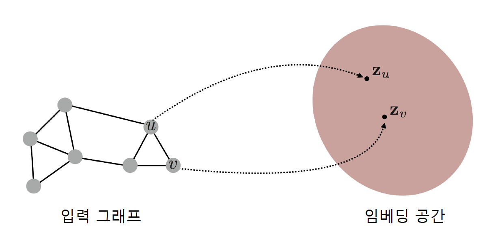

​      

정점 임베딩의 결과로 각 정점들이 벡터로 표현됨에 따라 **벡터 형태의 데이터를 위한 도구들을 그래프에 적용이 가능하다**

- 분류기 (로지스틱 회귀 분석, 다층 퍼셉트론)
- 군집 분석 알고리즘 (Kmeans, DBSCAN)
- 그래프를 위한 별도의 알고리즘이 아닌 최신의 기계학습 도구들을 정점 분류, 군집 분석등에 사용이 가능         

​          

**노드(정점) 임베딩의 2가지 단계**

- 그래프에서의 정점 유사도를 정의
- 임베딩 공간에서도 유사도 (임베딩 공간에서의 유사도는 내적을 사용) 를 보존하도록 노드(정점) 임베딩을 학습하는 단계

​           

#### 인접성 기반 접근법

그래프에서 두 정점을 연결하는 간선이 있을 때 (**인접**) 유사하다고 간주

**인접성 기반 접근법의 손실함수**

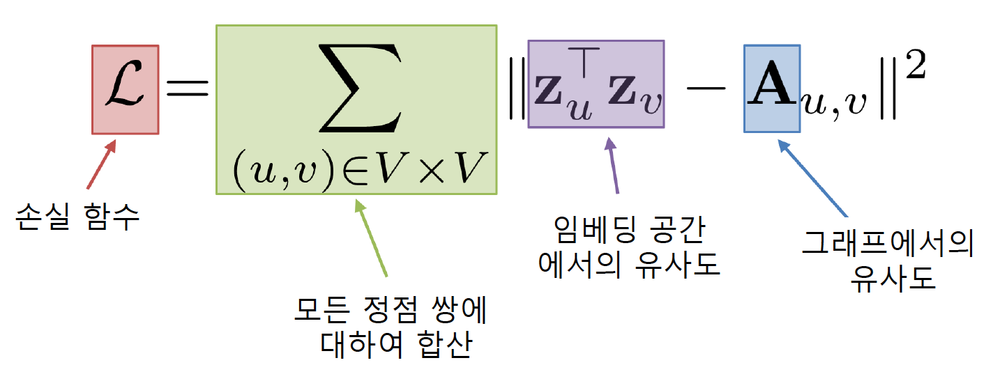

=> **모든 정점 쌍에 대하여 정점 쌍의 임베딩 공간에서의 유사도와 그래프에서의 유사도의 차이가 적어지도록 학습** 

​      

**인접성 기반 접근법의 한계**

- 정점 쌍의 거리가 서로 달라도 인접하지 않으면 유사도는 0으로 같다
  - Ex) 서로의 거리가 2인 정점 쌍과 서로의 거리가 5인 정점 쌍의 유사도는 모두 0이다.
- 서로 인접하지 않으면 같은 군집에 있는 정점쌍과 서로 다른 군집에 있는 정점 쌍의 유사도는 모두 0이다.

=> **거리/경로/중첩 기반 접근법** 으로 어느정도 해결이 가능하다.

​          

#### 거리 기반 접근법

두 정점사이의 거리가 **충분히 가까운 경우 유사**하다고 간주

일정 기준점 보다 가까운 거리의 정점 쌍은 서로 유사하다고 간주한다.

=>손실함수에서 그래프에서의 **유사도를 인접행렬을 사용하는 대신 거리 기반으로 판단한 유사도를 사용**한다.

​         

#### 경로기반 접근법

두 정점 사이의 경로가 많을 수록 유사하다고 간주한다.

두 정점 사이의 **경로중 거리가 k인것은 인접행렬의 k승과 같다**.

=> 손실함수는 아래와 같다.

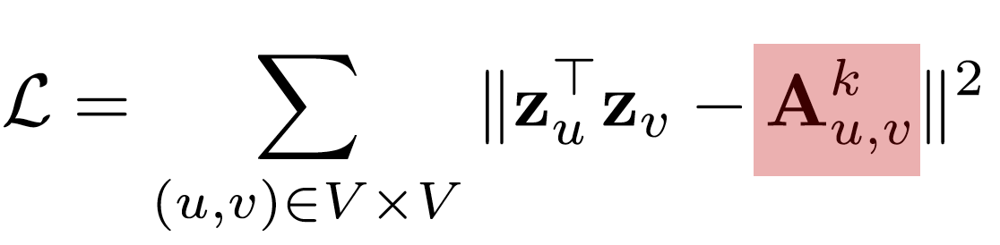

​             

#### 중첩기반 접근법

많은 이웃을 공유 할 수록 유사하다고 간주

ex)정점 쌍이 2개의 이웃을 공유한다고 했을 때 해당 정점쌍의 유사도는 2

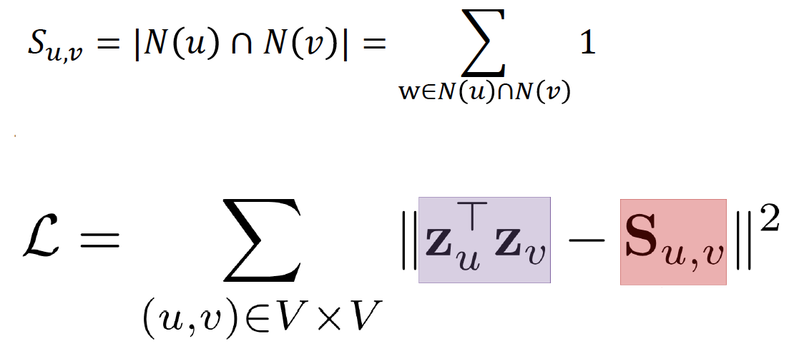

=> 공통 이웃 수 대신 **자카드 유사도** 혹은 **Adamic Adar** 점수를 사용 할 수 도 있다.

**자카드 유사도** : 공통이웃 수 대신 비율을 계산한는 방식

**Adamic Adar** : 공통 이웃 각각에 가중치를 부여하여 가중합을 계산

​           

#### 임의보행 기반 접근법

한 정점에서 시작하여 임의보행을 할 때 다른 정점에 도달할 확률을 유사도로 사용

=> 시작 정점 주변의 지역적 정보와 그래프 전역 정보를 모두 고려한다는 장점이 있다.

**임의 보행 기반 접근법의 3단계**

- 각 정점에서 시작하여 임의보행을 반복 수행

- 임의 보행중 도달한 정점들의 리스트를 구성(여러번 도달한 정점은 여러번 포함가능)

- 아래 손실 함수를 최소화하는 임베딩을 학습

  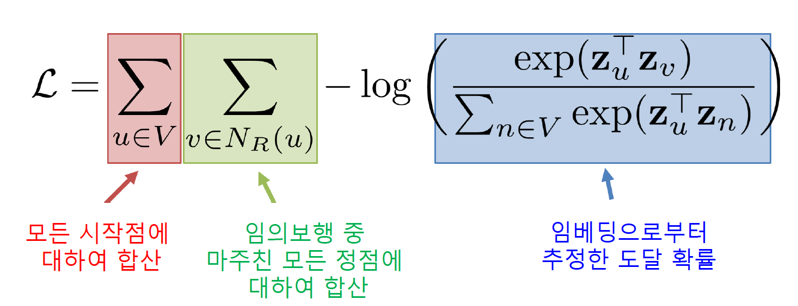

  로그안의 확률 값은 u에서 시작한 임의보행이 v에 도달할 확률을 의미한다.

  => 여기서 **v는 이미 실제로 임의보행으로 도달한 값 이기 때문에 이 확률값이 커지도록 학습**

  => -log로 확률값이 커질수록 해당 값이 작아진다.

​         

임의 보행의 방법에 다라 DeepWalk와 Node2Vec이 구분

**DeepWalk**

앞서 설명한 기본적인 임의보행을 사용

이웃중 하나를 **균일한 확률로 선택**하는 이동 과정을 반복

**Node2Vec**

**2차 치우친 임의보행**을 사용

현재 정점과 직전에 머물렀던 정점을 모두 고려하여 다음 정점을 선택

=> 직전 정점과의 거리를 기준으로 차등적인 확률을 부여

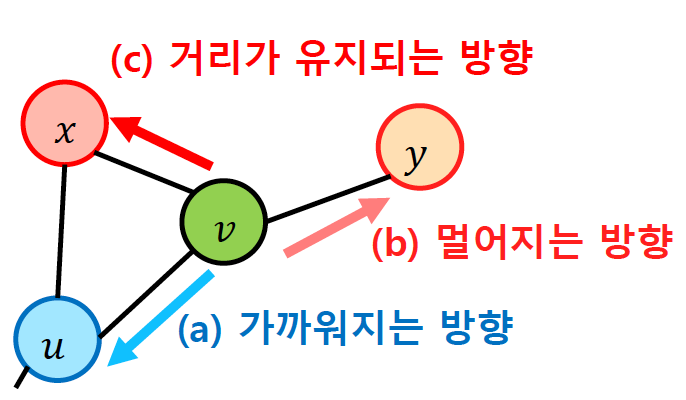

**부여하는 확률**에 따라 **다른종류의 임베딩**을 얻는다.

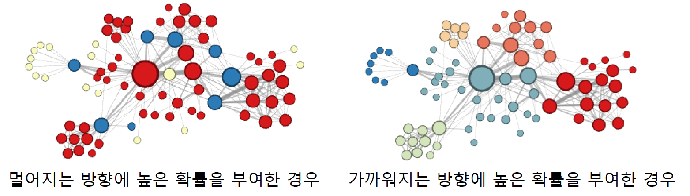

멀어지는 방향 : 정점의 역할 (다리 역할, 변두리 정점)이 같은경우 임베딩이 유사하다/

가까워지는 방향 : 같은 군집에 속한 경우 임베딩이 유사하다.

​        

**손실함수 근사**

임의보행 기법의 손실함수는 정점의 수의 제곱에 비례하는 시간이 소요된다.

=> 많은 정점을 가질수록 매우 많은 시간이 소요된다.

=> **근사식을 사용**

모든 정점에 대해서 정규화를 하는대신 **몇개의 정점 (네거티브 샘플)을 뽑아서 비교**하는 형태 (연결성이 높은 정점들을 뽑는다.)

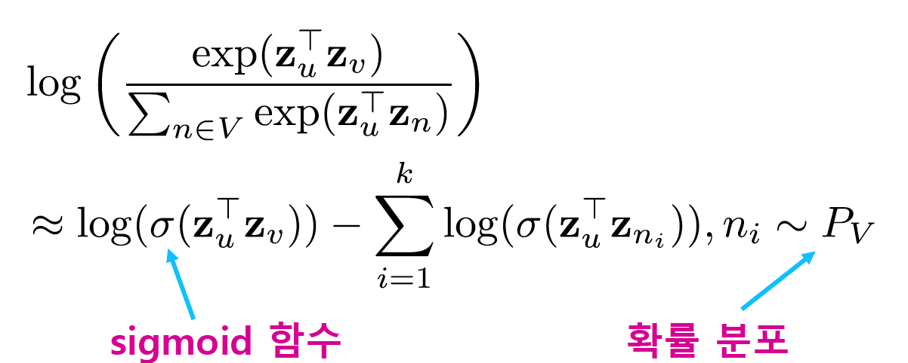

​         

#### 변환식 정점 표현 학습의 한계

변환식 방법 : 학습의 결과로 정점의 임베딩 자체를 얻는다.

귀납식 방법 : 정점을 임베딩으로 변화시키는 함수를 얻는다.

​        

**변환식 임베딩의 한계**

- 학습이 진행된 이후 추가된 정점에 대해서는 임베딩을 얻을 수 없다.
- 모든 정점에 대한 임베딩을 미리 계산하여 저장
- 정점이 속성 정보를 가진 경우에 이를 활용할 수 없다.

​                

## 추천시스템

**내용 기반 추천** : 각 사용자가 구매/만족 했던 상품과 유사한 것을 추천하는 방법

**협업 필터링** : 유사한 취향의 사용자들이 선호/구매한 상품을 추천하는 방법

​       

#### 넷플릭스 챌린지

훈련 데이터 : 2000 ~ 2005년 까지 수집한 48만명 사용자의 1만 8천개의 영화에 대한 1억개의 평점으로 구성

평가 데이터 : 각 사용자의 최신 평점 280만개로 구성

목표 : 추천시스템의 성능을 10%이상 향상, **평균 제곱근 오차 0.9514를 0.8563까지 낮추는것**

​         

#### 잠재 인수 모형 (UV)

사용자와 상품을 벡터로 표현하는 것

고정된 인수 대신 효과적인 인수를 학습하는 것을 목표로 한다.

=> 추천을 가장 정확하게 할 수 있는 차원을 찾아서 영화와 사용자를 배치

​     

**ㅋ사용자와 상품의 임베딩 벡터의 내적이 평점과 유사하도록 학습**

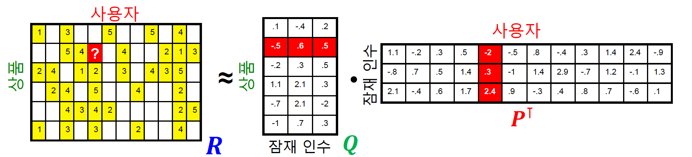

**손실함수**

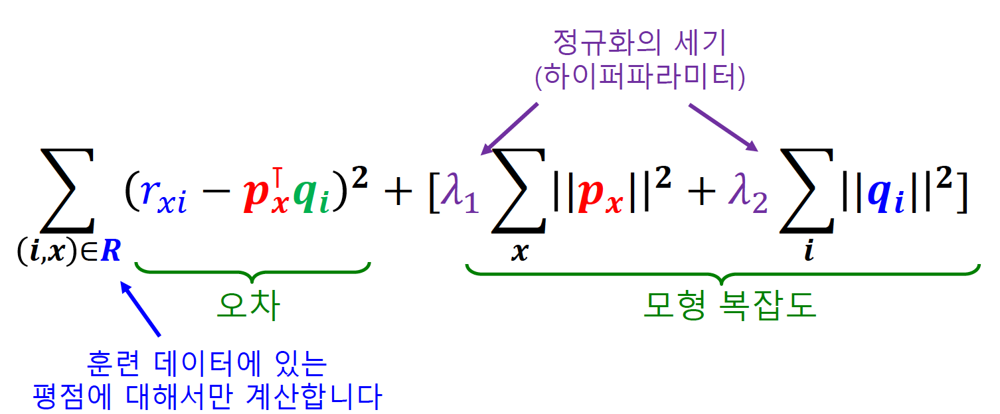

**과적합을 방지하기 위하여 정규화 항을 손실함수에 더해준다.**

=> q와 p와 너무 큰값을 가지지 않도록 손실함수에 추가해 주어서 p와 q의 값도 같이 작아지게 학습

=> 절대값이 너무 큰 임베딩을 방지하는 효과가 있다.

​       

#### 고급 잠재 인수 모형

**사용자의 편향** : 해당 사용자의 평점 평균과 전체 사용자의 평점 평균의 차이

 => 평균적으로 사용자점수를 다른사람들과 비교하여 후하게 주는 편인가?, 박하게 주는 편인가?

**상품의 편향** : 해당 상품의 평점과 전체 상품의 평균 평점과의 차이

=> 해당 상품의 전반적인 평가

​       

개선된 잠재 인수 모형에서는 평점을 전체 평균, 사용자 편향, 상품 편향, 상호작용으로 분리

=> 사용자 편향, 상품 편향을 제외한 평균만을 계산

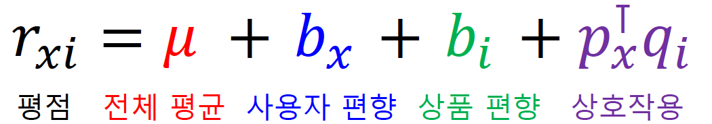

​       

**손실함수**

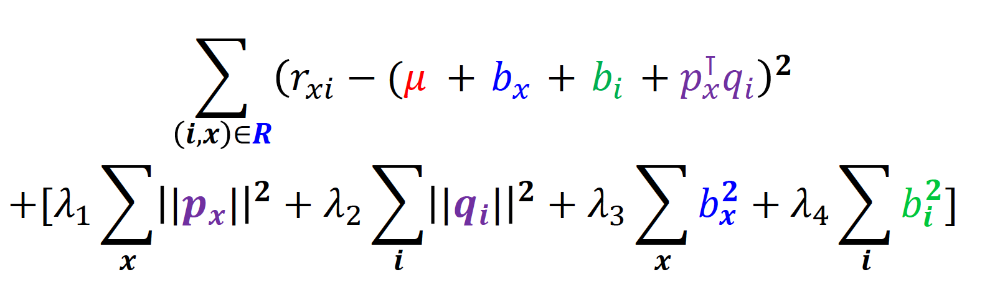

​         

**시간적 편향**

- 넷플릭스 시스템의 변화로 평균 평점이 크게 상승하는 사건
- 출시일 이후 시간이 자남에 따라 상승하는 경향을 가진다.

=> 이러한 시간적 편향도 고려해야한다.

**사용자 편향과 상품편향을 시간에 다른 함수로 가정**

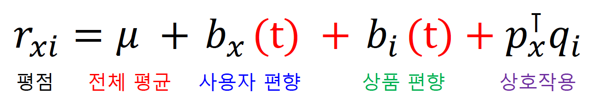

​       

​           

# 피어세션

- Cluster, community 차이점
  - https://stats.stackexchange.com/questions/15824/what-is-the-difference-between-graph-clustering-and-community-detection-methods
- 손실함수 근사에서의 sigmoid
  - https://www.edwith.org/bcaitech1/forum/51502
- 경로기반 접근법의 손실함수
  - https://www.edwith.org/bcaitech1/forum/51520
- 잠재 인수모형 손실함수의 모형 복잡도에서 제곱해주는 이유
- cold start, long tail problem 해결방안
- Node2Vec.fit 함수의 min_count
  - https://radimrehurek.com/gensim/models/word2vec.html
- 경로기반 접근법에서 인접행렬의 제곱
  - https://m.blog.naver.com/PostView.nhn?blogId=gt7461&logNo=110151975370&proxyReferer=http:%2F%2F222.101.143.147%2F

​          

​            

# 과제 진행 상황

어제 완료한 과제 이외에 추가적으로 제공된 과제가 없었다.

