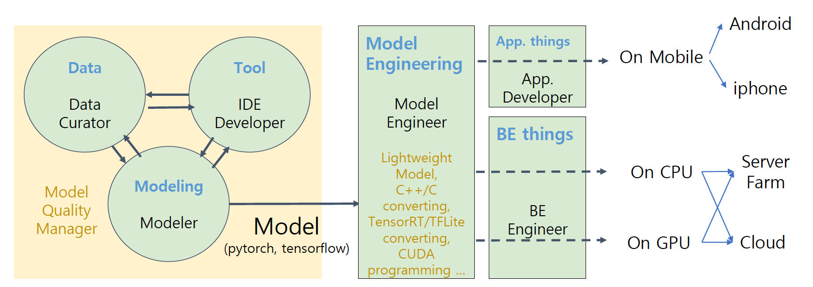

# 학습정리

- 서비스 향 AI 모델 개발하기
- AI 시대의 커리어 빌딩

​              

## 서비스 향 AI 모델 개발하기

**연구 관점에서의 AI 개발**

- 정해진 데이터셋/평가 방식에서 더 좋은 모델을 찾는 일을 한다.

**서비스 관점에서의 AI 개발**

- 데이터 셋이 존재하지 않는다.
  - 서비스 요구 사항으로부터 학습할 데이터셋의 종류/수량/정답을 정하고 수집
  - 학습 데이터 준비를 할려면 모델 파이프라인 설계가 되어있어야 한다.
  - 모델 파이프라인 설계와 학습데이터 준비를 여러번 반복하여 수렴해간다
- 테스트 데이터셋, 테스트 방법 준비
  - 개발 환경에서의 정량 평가와 실 서비스 적용시의 정량평가는 이질감이 클 수도있다.
  - OFFLINE 테스트 결과와 ONLINE 테스트 결과를 잘 설계해야한다.
- 모델 요구사항 도출
  - 처리시간
  - 목표 정확도
  - 목표 qps : 초당 처리가능한 요청수
  - serving 방식
  - 장비 사양

​              

**서비스 향 AI 모델 개발 기술팀의 조직 구성**

​               

**모델링에 대한 전문성뿐만 아니라 주변으로 역량을 확대**

​           

## AI 시대의 커리어 빌딩

**학교 vs 회사**

학교 : 논문을 써서 연구 성과를 만드는 것이 목표

회사 : 서비스/상품을 만들어 돈을 버는 것이 목표

​         

**AI/ML모델링은 팀 전체 업무의 일부분으로 팀 내에는 다양한 역할이 있다.**

=> 현실에서는 정말 다양한 역할이 있고 100%하나의 포지션에서만의 역할을 수행하는 경우는 드물다.

​        

내가 어디에 강점을 가지고있는지 잘 알고 강점을 살릴 수 있는 포지션을 찾는것이 중요하다.

​                

**AI engineering career 쌓기**

- 자기자신에 대한 이해
  - 어디에 관심이 있는지?
  - 어떤분야에 강점이 있는지?
- AI관련 분야 인턴십/아르바이트
  - 각 포지션 차이에 대한 이해를 얻을 수 있다.
  - 각 팀이 무엇에 관심을 가지는지에 대한 이해를 얻을 수 있다\
  - 일 하는 방법을 알게 된다.
- 인턴쉽/아르바이트 기회를 잡기가 어려울경우
  - AI competition(케글)
  - 최신 논문 재현

​       

# 피어세션

**질문**

- 백엔드를 공부할 때 자바의 spring과 파이썬의 django 중 어느 것을 학습하는 것을 추천하시나요? → Full Stack
- 캐글과 실제 현업의 갭?
- 캐글에서의 역량이 실제 현업에서 차지하는 비율?
- 캐글에서 예전 기술이 더 퍼포먼스가 좋은 경우도 있는데 꼭 최신 기술을 사용해야 하는지?