# 학습정리

- Instance, Panoptic Segmentation and Landmark Localization
- conditional Generative model

​               

## Instance, Panoptic Segmentation, Landmark Localization

#### instance segmentation

class별 segmentation이 아니라 객체별 segmentation

​         

**mask R CNN**

Faster R CNN구조에 Mask branch를 추가한 구조

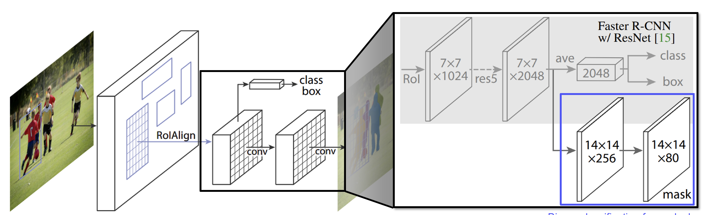

​       

**YOLACT**

One stage 방법으로 속도가 빠르다.

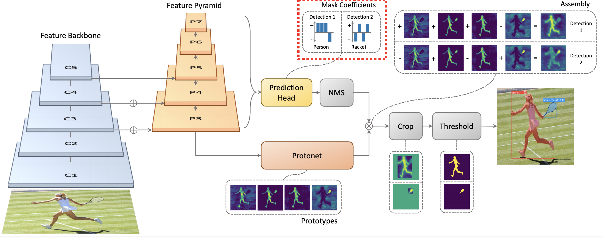

​      

**YolactEdge**

YOLACT를 video에서 사용할 수 있게 확장

=> 이전 프레임 에서 계산한 것을 다음 프레임에 전달

​            

#### panoptic segmentaion

객체별 segmentation 뿐만 아니라 배경도 구분

**UPSNet**

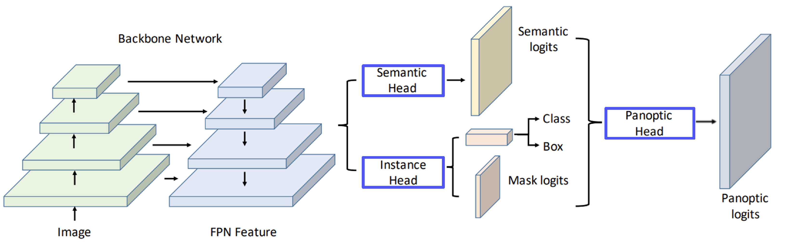

**VPSNet**

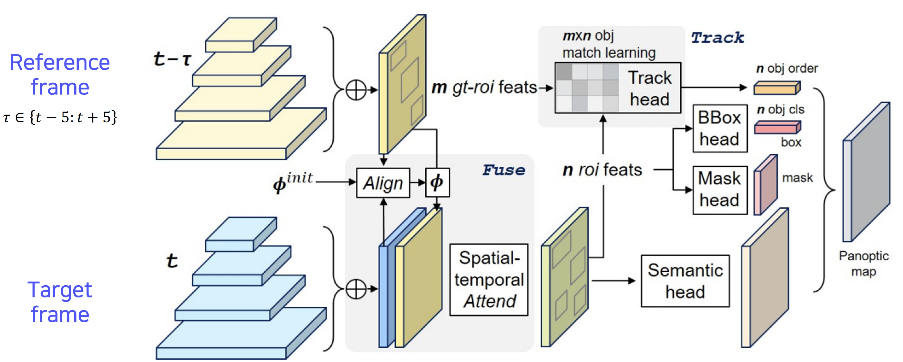

​       

#### Landmark localization

특정 물체에 대해서 중요하다고 생각되는 부분을 추정

- Coordinate regression : 각 point(x, y)를 예측하는 방식, 부정확하고 일반화 문제가 있다.
- heatmap classification : 각 pixel별로 분류하는 방식, 성능은 좋지만 계산량이 많다.

**Hourglass network**

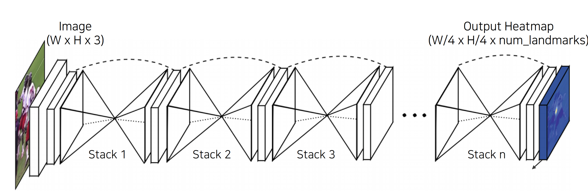

​                  

**DensePose**

UVmap을 활용하여. 3D표현 방식으로 표현

​             

**RetinaFace**

여러개의 task를 동시에 해결할 수 있는 방법으로 학습시켜 backbone이 더 잘 학습된다.

​         

#### Detecting object as key point

**cornernet**

왼쪽 위의점 오른쪽 아래의점을 찾는방식 => 속도가 빠르다.

​       

**centernet**

width, height, 중앙점를 찾는방식 

​         

​           

## conditional Generative Model

**Generative model** : 렌덤하게 생성한다. Ex) 렌덤한 가방 이미지를 생성

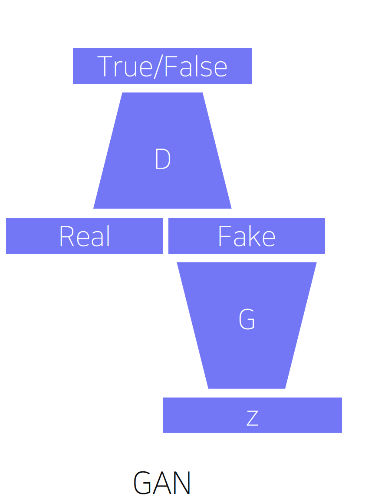

**Conditional Generative model** : 주어진 condition에 따라 생성한다. ex) 주어진 스케치 image로 가방 이미지를 생성

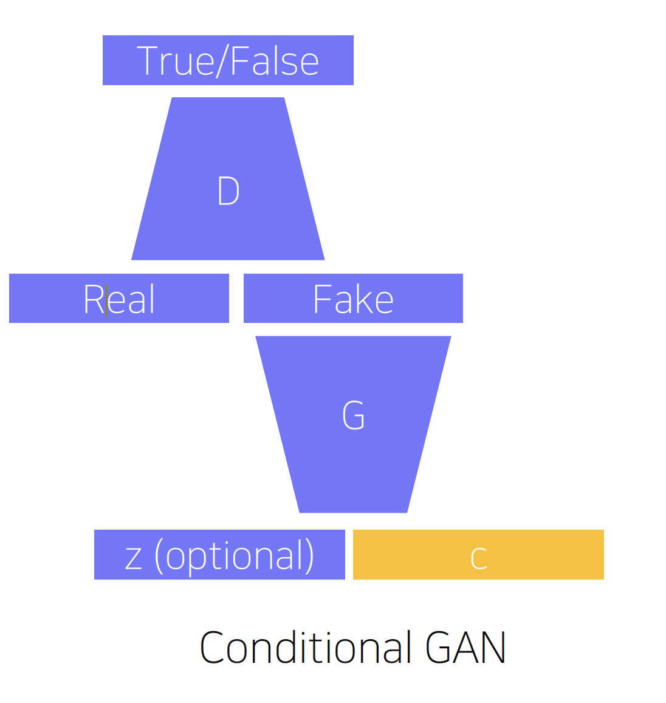

​         

#### Image translation

Style transfer(스타일 변화), Super resolution(고해상도), Colorization(색상)

**Super resolution**

저해상도의 image를 고해상도의 image로 변경하는 문제

- Naive Regression

  - 실제 HR image와 생성해낸 HR image와의 loss를 가지고 학습하여 생성

  - loss 값을 가지고 학습을 진행하다 보니 모든 정답 데이터를 고려하여 적당하게 떨어진 위치를 찾는다.

    => 구분성이 떨어지고 어쩡쩡한 이미지가 생긴다.

- Super Resolution Gan

  - condtional gan을 이용하여 저해상도의 image를 입력받아 고 해상도 이미지를 생성
  - 실제 이미지와 구분되지 않는 방식으로 이미지를 생성하기 때문에 Naive Regression 모델의 단점인 구분성이 떨어지는 문제가 발생하지 않는다.

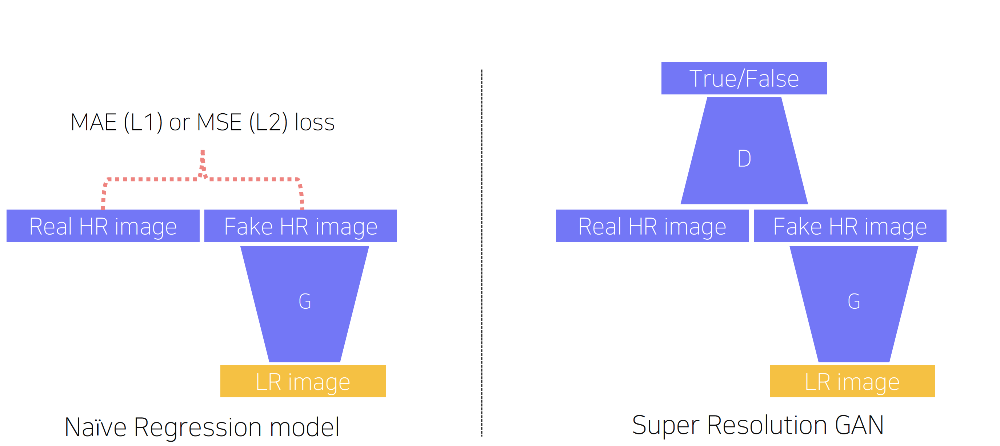

​          

**Pix2Pix**

주어진 이미지를 다른 style로 변환하는 문제 

ex) segementation => 일반적인 image, 흑백 사진 => 컬러 사진

​        

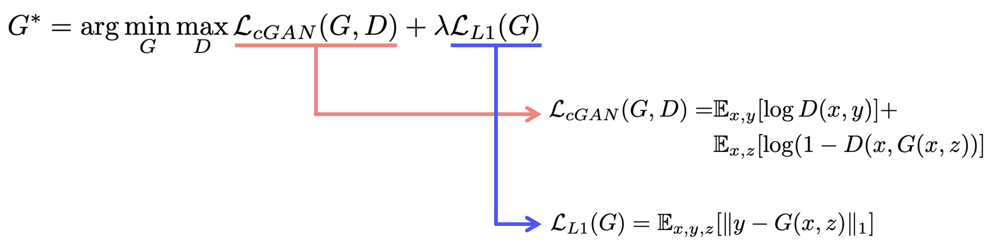

단순히 GAN모델의 loss만 사용하는 것이 아니라 L1 loss도 같이 사용한다.

=> GAN 모델의 Generator의 목표는 contional을 참고하여 비슷하게 만드는 것이 아니라 D를 속이는 것 이기 때문에 L1 loss를 추가해주어 contional도 참고하게 해준다.

​         

**CycleGAN**

대응관계가 존재하지 않는 데이터 set의 집합만으로도 translation이 가능하도록 한다.

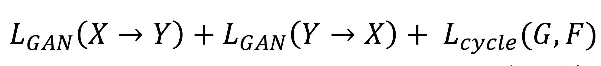

Cycle consistency loss : Gan을 통하여 이미지가 바뀌고 바뀐이미지를 다른 Gan을 통하여 다시돌아왔을 때 원본 이미지와의 loss	=>	**원본이미지와 유사해져야한다.**

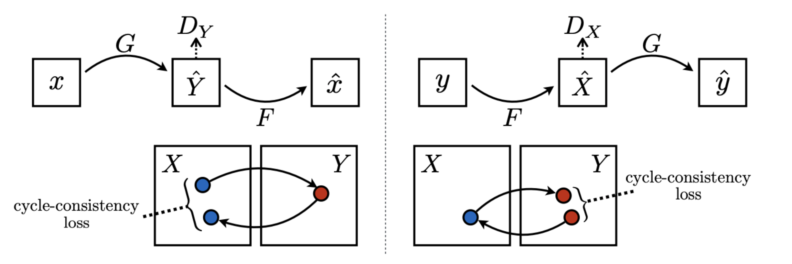

​           

**Perceptual loss**

GAN은 train 시키기에는 어렵다.  High quality image를 만드는 다른 방법이 있을까?

=> **perceptual loss** : 간단하게 forward backward computation으로 학습이 가능하다.

Generated image와 target사이의 **compute style**과 **feature loss**를 계산

​            

**Feature reconstruction loss**

content target의 feature map과 변환된 target의 feature map을 가지고 loss를 계산하여 계속 content를 유지하도록 해준다.

**Style reconstruction loss**

style target과 변환된 target의 image의 feature map을 Gram matrices로 변환하여 loss를 계산하여 style을 유지하도록 해준다.

​           

# 피어세션

- x, y가 각각 input, output이라고 할 때 z가 의미하는 것이 Style(Condition)을 의미하는 건지? 추가적으로 GAN loss에 대한 설명도 가능하면 부탁드립니다.
- Gram matrices가 만들어진 과정 
  - 연구 후 Gram matrices면 스타일을 표현할 수 있다. or 이렇게 시도해봤는데 스타일이 표현된다?
- https://arclab.tistory.com/220

