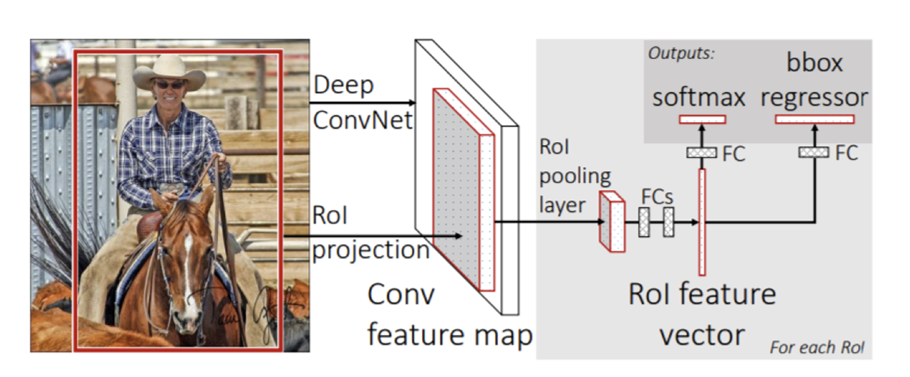
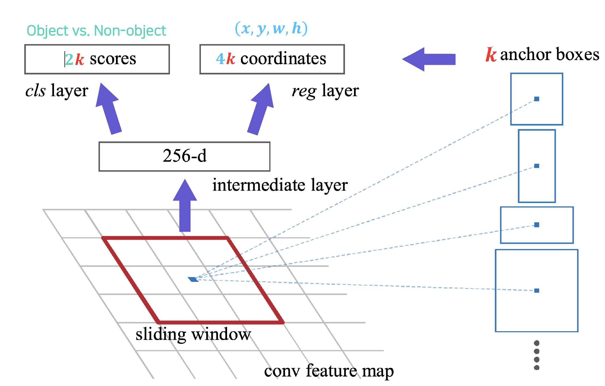

# 학습정리

- Object detection
- CNN Visualization

​                 

## object detection

주어진 이미지에서 특정 object의 위치와 class를 분류하는 것 ( classification + box localization)

=> Autonomous driving, ocr 등에 사용

​            

#### Two stage detector

**R-CNN**
Region proposal 별로 확인을 진행해야 하기에 속도가 매우 느리다

Region proposal을 뽑는 알고리즘은 사람이 만든 알고리즘으로 성능 향상에 제한이 있다.

- Region proposal을 2천개 이하로 추출한다.
- 뽑힌 영역을 사이즈에 맞게 변환한 이후 pretrain된 CNN에 넣어서 사용
- object를 분류

​           

**Fast R-CNN**

영상 전체에 대한 feature를 한번에 추출하고 재활용하여 여러 object들을 detection할 수 있다.

- Original image에 대한 feature map을 conv layer를 통하여 추출한다. ( conv layer는 input image 크기에 상관X )
- 추출된 feature map에서 물체의 후보위치를 추출하여 알맞는 사이즈로 resize (RoI pooling)
- 각 RoI 마다 object class와 box를 prediction

​            

**Faster R - CNN**

최초의 end to end object detection

Faster R-CNN에서는 detection에서 쓰인 conv feature을 **RPN**에서도 공유해서 RoI생성역시 CNN level에서 수행

​              

**IoU**(intersection over Union) : box의 영역과 실제 object영역의 교집합 / 합집합

**Anchor boxes** : 각 위치에서 발생할 것 같은 box들을 미리 정해논다

**RPN (Region Proposal Network)**

Conv 레이어를 통과한 feature map에 sliding window 방식으로 window를 움직이면서 Anchor box를 이용하여  **classification( object, or Non object) 과 bbox regression**을 구한다.

 => Anchor box중 object와의 IoU가 0.7이상인거는 Positive 0.3 이하인것은 negative로 판별하여 학습

한 object당 여러개의 box가 나올 수 있다 

=> **NMS 로 해결**

​       

​              

#### single sate detector

regional proposal와 classification이 동시에 수행

=> 빠르고 비교적 정확도가 낮다

​          

**YOLO**

- 이미지를  그리드로 나눈다.
- 각 grid에 대해서 bounding box와 confidence score( bounding box가 객체를 포함한다는 것을 얼마나 믿을만한지 그리고 예측한 bounding box가 얼마나 정확한지) 를 계산
- class probability : 각 grid안에 객체가 어떤 클레스인지에 대한 조건부 확률들을 계산한다.
- 2가지를 활용하여 각 bound box안에 들어있는 객체의 종류를 분류한다.

​       

**SSD( Single Shot MultiBox Detector):**

각 위치마다 bounding box를 사용

**Focal loss**

Single stage detector는 RoI pooling이 없기 때문에 모든영역에서의 loss가 발생한다.

=> 따라서 object가 없는 영역인 negative sample이 많이 발생한다 (class imbalance problem)

Focal loss를 이용하여 잘못 판별된 예측에 대해서는 큰 gradient, 쉬운 예측에 대해서는 약한 gradient를 주어 학습시킨다.

**Transformer**

- ViT
- DeiT
- DETR

​              

## CNN Visualization

CNN 내부에서 어떻게 동작하고 있는가?, 왜 잘 동작하는가?, 성능을 어떻게 높일 것인가?

**Analysis of model behaviors** : 모델의 특성을 분석하는 방식, 모델을 이해하기 위한 노력

**Model decision explanation** : 모델의 결과인 출력을 통하여 분석하는 방식, 데이터 분석

​          

**Analysis of model behaviors  (모델을 이해)**

- Embedding feature analysis 

  - Nearest neighbors in a feature space : 특징 공간에서 가장 유사한 feature를 가진것들을 비교

  - Dimensionality reduction : 차원축소 다차원 공간에서의 특징을 이해하기 쉬운 2차원 3차원 공간으로 축소하여 사람이 보귀 쉬운 형태로 변경

    

    mnist 숫자 데이터를 2차원으로 표현 => 데이터 분포가 잘 구분되어있는 것으로 보아 좋은 모델이라고 판단된다

- Activation investigation

  - Layer activation : conv layer의 특정 차원을 정하여 해당 차원이 이미지에서 어떤 부분에 집중하고 있는지 보여준다.
  - Maximally activating patch
    - 특정 layer의 특정 체널을 정한다.
    - 이미지를 넣고 고른 특정 layer, 체널에서 계산된 값들을 얻는다.
    - 해당 값들중 가장 큰 값의 Receptive field를 계산하여 해당 부분을 crop한다.
  - class visulaization : 알고 싶은 class의 확률을 최대로 만들게하는 이미지를 구하는 방법
    - Dummy image를 학습된 모델에 넣어 알고 싶은 class의 결과값을 얻는다.
    - 역전파를 이용하여 알고 싶은 class의 값이 커지도록 image를 갱신한다.
    - 반복하여 image를 update

​          

**Model decision explanation (모델의 출력 결과를 통하여 해석)**

- Saliency test
  - Occlusion map

    입력 이미지에서 특정 부분을 가리고 학습된 모델을 통과시켜 원래 이미지의 확률과 가리고 난 이후의 확률을 비교하여 가려진 부분의 중요도를 측정

    

  - via Backpropagation

    입력이미지에서 정답을 예측하는대 결정적으로 영향을 미친 영역이 어디인가?

    - 입력이미지를 넣고 class score를 얻는다.
    - input domain에 대한 class score을 backpropagate
    - 얻어진 gradient magnitude map을 보여준다.

- Backpropagate features

  - Guided backpropagation
    - ReLU backward :  ReLU 함수의 역전파는 역전파 과정에서 0보다 작은 값을 0으로 처리하여 사용하는 것이 아니라 순전파 과정에서 0으로 처리된 값의 위치를 기억했다가 해당 위치를 0으로 처리하여 사용한다. 
    - deconvnet : ReLU의 backward 처럼 순전파 과정에서의 0보다 작은 위치를 기억하여 역전파에서 처리하는 것이 아니라 역전파 과정에서 0보다 작은 값을 0으로 처리 하는 것
    - Guided backpropagation은 위의 2개의 방법을 and연산으로 모두 사용하는 방법 즉 순전파 과정에서 0보다 작았던 위치들과 역전파 과정에서 0보다 작았던 위치들을 모두 0으로 변환

  

- Class activation mapping (CAM)

  - CAM

    **image의 어느 부분이 최종 결정에 영향을 미쳤는지를 알려준다.**

    - 출력단에서 FClayer 대신 Global average pooling layer를 사용해야한다.

      

    - CAM 부분은 공간에 대한 정보가 남아있기 때문에 image의 어떤 부분이 큰 영향을 미쳤는지 알려준다.

  - Grad CAM

    CAM은 무조건 Global average pooling layer를 사용해야한다 따라서 이를 사용할려면 backborn 네트워크가 Global average pooling layer를 사용하지 않는다면 re training 해야한다는 단점이 있다.

    => Grad CAM은 어디서나 사용가능

# 피어세션

- R-CNN, Fast R-CNN, Faster R-CNN
  - 원리
- ROI pooling
  -  Faster r cnn 에서 어떤식으로 RoI pooling이 진행되는가?
- SSD에서 feature map의 1픽셀에 여러개의 anchor box가 고려되는데 이것이 어떻게 가능한 것인지?
- 결과가 동일한 여러 함수 중 어떤 기준으로 선택하시는지? / 시간 or 메모리?