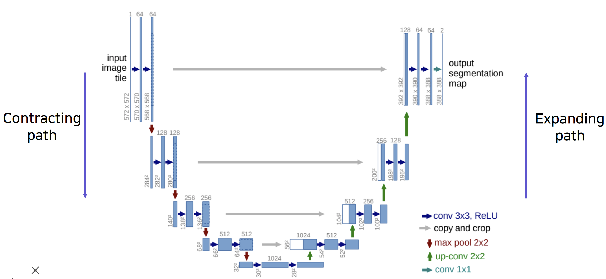

# 학습정리

- Image classification
- semantic segmentation

​         

## image classification

**deep network**

더 큰 receptive field( 영향을 미치는 공간), 더 큰 복잡도를 가져 성능이 증가한다.

=> 하지만 무조건 층을 깊게 쌓는다고 성능이 계속 좋아지는 것 X 

- gradient vanishing, exploding 문제
- 계산 복잡도가 증가
- Degradation problem (깊은 네트워크가 오히려 error와 정확도가 낮은 문제)

​            

**GoogLeNet**

**Inception 구조** 사용

**Inception 구조** : 여러개의 convolution filter와 max pooling을 사용하여 체널 축으로 concat (수평적으로 확장)

=> 계산 resources가 증가하는 것을 1 *1 convolution 연산으로 해결

**일반적인 conolution network이후에 inception 구조를 stack하는 방식으로 구현 **

**Auxiliary classifiers** 

레이어 중간 중간에 Auxiliary classifier를 사용하여 최종 분류기와 같은 역할을 하는 분류기를 추가해준다.

gradient vanishing 문제를 해결해주기 위해 추가한 구조로 기울기를 추가해주는 역할을 한다. (Test 할 때는 사용 X)

​          

**ResNet**

Residual block 사용

레이어의 input으로 들어온 값을 layer를 통과한 output값에 더해주어서 사용한다.

=> gradient가 vanishing 되더라도 short cut 부분을 통하여 계속 흐르기 때문에 계속해서 학습이 가능하다.

=>2^n 개의 path가 존재

**Resnet 구조**

​                  

**DenseNet**

ResNet이 input을 더하여 사용했다면 Densenet은 concat하여 사용

​     

**SENet**

Attention을 사용하여  체널간의 관계를 파악하여 가중치를 두어서 학습 한다.

체널축만 남게 squeeze하여 벡터형태로 만들고 만들어진 벡터으로 **attention score를 얻어 각 체널에 중요도를 부여**한다.

​         

**EfficientNet**

가장 성능이 좋은 Network중 하나로

- Wide scaling : 한 layer의 수를 늘린다. Ex) GoogLeNet, DenseNet
- depth scaling : depth 수를 늘린다. Ex) ResNet
- resolution  scaling : input을 크게 사용한다. ex) 해상도가 높은 image

3개를 잘 조정하여 사용

​                

**Deformable convolution**

정해진 사각형 형태의 fillter를 사용하는 것이 아니라 다른 형태의 filter를 사용하여 convolution연산을 수행한다.

offset field를 사용하여 offset을 구하고 offset을 이용하여 계산한다.

​           

## semantic segmentation

각 픽셀을 분류하는 카테고리별로 분류하는 문제

​      

**FCN**

semantic segmentation 문제의 첫번째 end to end 아키텍쳐

**임의의 사이즈**를 가진 이미지를 받아 segmentation map을 출력 

=> 모두 convolutional layer로 구성되어 있기 때문에 이미지의 사이즈에 영향을 받지 않는다.

​        

**단점**

높은 receptive field를 가지기 위해서 해상도가 낮아져 score map 부분에서는 아주 낮은 해상도를 가진다.

=> upsampling을 통하여 input 이미지 정도의 해상도로 높여준다.

- transposed convolution

  

  겹치는 부분(checkerboard)이 발생

- upsampling and convolution

  중첩 문제가 발생하지 않는 upsampling 방법으로 convolution연산이 뒤따르는 up sampling(보간법)을 사용

​       

마지막 activation map은 큰 receptive field를 가지고 픽셀을 분류하기 때문에 세부적인 부분(경계 부분)을 고려하기 힘듬

=> skip connection을 이용하여 마지막 activation map만 고려하는것이 아닌 이전 단계(높은 해상도)의 feature map을 함께 고려하여 더 좋은 성능을 낼 수 있다.

위의 그림에서 여러 feature map을 참고한 FCN-8s의 성능이 가장 좋다.

​           

**U net**

- fully convolution network로 이루어져있다.
- FCN의 skip connection과 유사하게 낮은 층(고해상도)의 feature map과 높은층 (저해상도)의 feature map을 결합하여 사용

contracting path 에서는 Down sampling을 통하여 1/2씩 줄어들고 Expanding path 에서는 2배씩 증가한다. 

=> 이를 맞추어 주기 위해서 **홀수 상태의 map이 나오면 안된다.**

앞쪽 layer에서 공간적으로 높은 해상도가 민감한 정보를 뒤쪽 layer에 전달해주는 방식

​           

**DeepLab**

- **CRF**( conditional Random Fields ) 사용

  - 후처리로 사용되는 tool
  - 픽셀과 픽셀관계를 그래프로 보고 경계를 잘 찾도록 모델링
  - 스코어 맵이 경계선에 잘 들어 맞도록 확산

- **Dilated convolution** 사용

  - 일정 간격씩 건너 뛰어 실제 conv 커널보다 너 넓은 영역을 고려할 수 있게 해준다

- Depth wise separable convolution

  - 실행 시간을 줄이기 위하여 convolution 연산을 Depth wise, point wise부분으로 나누어 연산한다.

    

​      

# 피어세션

- 두번째 강의 자료 p.23 

  - {Nearest-neighbor(NN),Bilinear} interpolation followed by convolution 어떻게?
  - 미분이 가능해지는 것은 어떻게? 그게 가지는 의미는?

- 두번째 강의 자료 p.40 - U-Net

  - 왜 크기가 다를까?

    => crop하여 사용

- mirror padding

  - https://www.youtube.com/watch?v=h0c0Tt9wsLg

​           

# 과제 진행상황

이번 과제도 작성되있는 코드의 빈 칸을 채워 작성하는 문제로 코드를 완성하는데는 큰 문제가 없었다. 