# 학습정리

- Image classification
- efficient learning

​                     

## image classification

input으로 영상, 사진을 받아 해당 input의 class 정보를 return

=> 세상의 모든 data를 memorize 할 수 있다면 knn으로 문제가 해결가능 (검색문제로 변화)

하지만 Input data가 많아질수록 Time complexity 와 Memory complexity가 증가한다.

=> Neural Networks 사용 : 방대한 data를 제한된 복잡도 시스템에 압축하여 넣는것

​              

**Fully connected layer** 

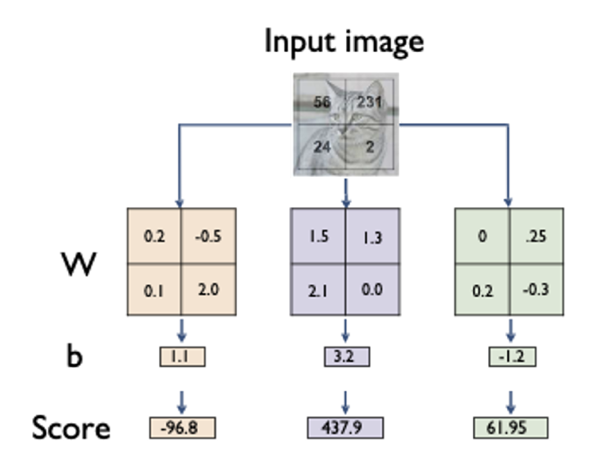

1개의 특징을 뽑기 위하여 모든 pixel을 고려하여 이미지 전체 에대한 대표적인 패턴을 학습하는 방식으로 변형된 사진은 찾지 X

​        

**CNN**

공간적인 특성도 고려, 국부적인 영역의 정보를 고려한 layer, 위치정보도 고려한다.

특징당 전체 pixel을 고려하는것이 아니라 커널 크기만큼만 고려하기 때문에 파라미터수가 적다 

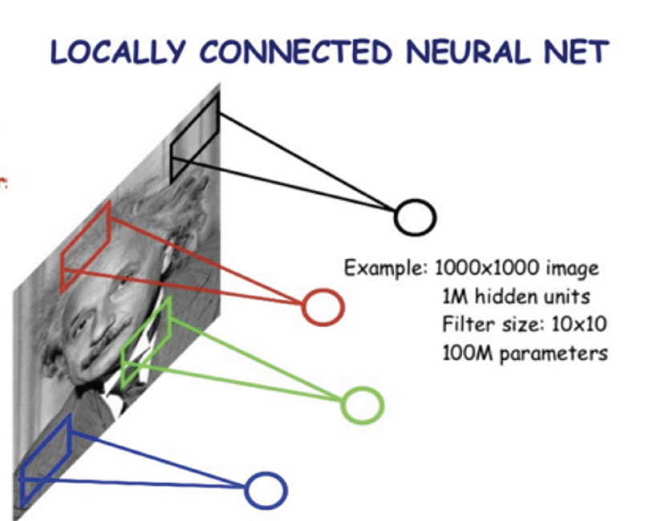

CV task에서 cnn은 backbone으로 많이 사용되고 목적에따라 head를 적합하게 디자인하여 사용한다.

​           

**AlexNet**

- 이전 Network들 보다 layer수와 train data수를 많이 증가시켰다.

- Activation function으로 ReLU를 사용
- Drop out 사용
- Local Response Normalilzation 사용 : 명암을 nomalization하는 기법으로 지금은 잘 사용하지 X
  - 최근에는 Batch normalization을 사용

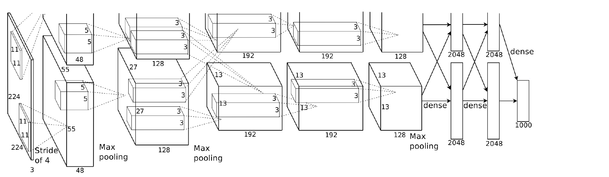

​          

**VGGNet**

- 더 깊은 layer를 사용
- 간단한 구조 3x3 conv filter와 2x2 max pooling layer만 사용
- ReLU 사용

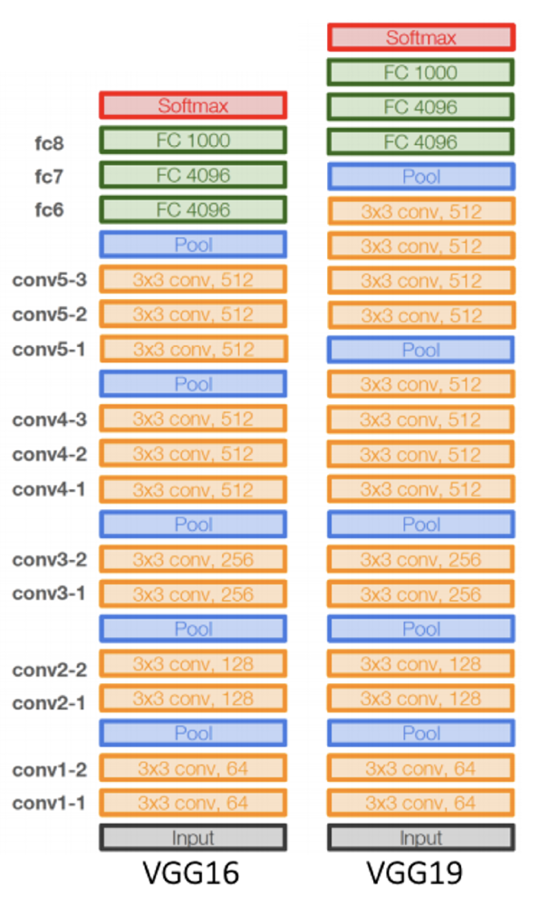

​                 

​            

## efficient learning

**Data augmentation**

Train 데이터는 real 데이터의 분포를 다 표현하지 못한다. (bias 존재) 일부분만 표현

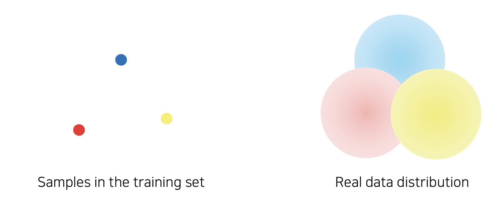

Ex) 밝은 배경의 이미지들로만 학습된 모델은 배경이 어두운이미지를 잘 분류해 내지 못한다.

=> Augmentation으로 training 데이터의 분포를 real data에 가깝게 만들어 준다. (real data 분포와의 gap을 줄여준다.)

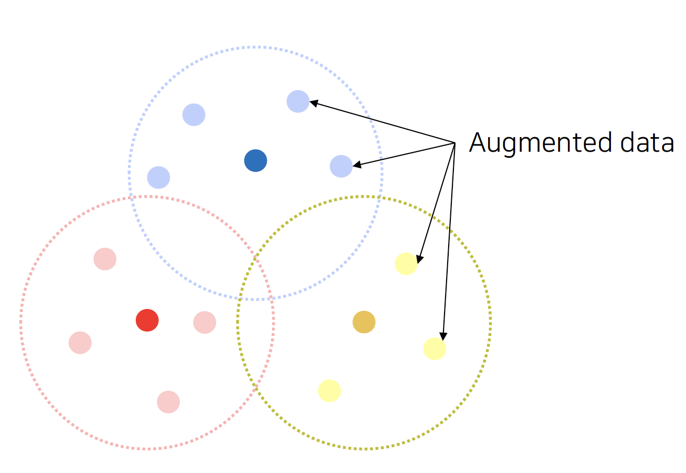

**종류**

- brightness
- Rotate, flip
- crop
- Affine transformation
- CutMix

=> 위와 같은 Augmentation 기법들을 Random하게 조합하여 사용

​           

**Pre trained information**

미리 사전에 학습된 정보를 사용

이미 라벨링된 데이터를 많이 얻는것은 비용이 비싸다 

=> 적은 데이터로도 효과적으로 사용할 수 있는 방법으로 Pre train된 모델을 사용( transfer learning )

​           

이미 학습된 모델을 새로운 task에 적용시켜 **바뀐 부분만을 학습하는 방법**

Ex) 10 classification문제로 학습한 모델을 100classification문제에 적용, 데이터가 아주 적을 때 효과적이다.

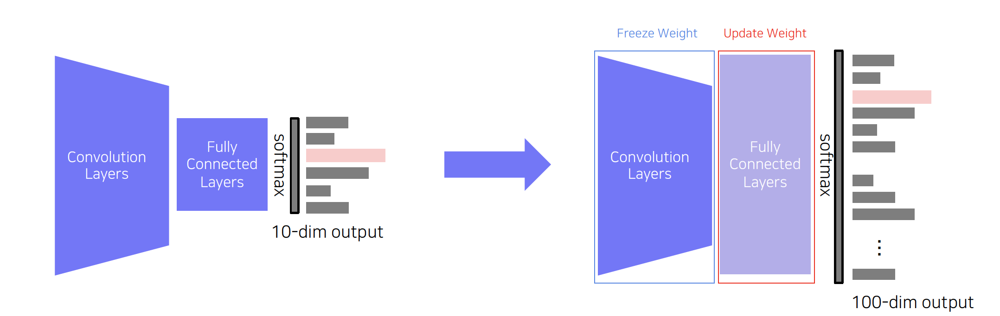

​             

이미 학습된 모델을 새로운 task에 적용시켜 task에 적용시킨 FC layer는 높은 lr로, 적용할 Convolution layer는 낮은 lr로 학습시켜 사용 위의 경우보다 데이터가 조금 더 많을 때 효과적이다.

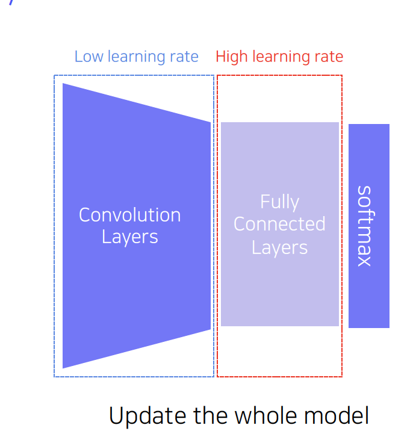

​             

**Knowledge distillation**

모델 압축에 많이 사용되는 기법으로 크기가 큰 Teacher 모델을 student 모델이 따라하는 방식으로 학습시킨다.

​               

**라벨이 없는 데이터 사용** : Teacher 모델의 output과 Student 모델의 output의 차이를 측정하여 student를 학습 시킨다.

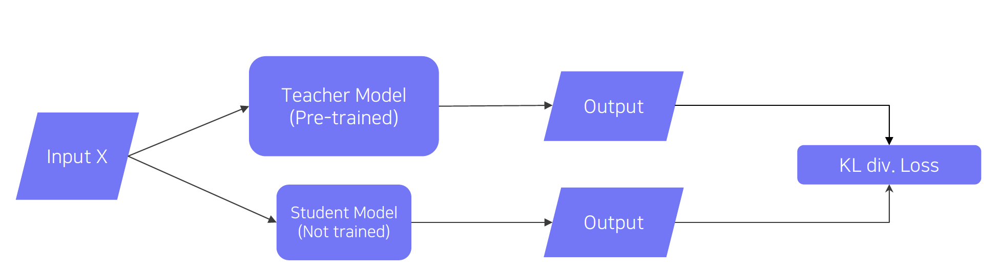

​               

**라벨이 있는 데이터 사용** : 라벨이 있는 데이터를 사용할 때는 teacher model과 student 모델의 soft prediction의 Distillation Loss와 student모델과 실제 정답 레이블과의 loss를 가중합 하여 사용한다.

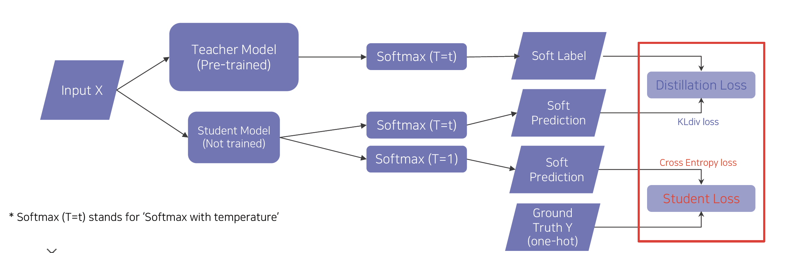

- Hard label, soft label
  - Hard label : one hot encoding
  - Soft label : softmax를 취한 값처럼 확률로 표시 

- softmax temperature (T)

  - Nomal softmax는 T=1일 때로 일반 소프트 맥스 함수와 동일하다. softmax함수의 output 값의 차이가 크다.
  - T = t를 사용할 때 (Soft prediction)는 T=1일 때와 비교하여 softmax함수의 output 값의 차이가 상대적으로 작다 => 출력을soft하게 중간값으로 만들어주어서 값이 한쪽에 쏠리는 것을 막아준다.

- 손실함수

  - Teacher 모델과 Student모델과의 차이를 측정하는 loss를 사용 (KL div)

  - 실제 레이블과 Student모델과의 차이를 측정하는 loss를 사용 (cross entropy)

  - 2 loss를 가중합 하여 사용한다

    ​       

**Unlabeled dataset for training**

labeling된 데이터의 수는 labeling되지 않은 모델에 비하여 수가 적다

=> labeling되지 않은 데이터를 활용 

- label이 있는 데이터를 활용하여 모델을 학습
- 라벨이 없는 데이터를 학습된 모델을 이용하여 라벨을 부착
- 라벨이 부착된 데이터를 학습데이터로 사용하여 다시 학습

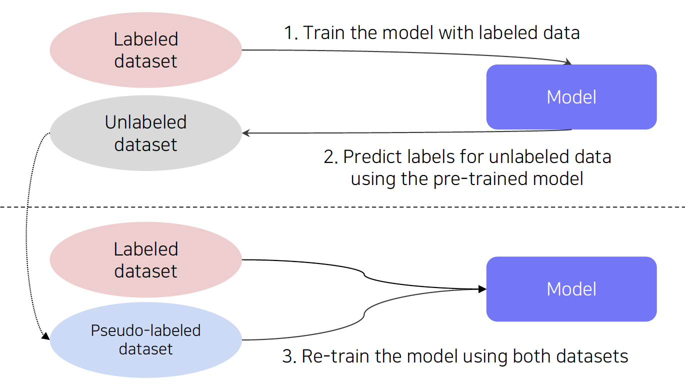

​             

2019 Image net classification에서 Augmentation + Teacher Student network + semi-supervised learning을 같이 사용한 모델이 좋은 성적을 거두었다.

- label이 부착되어있는 데이터 1M개를 이용하여 Teacher 모델학습
- 300M의 lable이 부착되지 않은데이터에 라벨 부착
- Pseudo labeled 데이터를 활용하여 Student 모델 학습 ( Teacher 보다 더 큰 모델을 사용)
- 위의 과정을 반복

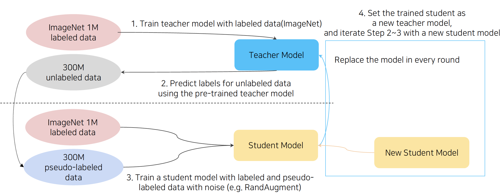

​        

# 피어세션

- Pseudo-labeling이 왜 정확도를 높여주는가?
  - https://www.edwith.org/bcaitech1/forum/53484
- cv2.rotate 회전시킨이후 사이즈가 변하는데 어떻게 input사이즈를 맞추는가?
  - https://dsbook.tistory.com/184?category=802614 다른 함수 사용
- 과제중 classifier
  - https://pytorch.org/vision/0.8/_modules/torchvision/models/vgg.html#vgg11
- TTA
  - CutMix/FMix

​           

# 과제 진행 상황

오늘 과제는 이전과 마찬가지로 빈칸을 채우는 형식으로 진행되었다. 빈칸을 채우는대에는 큰 어려움이 없이 해결하였고 이후 전반적인 코드를 리뷰하며 복습하였다.