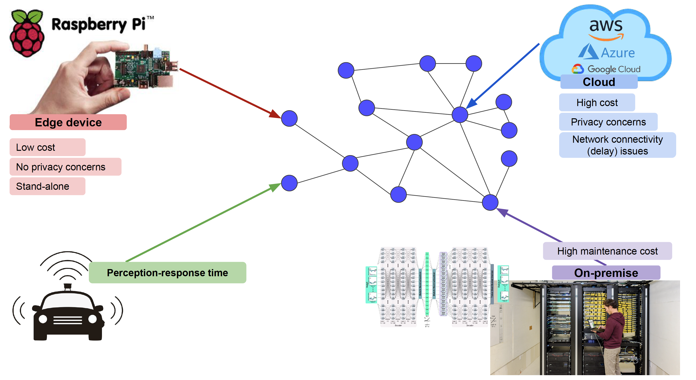

# 학습정리

- 가벼운 모델
- 동전의 뒷면
- 가장 적당하게

​                

## 가벼운 모델

**결정**

- 연역적 결정 : 가설을 먼저 제안하고, 가설로부터 현상에 적용한 결과를 연역
- 귀납적 결정 : 관찰과 실험에서 출발해 가설이나 이론을 구성하고 최종적으로 자연현상을 이해하고 설명

​          

**머신러닝 모델 => 결정기** : 의사결정을 모델이 대신해준다. ex) 로봇 청소기

**결정기 => 가벼운 결정기** : 이러한 결정기들을 제한적인 상황에서도 동작 할 수 있게 가볍게 만드는것

​        

**Edge device** : dumb and fast				

ex)라즈베리파이, 테블릿

​          

**Cloud intelligence** : 중앙서버가 많은것을 처리 -> 서버의 가중이 높아진다.

**Edge intelligence** : edge에서 많은것을 처리, workload 분산

​        

## 동전의 뒷면

**정방향 역방향**

- 시간 vs 안정적 솔루션
- 잘만들어진 제품 vs 잘팔리는 제품
- 개발자 관점 vs 고객 관점

​          

순서 : 문제 정의 -> 기술 정의 -> 기술 공부

코드를 실제로 구현하는 시간보다는 다른사람의 코드를 이해하는 시간이 더 길다.

​         

**확실한 상황에서 -> 분담**

**불확실한 상황에서 -> 협업**

​          

ai는 정확한 출력을 보장해 주지않는다. => 정확히 어떤 부분이 문제인지 알 수가 없다.

​       

**Machine learning life cycle**

=> 모델링 말고도 많은 부분이 중요하다.

​       

Model size => 점점더 증가해간다.

**GPT3를 한번 train 하는데 드는 비용 : 50억**

=> 정확도를 높이는 것이 가장 중요한 문제일까?

​       

**다른 문제들도 중요하다.**

- Real time customer engagement
- Sensor data analysis and IoT
- Security and privacy
- Scalability and cost

​          

## 가장 적당하게

**문제**

Initial state와 Terminmal state간의 차이

=> decision들을 통하여 문제를 해결한다.

**문제를 해결하는 과정**

- Deductive process : 연역적 과정으로 모든 combination 을 고려한다.
- Inductive process : 귀납적 과정으로 모든 combination을 고려하지 않고 귀납적으로 답을 찾아나간다.

​          

**문제 종류**

- Optimization Problem : 최적의 해를 찾는 문제
  - loss를 최소로 하는 모델을 찾을 수 있는가?
- Decicion Problem :  정해진 임계값이 있고 해당 임계값보다 나은 solution을 찾는 문제
  - loss가 k 보다 작은 모델을 찾을 수 있는가?

​         

**Constraints**

object에 따라 constrant가 달라진다.

**cost의 총 합이 constant(제약) 보다 작아야한다.**

​        

# 피어세션

- 1강 minicode `print(4 != 0 not in [1, 2, 3])`, `print(4 != 0 not in [0, 1, 2, 3])`
- CV 과제 3: TO DO 5, 6

- 경량화 과제 1: (x, y) 좌표 관련 수정
- 정보 공유 오픈톡방

​          

# 과제 진행상황

빈칸을 채우는 문제로 큰 어려움 없이 해결하였다.