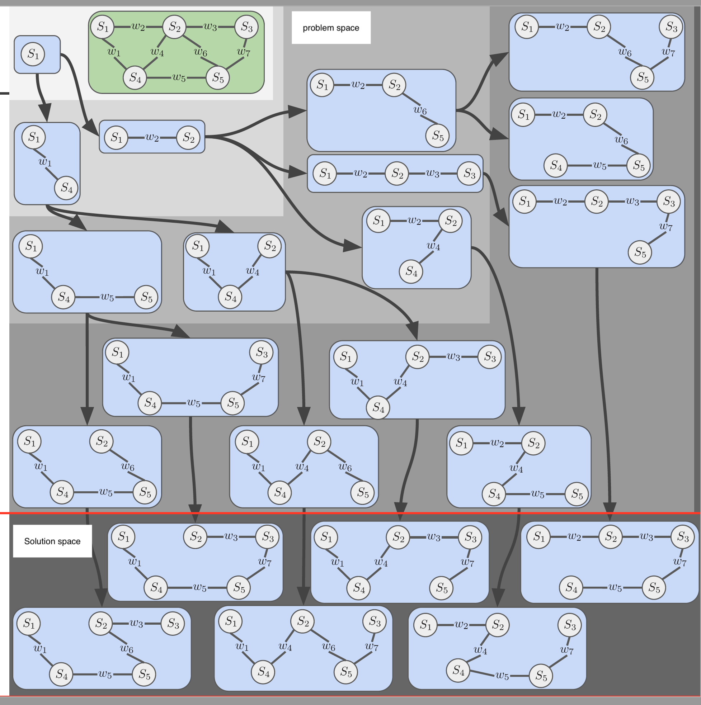
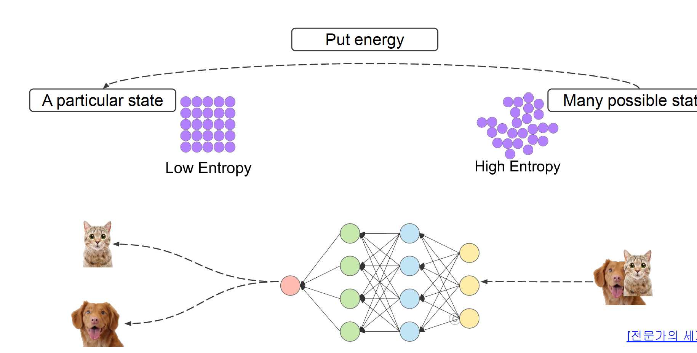
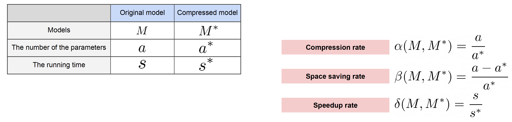

# 학습정리

- 모델의 시공간
- 알뜰히

​              

## 모델의 시공간

**Problem space** : 문제가 정의된 공간

**Solution space** : solution 후보들의 공간

​        

**Time complexity** : 시간복잡도 input의 크기가 커질수록 차이가 커진다.

Ex) 빅오 노테이션

​             

time, space trade off : 상황에 맞추어 잘 선택

Ex) dp

​            

**entropy**

정리된 상태 => 어지려펴진 상태 : **엔트로피가 증가한다.**

다시 정리된 상태로 돌아가기 위해서는 **에너지**가 필요

**기계학습에서는 모델이 에너지의 역할을 한다.**

​            

**parmeter search** : 딥러닝에서의 파라미터는 컴퓨터가 알고리즘을 통하여 찾아준다.

**Hyperparameter search** : 인간이 찾아야하는 파라미터로 바뀔때마다 영향력이 크고, 알맞는 값을 찾는데 많은 시간이 걸린다.

- Manual search
  - 가장 직관적인 방법으로 경험에 의존하여 직접 튜닝한다.
- Grid search
  - 균등하게 탐색하는 기법
  - 탐색하고자 하는 하이퍼파라미터수가 커질수록 탐색 시간이 커진다.
- Random search
  - 탐색하고자하는 범위내의 값들을 랜덤하게 선택
  - Grid search에 비하여 불필요한 반복이 적다.
- Surrogate Model
  - 하이퍼파라미터를 찾아주는 모델
  - Gaussian Process

**Neural Architecture Search** : 어떤 모델을 사용할 것인가?

​            

## 알뜰히

**Compression** 

- 비손실 압축
  - 압축된 자료를 원본그대로 복원이 가능
- 손실압축
  - 원본그대로 복원이 안된다.
  - 비손실 압축보다 압축률이 높다.

​             

**coding**

**Encoding**

​              

**Compression rate** (압축률)

- compression rate
- space saving rate
- speed up rate

​         

# 피어세션

오늘은 팀원분들 모두 기술적으로 큰 어려움이 없어 동기부여, 관심분야, 등의 정보를 공유하는 시간을 가졌습니다.

​       

# 과제

빈칸을 채우는 과제로 큰 어려움 없이 진행하였습니다.