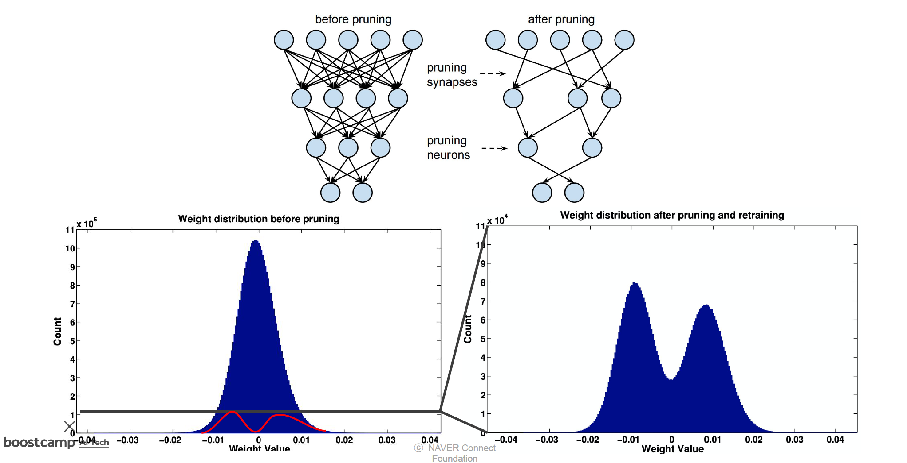
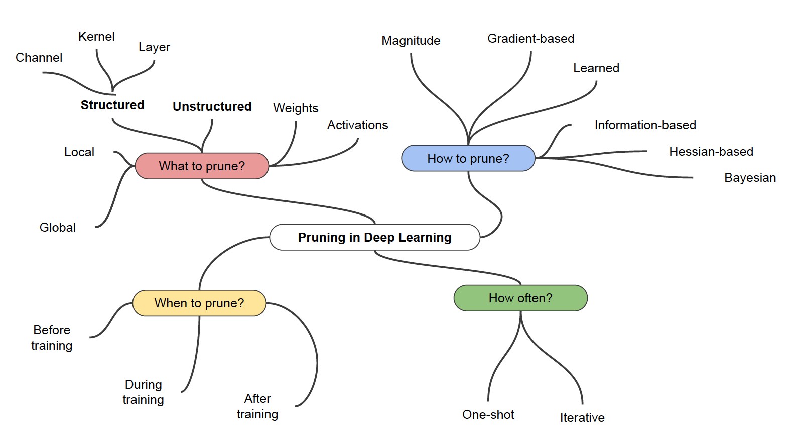
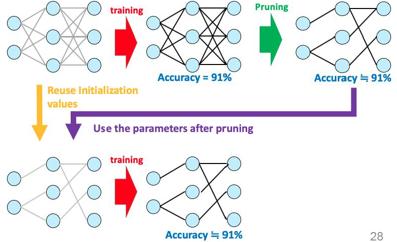

# 학습정리

- 빠르게
- 가지치기

​           

## 빠르게

**Acceleration** : H/W

hardware : hardware acceleator (gpu, tpu)

=> cpu보다 더 빠르게 진행 하고싶을때 사용 (**병렬처리**)

​     

**Compression** : S/W

H/W에대한 지식에 기반하여. compression하는것이 더 좋은 성능을 낼 수 있다.

​          

## 가지치기

**weighted sum**

중요도와 같은 값에 따라 가중치를 두어 계산하는 방법

​          

**Pruning**

덜 중요한 파라미터를 제거하는 방식

- 이점
  - 속도 향상
  - 일반화, 크기 감소
- 단점
  - 정보 손실

​          

**Drop out과의 차이점** : dropout은 학습과정에서 몇몇 weight를 지우고 학습하지만 최종단계에서는 모든 파라미터들을 사용한다.

​         

**Pruning 분류**

​        

**Structed pruning** : 커다랗게 규격을 잡아 자른다. Ex) node 별로

**unstructed pruning** : weight 하나하나를 자른다.

​       

한번에 여러개를 잘라내지 않고 잘라내고 retraing하는 과정을 반복한다.

=> 한번에 너무 많이 잘라내면 retrain해도 성능이 올라가지를 않는다.

​       

**Lottery Ticket Hypothesis**

원래 network안에 파라미터수도 작고 acc도 비슷한 subnet이 존재한다는 가설

​           

# 피어세션

### <질문>

- Iterative Pruning → 조교님께

- 쓸만한 간단한 팁이나 라이브러리 → 조교님께

### <팁>

- 윈도우 캡쳐: 윈도우 + shift + s

- 윈도우 창 이동: 윈도우 + 방향키

- 맥: 지정 키 변경 (프로그램 필요)

-  윈도우 프로그램 추가/제거: 실행창에 appwiz.cpl 입력

- 맥 트랙패드 제스쳐 설정

- 주피터 노트북 실행취소: Z

- 새 창 띄우기: 작업표시줄 아이콘 휠 클릭

- 에디터에서 같은 문자열 한 번에 바꾸기: ctrl + f 후 replace all

​        

​       