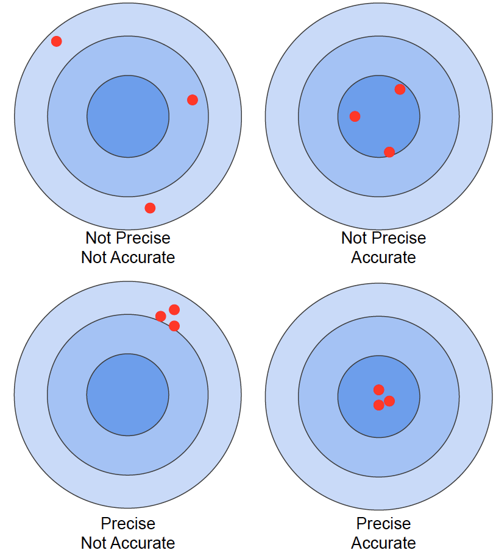
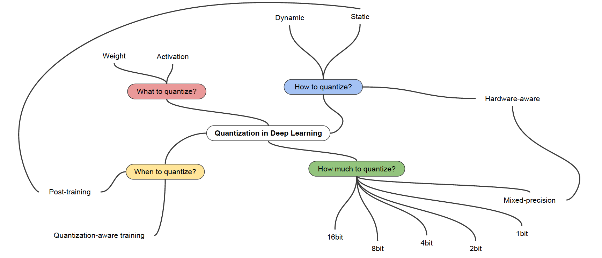
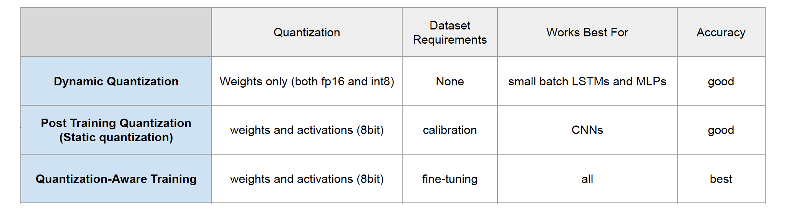
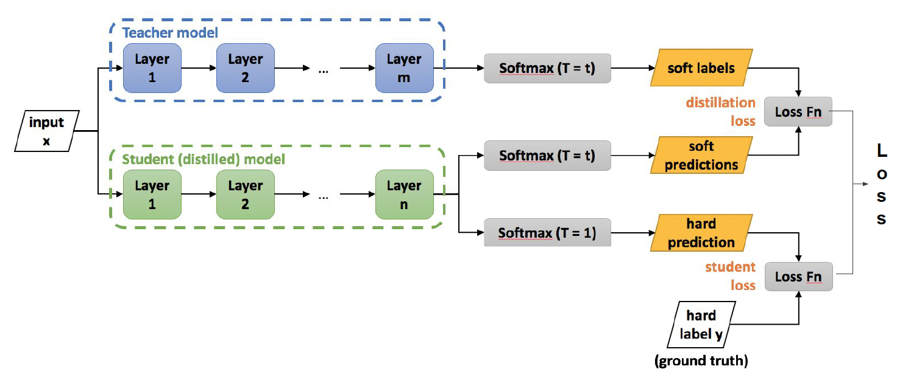

# 학습정리

- 양자화
- 지식 증류

​         

## 양자화

**Fixed point, Floating point**

- fixed point : 소수점의 위치를 고정시켜서 사용
- floating point : 지수부와 가수부로 나누어 사용

​             

**precision , accuracy**

​        

**Quantization**

=> 정밀도가 떨어지는 값으로 표현 	ex) float32로 표현된 파라미터들을 int8로 표현

- model size의 감소
- Memory bandwidth 요구량 감소
- 속도 향상

​           

**Quantization 종류**

- Dynamic quantization
- Static quantization
- Quantization aware training 

​       

## 지식 증류

**Knowledge distillation**

이미 학습된 네트워크를 새로운 네트워크가 학습

**Transfer learning** : 다른 task에 대하여 pretrained된 모델을 사용하여 학습시키는 방법

**Knowledge distillation** : 같은 task에 대하여 pretrained된 모델을 따라 학습시키는 과정

​           

- soft prediction
  -  teacher 모델과 student모델의 loss를 구할 때 사용
  - 각 클레스별 확률값의 차이를 줄여 soft하게 만들어준다.
  - 각 label별 유사도를 고려할 수 있게 해준다.
- Hard prediction
  - student model과 ground truth와의 loss를 구할 때 사용
  - 일반적인 softmax함수를 사용

​           

distilation이 모두 compression이라고 할 수는 없다.

=> zero mean Assumtion이 참이때 model compression이라고 할 수 있다.

​       

**distillation 종류**

- Activation-Boundary Distillation (AB)
- Overhaul Distillation (OH)
- Relational Knowledge Distillation (RKD)
- Teacher-Assistant Distillation (TAKD)
- Simple Feature Distillation (SFD)
- Ensemble Distillation (MKD)
- Unsupervised Distillation (UDA)

# 피어세션

- vscode extension todo tree
- pytorch lightning

​      

조교님 설명

​         

# 과제 진행상황

오늘 과제 역시 빈칸을 채우는 식으로 제공 되었고 큰 어려움 없이 진행하였습니다.

