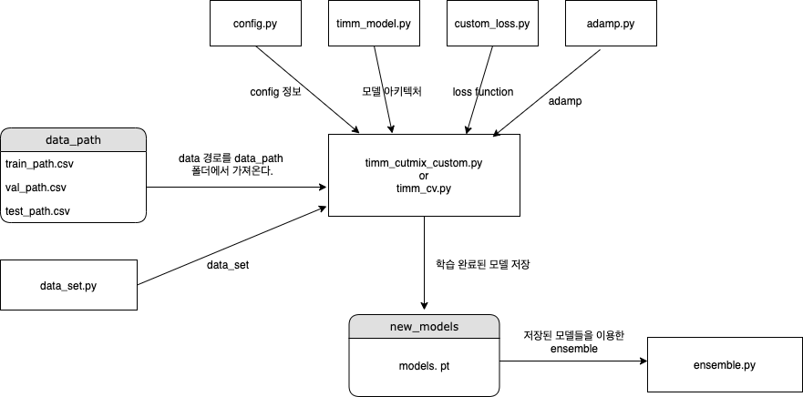

### 구성

### 세부 내용

- config.py

  - 학습에 필요한 정보

    

- timm_model.py

  - timm 라이브러리를 이용한 모델 아키텍쳐

    

- custom_loss.py

  - 일반적인 crossentropy loss에  1 - f1 score를 더해준 loss로 f1score를 최대로 하도록 학습유도

    

- adamp.py

  - adamp optimizer

  - https://github.com/clovaai/AdamP

    

- data_set.py

  - data set 생성

    

- timm_cutmix_custom.py

  - 일반적인 cutmix는 얼굴 혹은 마스크부분이 잘려지지 않을 수 도 있기에 절반을 세로로 잘라 cutmix

  - 전반적으로 중년층과 노년층의 데이터를 구분을 못하기에 노년층의 데이터만 cutmix로 사용

    

- timm_cv.py

  - k fold cross validation 사용

    

- ensemble.py

  - ensemble : 모델을 입력으로 받아 더한뒤 평균을 취해주는 방식
  - ensemble_softmax : softmax를 통과한 확률값들을 받아 ensemble, 중년층 class에 추가 weight를 주었다.